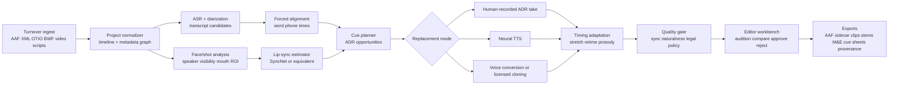
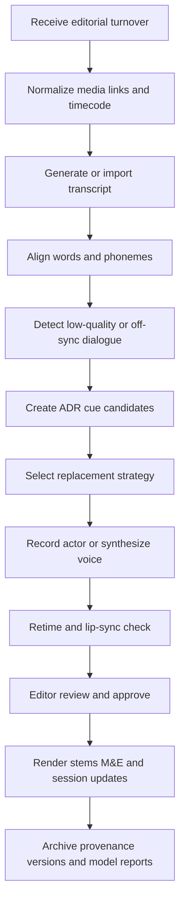
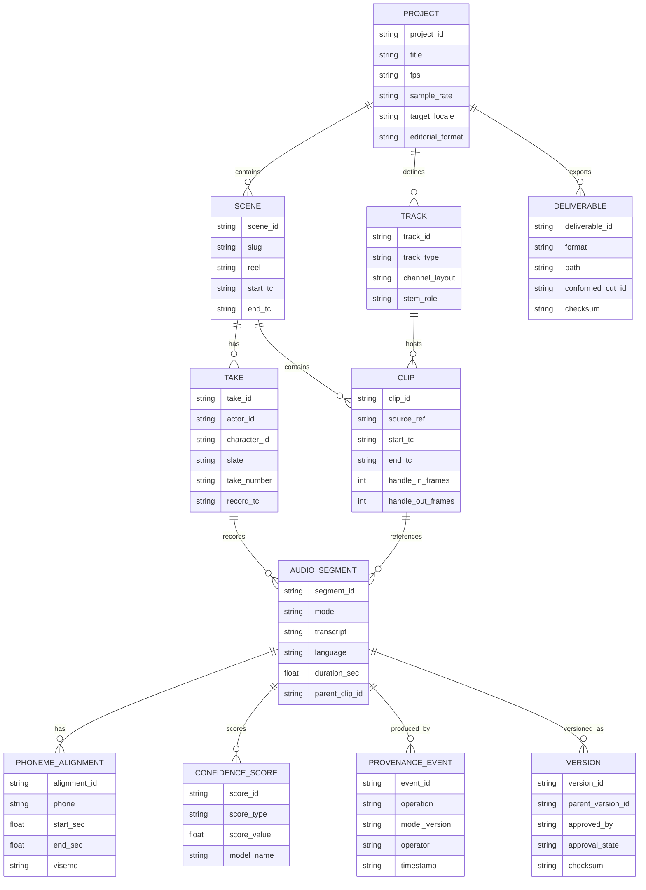

# Data Models and Workflows for Video Dialogue Replacement

## Executive summary

Professional dialogue replacement in film and television is still fundamentally a **data-management and synchronization problem** before it is a machine-learning problem. In established post workflows, editors or dialogue teams identify replacement cues, prepare an interchange package from the picture editorial system, record multiple replacement takes against picture using cueing aids such as beeps, countdowns, streamers, and line text, then conform, edit, and mix the results back into the master session. Modern tools make this process more integrated—DaVinci Resolve Fairlight includes built-in ADR tooling, Media Composer exports directly to Pro Tools session formats, and Avid now supports tightly integrated ADR cueing through Cue Pro—but the workflow still depends on deterministic references: frame-accurate timecode, clip boundaries, handles, and stable metadata. For global release, the workflow also depends on deliverables such as dialogue/music/effects stems and Music-and-Effects packages that stay conformed to the final picture. citeturn15search2turn7search1turn16search0turn16search4turn29search1turn32search4

The most reliable technical substrate for automated ADR is a combination of **SMPTE timecode**, **BWF/WAV production sound**, and a rich editorial interchange layer such as **AAF** or XML/OTIO, rather than a pure end-to-end model that “guesses” timing from pixels and audio alone. SMPTE ST 12 remains the canonical frame-addressing system; BWF extends WAVE with the `bext` chunk, time reference, UMID, loudness, and coding-history metadata; and AAF provides an object model with constructs for compositions, source clips, slots, comment markers, timecode, and sound descriptors. Systems that preserve these artifacts can use machine learning only where it adds clear value: word or phoneme alignment, take scoring, transcription, voice conversion, and visual sync estimation. citeturn0search4turn20view3turn20view0turn12view3turn0search8

For alignment, the current best practice is **layered rather than singular**. Timecode and slates provide coarse synchronization; transcript-driven forced alignment refines it to the word or phoneme level; and lip-sync models estimate whether the new speech visually matches the face. In recent comparisons on manually aligned speech corpora, classical forced alignment as implemented in the Montreal Forced Aligner still outperformed newer ASR-based alignment pipelines such as WhisperX and MMS on the segments compared, while audiovisual models such as SyncNet and Wav2Lip remain widely used for lip-sync estimation and generation. Diffusion and latent-space talking-face methods improve visual fidelity, while modern neural TTS and voice-cloning systems improve voice quality and adaptability. citeturn4search4turn5search7turn5search11turn4search2turn4search1turn24search10turn24search7turn23search0turn23search1turn23search11turn23search14

The most practical AI architecture for ADR automation is therefore an **agentic orchestration layer over conventional editorial data**, not a monolithic black box. The agent should ingest AAF/XML/OTIO timeline data plus reference media and BWF metadata; run speech recognition, alignment, cue generation, voice selection or cloning, take scoring, and optional lip-edit proposals; write back structured outputs that editors can inspect; and preserve provenance for every generated artifact. This architecture supports both batch localization and low-latency auditioning, maps cleanly to existing NLE and DAW workflows, and makes legal controls—especially consent for digital voice replicas and limits on reuse—enforceable at the data-model level. citeturn19search0turn19search1turn17search0turn11search4turn11search23turn22view4turn8search1turn8search6

## Professional ADR workflows in cinema and television

In professional post, ADR begins when the dialogue or sound team identifies where on-set dialogue is unusable or creatively inadequate. Official workflow guides describe the team first reviewing the edited program, marking cues, and then bringing actors into a controlled studio or dubbing stage to re-perform lines against picture and guide audio. Blackmagic’s Fairlight workflow explicitly centers an ADR list with character names and dialogue, configurable cueing options such as beeps, countdowns, text prompts, and streamers, and multi-take recording with ratings; iZotope’s post guide similarly describes the dialogue editor or sound editor finding cues and then recording actors to sync back to picture. citeturn15search2turn15search4turn32search4

That workflow is now implemented in several software ecosystems. Fairlight has built-in ADR and elastic retiming for matching takes to picture. In Pro Tools-centric facilities, external cueing systems have historically filled the gap; Avid’s current integration with Cue Pro shows the direction of travel, with ADR overlays rendered directly into Pro Tools video output and no need for a separate video timeline or MIDI/Satellite sync layer. Cue Pro’s own documentation adds that modern cueing systems increasingly manage import/export of scripts and cue sheets, track automation per character, take review stages, and picture reconform. citeturn15search2turn16search0turn16search13turn16search3

The enterprise handoff between picture and sound is equally important. Avid’s own interchange note distinguishes AAF from OMF and describes the common export choices: link to current media, copy media, consolidate with handles, or embed media; it also emphasizes compatibility constraints such as Pro Tools not supporting embedded AAF media and not importing embedded OMF video. Those mundane settings determine whether an ADR or dialogue session opens cleanly, whether handles survive for retiming, and whether the receiving stage can relink to underlying production sound. citeturn21view0

For international localization, ADR-like workflows extend beyond same-language cleanup into dubbing, where downstream deliverables must preserve synchronization and separability. Netflix’s M&E guidance requires a fully filled Music-and-Effects package conformed and in sync with final media, and for nonfiction it explicitly recommends separated dialogue plus married music/effects when a full M&E is not feasible. In practice, that means a dialogue-replacement system must treat stem and M&E generation as first-class outputs, not as an afterthought. citeturn29search1turn29search5

A concise way to think about the professional workflow is that it has three control loops. The first loop is **editorial**, where cues and handles are defined. The second is **performance**, where actors are cued and multiple takes are recorded. The third is **technical conformity**, where retiming, reconform, relinking, stem creation, and delivery ensure that the newly recorded dialogue still matches the master cut and the international package. AI can speed all three loops, but if it breaks any one of them, post teams will revert to manual tools. citeturn15search2turn21view0turn29search1turn16search3

## Interchange formats timecode and metadata schemas

SMPTE timecode is the backbone of picture-sound correspondence. SMPTE’s own overview describes the ST 12 family—ST 12-1, ST 12-2, and ST 12-3—as the timecode suite used to label frames and carry time-and-control-code information. That does not by itself solve dialogue replacement, but it gives every downstream system a common frame address. citeturn0search4

Broadcast Wave then binds audio to that addressing system. EBU Tech 3285 defines BWF as a WAVE-based audio format for seamless interchange across broadcast environments. In the `bext` structure, it includes a `TimeReference` field defined as the first-sample count since midnight, a version field, optional UMID carriage, loudness metadata in version 2, and a `CodingHistory` field that records processing history. The specification also says BWF-compliant applications shall pass additional non-standard chunks, which matters because production pipelines often carry richer metadata in iXML. Sound Devices’ overview makes the production use explicit: BWF files commonly carry scene/take metadata, timecode value and rate, unique identifiers, and, via iXML, track names and notes. citeturn20view3turn20view0turn31search1turn28search5

AAF provides the structured editorial interchange layer missing from simple audio files. The AAF object specification describes an extensible object model for multimedia interchange; its class hierarchy includes `CompositionMob`, `SourceClip`, `CommentMarker`, `Timecode`, `TimelineMobSlot`, `WAVEDescriptor`, and `PCMDescriptor`, and the header model includes file-wide identification, versioning, last-modified time, operational pattern, and generation tracking. The Library of Congress description likewise characterizes AAF as an object-based format that wraps metadata together with media essence or references to external essence. citeturn12view3turn0search8

OMF remains relevant largely as legacy interchange. Avid’s own note says OMF is both a media-file and sequence format, can contain audio and video, is more compatible in version 2.0 than 1.0, and should generally be kept under about 2 GB when embedding media. In contrast, the same note describes AAF as a sequence format that can refer to external media or contain embedded data, while also documenting Pro Tools compatibility limits around embedded AAF and embedded OMF video. That is why modern post supervisors usually prefer AAF unless a downstream system forces OMF. citeturn21view0

XML-based interchange spans several flavors. Apple’s FCPXML reference describes FCPXML as an XML document structure for assets, projects, and metadata sent to and from Final Cut Pro. Adobe documents export of Final Cut Pro XML from Premiere for exchange with compatible systems. OpenTimelineIO goes one step further and defines itself as an API and interchange format for editorial cut information that is “a modern EDL,” while emphasizing that it is **not** a media container. For automation work, that distinction is useful: OTIO or XML can represent editorial intent cleanly, while AAF and BWF carry heavier operational metadata and media linkage. citeturn19search1turn19search5turn19search0turn30search6

The format comparison below synthesizes SMPTE, EBU, AAF, Adobe, Apple, OTIO, Avid, and Sound Devices documentation. citeturn0search4turn20view3turn21view0turn19search1turn19search5turn19search0turn31search1turn28search5

| Artifact | What it carries | Strengths for ADR | Main limits |
|---|---|---|---|
| SMPTE timecode | Frame addresses and time/control code | Deterministic sync between picture, cues, and recorded takes | Does not carry dialogue semantics |
| BWF/WAV | PCM or compressed audio plus `bext` metadata | Stable audio exchange, sample-level origin, coding history, time reference | Limited editorial structure by itself |
| iXML in BWF | Scene, take, notes, track names, original filename | Excellent production-sound metadata for cue generation and relink | Survival across exports is tool-dependent |
| OMF | Timeline plus media, often embedded audio | Legacy interoperability with older post tools | Size/feature constraints; weaker modern support |
| AAF | Structured timeline objects plus essence or references | Best mainstream interchange for editorial-to-audio turnover | Real-world compatibility varies by exporter/importer settings |
| FCPXML / XML | Timeline, assets, project metadata | Readable and scriptable; good for custom parsing | Not standardized across all NLEs |
| OTIO | Editorial cut structure and metadata references | Clean internal model for automation; good plugin-based translation | No embedded media; uneven adoption |
| Stems / M&E | Dialogue, music, effects separations | Required for localization and downstream mix flexibility | Not an editorial format; generated late in pipeline |

The NLE landscape follows those same distinctions. Premiere exports OMF for Pro Tools and can include clip-based audio, keyframes, transitions, metadata, and either full files or trimmed handles; it also exports Final Cut Pro XML and can round-trip audio work to Audition, which can import a Premiere `.prproj` directly using original media. Media Composer can export Pro Tools session files directly, while DaVinci Resolve recommends OTIO where supported and otherwise XML or AAF for cross-application interchange. citeturn7search15turn19search5turn17search0turn17search4turn7search1turn7search17

## Alignment methods and lip-sync model families

A robust ADR system should treat alignment as a stack of increasingly fine constraints. At the coarsest level are **timecode and slate cues**. BWF’s time reference stores the first-sample count since midnight, and production mixers routinely rely on timecode-bearing BWF files for editorial sync; smart slates and timecode devices then provide a visual and audible fallback when jam sync or metadata is wrong. That layer is deterministic and extremely fast. citeturn20view0turn28search5turn28search10

The next layer is **text-audio alignment**. Montreal Forced Aligner is a classical trainable forced-alignment system built on Kaldi acoustic modeling and speaker adaptation. WhisperX combines Whisper-style ASR with a lightweight alignment stage to obtain word-level timestamps and speaker attribution on long-form audio. A recent comparison against manually aligned TIMIT and Buckeye data found that MFA outperformed both WhisperX and MMS on the correctly recognized words evaluated, which is a useful reminder that newer end-to-end ASR does not automatically yield better word or phone boundaries. CTC-based alignment is another active path; torchaudio’s forced-alignment tutorial and recent work on CTC label priors show how end-to-end models can be adapted to boundary recovery. citeturn4search4turn5search11turn5search3turn5search7turn25search6turn25search2

For **classical lip-sync**, older pipelines rely on explicit phoneme-to-viseme mappings and coarticulation rules. JALI is a strong modern reference from the animation side: it combines text, phonemes, and audio alignment to compute co-articulated viseme action units, rather than treating each phoneme as an isolated mouth shape. At the API level, Microsoft’s speech synthesis documentation still exposes viseme events and facial-position data, which is a sign that explicit viseme representations remain useful in production systems even when the generation model itself is neural. At the signal-processing level, dynamic time warping remains an important alignment primitive whenever two sequences must be matched under local tempo variation; recent work continues to study how to make DTW more robust under difficult global warping conditions. citeturn5search6turn5search20turn25search7

For **audiovisual neural synchronization**, the mainstream model line starts with SyncNet, which learns an audio-video synchronization representation from short speech clips, and continues into Wav2Lip, which uses a lip-sync discriminator to drive face-video generation for arbitrary identities in unconstrained videos. More recent work such as Diff2Lip applies diffusion to lip inpainting for better visual quality, while MuseTalk moves into latent-space inpainting with a real-time objective and reports more than 30 FPS at 256×256 with negligible startup latency. SadTalker is relevant when a pipeline needs not only lip movement but also plausible pose and expression from limited visual input. citeturn4search2turn4search1turn24search10turn24search7turn24search1

For **voice generation and replacement**, the speech side now spans ASR, TTS, voice conversion, and zero-shot cloning. Whisper is trained on 680,000 hours of multilingual, multitask supervised data and is widely used as the transcription front end. Neural TTS surveys organize the field into text analysis, acoustic modeling, and vocoding; FastSpeech 2 is a canonical non-autoregressive architecture that explicitly predicts duration, pitch, and energy; YourTTS extends toward multilingual zero-shot multi-speaker generation; and VALL-E–style codec language models push zero-shot personalization from very short prompts. Neural Voice Cloning with a Few Samples remains a useful framing reference because it separates **speaker adaptation** from **speaker encoding**, which is still a helpful conceptual split for production system design. citeturn11search1turn23search0turn23search1turn23search11turn23search14turn4search11

For evaluation, the field now has multiple objective views of “sync.” Wav2Lip popularized **LSE-C** and **LSE-D**, both derived from SyncNet-style embeddings; later work and surveys also use **landmark distance** in the mouth region, **MOS** for perceived quality, and **PhoVis**, which scores dubbed synchronization using phoneme-viseme agreement at the utterance level. In practice, ADR systems should use more than one metric because a take can score well on embedding-based sync while still looking uncanny to human reviewers. citeturn18search3turn18search7turn18search8turn18search15

## Reference architecture for an automated ADR agent

An end-to-end ADR agent should be built as an orchestrated pipeline over stable editorial artifacts, not as a single generative model. The control plane ingests the project turnover—AAF/XML/OTIO, reference video, production BWF, transcripts or scripts, cue sheets, and preferred voice policies. The perception plane performs ASR, forced alignment, speaker/character linking, face tracking, active-speaker analysis, and lip-sync estimation. The generation plane proposes one or more dialogue replacements using either recorded takes, neural TTS, voice conversion, or licensed voice-replica models. The editorial plane writes back timecoded cues, alternate takes, confidence and quality scores, and deliverables such as replacement clips, dialogue stems, and updated cue sheets for human approval. That design matches both current interchange standards and the containerized deployment patterns used by modern speech and facial-animation stacks. citeturn19search0turn17search0turn11search4turn11search23turn15search7

The sequence below shows the recommended processing timeline. It is deliberately editor-centric: the machine proposes, but the editor or mixer remains the final arbiter. That is consistent with both the strengths and the current failure modes of speech and talking-face systems. citeturn15search2turn16search3turn24search7turn5search7

Training data needs follow naturally from the architecture. Forced alignment wants corpora with reliable transcripts and manual or trusted boundaries; TIMIT and Buckeye are useful for evaluation, while TED-LIUM is useful for large-scale transcription training. Lip-sync and talking-face generation want paired audio-video speech data; LRS2 and LRW are standard audiovisual speech datasets, TCD-TIMIT provides controlled continuous audiovisual speech, VoxCeleb2 gives very large-scale in-the-wild speaker/video coverage, and HDTF adds higher-resolution talking-face material. None of these datasets, however, fully substitute for studio-grade licensed ADR data with cue sheets, alternate takes, stems, and union-compliant voice rights, so production systems typically need a combination of public foundation data and private supervised fine-tuning data. citeturn33search7turn33search10turn6search22turn6search0turn6search10turn6search1turn33search4turn33search5

A practical latency split emerges from those model families. **Batch mode** is the default for catalog localization and full-episode conforms because it tolerates slower, higher-quality alignment and generation passes. **Interactive preview mode** should restrict itself to proxy video, short context windows, cached embeddings, and fast inference paths; vendor speech stacks such as NVIDIA Riva explicitly target both real-time speech pipelines and offline high-throughput workloads, while modern lip-sync systems such as MuseTalk are designed around real-time operation. A sensible product target is sub-second preview for cue auditioning and fully offline rendering for final approval. That last target is an engineering recommendation rather than a published standard, but it follows directly from those primary capabilities. citeturn11search4turn24search7turn11search2

## Data model and API design

The right internal data model is a **hybrid of editorial graph and media provenance ledger**. AAF contributes the editorial graph idea—composition objects, source references, markers, slots, timecode, and descriptors. BWF and iXML contribute production-sound metadata—time reference, originator, scene/take notes, track names, and coding history. OTIO contributes a clean API-first representation of editorial intent. A minimal viable ADR schema should therefore separate timeline structure from audio-generation events while still linking them through immutable IDs and explicit time bases. citeturn12view3turn20view3turn31search1turn19search0

The table below is a recommended minimum viable schema derived from AAF object concepts, BWF/iXML metadata practice, and the needs of forced alignment and ADR approval workflows. citeturn12view3turn20view0turn31search1turn28search5

| Entity | Required fields | Important attributes | Key relationships | Why it matters |
|---|---|---|---|---|
| Project | `project_id`, title, fps, sample_rate, editorial_format | target locale, NLE origin, policy profile | owns scenes, tracks, deliverables | Establishes global time base and policies |
| Scene | `scene_id`, reel, start_tc, end_tc | source reel, sequence, episode | belongs to project; contains clips | Natural review and scheduling unit |
| Take | `take_id`, actor_id, character_id, slate, take_number, record_tc | studio, mic chain, engineer, rehearsal flag | linked to audio segments | Keeps studio recordings auditable |
| Track | `track_id`, track_type, channel_layout | stem role, mono/poly, mic identity | hosts clips | Distinguishes DX, M, E, guide, VO, ADR |
| Clip | `clip_id`, source_ref, start_tc, end_tc | handle lengths, reel/tape, muted/selected state | on track; references source media | Mirrors editorial interchange concepts |
| Audio segment | `segment_id`, mode, transcript, language, duration | source type: production/ADR/TTS/VC | references clip or take | Primary unit for replacement and approval |
| Phoneme alignment | `alignment_id`, phone, start_sec, end_sec | viseme, stress, confidence | belongs to audio segment | Needed for fine sync and visual scoring |
| Confidence score | `score_id`, type, value, model_name | threshold, calibration set | attached to segment or take | Supports “human-in-the-loop” gating |
| Provenance event | `event_id`, operation, timestamp | model version, prompt, operator, device | attached to any generated artifact | Required for debugging and compliance |
| Version | `version_id`, parent_version_id`, checksum | approval state, notes, rollback pointer | attached to artifacts and segments | Prevents silent overwrite of approved edits |

A minimal API should expose data as **time-addressable resources** with immutable artifact IDs and explicit job status. Editorial systems do not need a giant endpoint surface; they need a few reliable ways to import turnovers, request analyses, audition alternatives, approve results, and export conform-ready deliverables. The API design below is intentionally conservative and can be implemented over REST, gRPC, or event-driven job primitives. Its structure aligns with modern OTIO-like editorial APIs and the provenance needs implied by AAF generation tracking and BWF coding history. citeturn19search0turn12view3turn20view2

| Endpoint | Method | Input | Output | Notes |
|---|---|---|---|---|
| `/projects` | `POST` | project manifest, fps, sample rate, policy profile | project record | Create working context |
| `/turnovers` | `POST` | AAF/XML/OTIO + media refs | normalized timeline graph | Parse and validate turnover |
| `/segments:detect` | `POST` | project/scene range | candidate ADR segments | Finds cleanup or replacement candidates |
| `/alignments` | `POST` | audio ref + transcript | word/phoneme timings | Supports MFA, WhisperX, or CTC backends |
| `/voices` | `POST` | licensed speaker profile or voice model ref | voice resource | Must enforce consent policy |
| `/replacements` | `POST` | segment ID + mode + voice ref | candidate replacement artifacts | `mode` = human_take / tts / voice_convert |
| `/scores` | `POST` | segment ID or artifact ID | sync/naturalness/confidence metrics | Quality gate endpoint |
| `/approvals` | `POST` | artifact/version ID + reviewer decision | approval record | Human review is explicit |
| `/exports` | `POST` | target format, cut version, stem options | deliverable package | AAF sidecars, WAV/BWF, XML, stems, M&E |
| `/provenance/{id}` | `GET` | artifact or segment ID | full lineage | Compliance and debugging |

## Engineering evaluation and deployment

Synchronization failures in ADR are rarely caused by one thing. More often they come from a chain: mismatched frame rates, sample-rate conversions, destroyed BWF metadata, bad relinks, wrong handles, reconforms after picture editorial changes, or generative output that looks plausible but no longer matches labials. Several official docs point directly to these risks. Avid’s export note highlights sample-rate and frame-boundary compatibility when moving from Pro Tools back to Avid and explains that “Enforce Avid Compatibility” resamples to 44.1 kHz or 48 kHz and pads audio edits to keep them frame accurate. EBU R98 and related BWF guidance continue to treat 48 kHz as the recommended exchange rate for program audio. Resolve exposes elastic retiming specifically to help synchronize ADR to picture. citeturn21view0turn26search2turn15search2

For storage planning, the most useful rule is to separate **raw audio**, **review video**, and **derived artifacts**. Uncompressed 48 kHz, 24-bit mono PCM is about 0.52 GB per hour per track by direct calculation from PCM sample size; eight isolated mono production tracks therefore consume about 4.15 GB per hour before overhead. On the video side, Avid’s official DNxHR bandwidth table gives 1080p DNxHR SQ at 23.976 fps as 13.77 MB/s, or roughly 49.6 GB per hour. That means even a modest ADR review system can end up dominated by proxy and reference video, not by speech assets. citeturn20view3turn10search4

The evaluation stack should be multi-objective. For timing, use boundary error or overlap metrics on manually aligned corpora such as TIMIT and Buckeye. For transcription quality, use WER or CER on representative dialogue. For audiovisual synchronization, use LSE-C, LSE-D, and if possible a perceptual dubbed-content metric such as PhoVis; landmark-mouth distance is useful as a secondary visual measure. For listening quality, retain MOS or expert panel review because objective sync scores do not fully capture timbre mismatch, emotional mismatch, or room-tone discontinuity. For deployment safety, keep track of calibration curves on confidence scores so the editor UI can distinguish “high-confidence auto-apply” from “mandatory human review.” citeturn33search7turn33search10turn18search3turn18search8turn18search15

The most common error modes are now well understood. Alignment systems degrade on noisy, reverberant, overlapping, or transcript-mismatched speech; talking-face systems degrade on strong pose changes, occlusion, identity drift, and in-the-wild motion; voice-conversion systems can preserve speaker identity too strongly, including undesirable acoustic conditions, or hallucinate prosody that no longer matches the face. The right fallback is not “try a bigger model” but a staged retreat: re-run deterministic alignment from the original BWF and guide track, widen handles, fall back from synthesis to human-recorded ADR, or use local elastic retiming only on the approved take. citeturn5search11turn25search12turn24search10turn24search7turn23search14turn15search2

The deployment options below are practical engineering recommendations grounded in official deployment guidance from NVIDIA and in codec/audio-rate documentation; the exact hardware profile will vary with chosen models and resolution. citeturn11search4turn11search23turn10search4turn20view3

| Deployment mode | Best fit | Operational profile | Ballpark media/storage profile | Main tradeoff |
|---|---|---|---|---|
| On-prem batch | Feature films, unreleased episodic, union-sensitive projects | Highest control; easier to keep voice assets and unreleased cuts inside facility perimeter | Audio modest; reference proxies tens of GB/hour if kept in mezzanine/proxy formats | Highest upfront GPU/storage cost |
| Cloud batch | Large catalog dubbing, burst localization | Elastic scaling for ASR, alignment, scoring, and offline generation | Cheap to scale derived jobs; egress and secure media handling matter | Data-governance complexity |
| Edge or workstation preview | Editor-side auditioning, stage-side review, live session assistance | Fast local preview using proxies and cached embeddings | Smaller working set; usually only short proxy segments local | Quality must be lower or narrower than final batch |
| Hybrid | Most real studios | Local ingest/governance, cloud rendering for non-sensitive or approved jobs | Best balance if storage tiers are clear | More orchestration complexity |

Integration with mainstream editing systems should be explicit. In Premiere-centric shops, the lowest-friction paths are OMF export to Pro Tools, FCP XML for structured interchange, and direct Audition import of the Premiere project. In Media Composer shops, direct Pro Tools session export and AAF remain the most natural handoff. In Resolve shops, Fairlight can cover both ADR recording and many audio-post tasks internally, and Resolve now also supports OTIO/XML/AAF interchange depending on the destination system. For an AI ADR product, the correct product decision is therefore **not** to replace those handoffs, but to sit beside them and emit artifacts they already understand. citeturn7search15turn19search5turn17search0turn7search1turn21view0turn15search2turn7search17

## Legal ethical and privacy constraints

The legal center of gravity for AI-enabled dialogue replacement is **consent, scope of use, and traceability**. The U.S. Copyright Office’s AI initiative separated digital replicas from output copyrightability and model-training questions because replicas raise distinct legal and policy concerns. SAG-AFTRA’s AI resources and replica agreements then operationalize that concern in production language: informed consent is required for creation of a digital voice replica, additional consent and negotiation are required for many external uses, and transparency about the intended use is required before compensation and approval. citeturn8search1turn9search2turn22view4turn12view4

That has direct architectural consequences. If a system supports voice cloning or voice conversion, the platform must store the **legal basis** for each voice asset: who consented, for what project, for what term, for what territories, for what modes of use, and whether sublicensing is permitted. A “voice profile” without those attributes is not just incomplete metadata; it is a compliance failure waiting to happen. SAG-AFTRA’s Replica agreement is unusually concrete here, requiring informed consent, compensation negotiation, and use descriptions that include the anticipated role and, where known, the expected number and nature of lines. citeturn12view4

There is also an important nuance: union AI protections coexist with longstanding dubbing practice rather than simply replacing it. SAG-AFTRA’s AI FAQ notes that dubbing was excluded from the specific “informed consent” requirement in those agreements because dubbing was already permitted under existing codified contract provisions. For product design, that means the platform should distinguish sharply between **conventional dubbing/ADR under existing production rights** and **digital-replica creation or reuse**, which carries a different approvals path. citeturn9search12

On the risk side, regulators are focused on misuse of cloned voices outside authorized production contexts. The FTC has treated harmful voice cloning as a fraud and consumer-protection issue and has emphasized that technological safeguards alone are not enough. NIST’s recent deepfake and forensic evaluation initiatives point in the same direction: provenance and detection matter because synthetic media can be cheap to generate and hard to assess after the fact. In an ADR system, that argues for strong internal provenance, immutable artifact logging, visible UI labeling of synthetic segments, and optional watermarking or authenticity credentials where downstream distribution allows it. citeturn8search2turn8search6turn8search22turn8search14

A defensible privacy posture therefore includes narrow retention of voice models, separation of consented voice assets from general training corpora, revocation workflows, and strict project scoping. The safest default is that production recordings used to generate a voice model are **not** silently added to foundation-model training pools. Some SAG-AFTRA agreements make this explicit for audio capture and machine-learning or synthetic-voice creation. If a studio wants reusable models, it should acquire that right overtly and record it as structured policy metadata, not bury it in terms of service. citeturn9search6turn9search3turn9search17

The upshot is simple. An ADR system can automate detection, prep, sync estimation, and even some generation, but the system should treat voice identity as a governed asset, not as just another embedding vector. In production software, ethics becomes data modeling: consent tables, license scopes, provenance chains, review states, and export controls are not ancillary paperwork; they are part of the core system design. citeturn8search1turn12view4turn9search12turn8search6