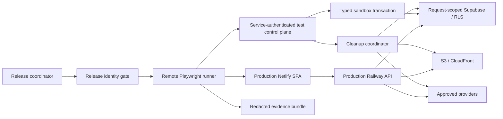

# Production Browser Testing for Agents — Scope and PR Plan

<!-- agent-summary: This proposal makes deployed production browser testing safe, repeatable, and agent-runnable. -->
<!-- agent-summary: Local deterministic and local-Supabase suites remain required; production is an additional tier. -->
<!-- agent-summary: Exact release identities must prove Netlify, Railway, and required database migrations before testing. -->
<!-- agent-summary: Production mutations require service-authenticated sandboxes, normal user RLS paths, and complete cleanup. -->
<!-- agent-summary: Provider canaries require isolated credits, hard spend limits, concurrency caps, and circuit breakers. -->
<!-- agent-summary: Irreversible billing, destructive administration, and injected outages remain outside production. -->
<!-- agent-summary: The PR sequence is ordered so read-only evidence lands before any production mutation authority. -->

Status: Proposed

Owners: Test skeptic, security/data steward, delivery lead

Primary inventory: [End-to-End Test Inventory And Gaps](../testing/e2e-test-inventory-and-gaps.md)

Manual flow source: [Full App Manual Testing Guide](../manual-tests/full-app-inventory.md)

## Executive decision

Popcorn Ready should add a production browser-testing tier that exercises the
actual Netlify SPA, Railway API, hosted Supabase authentication and database,
S3/CloudFront delivery, and selected provider paths. It should not replace the
existing local Playwright or local-Supabase suites.

For this scope, "agents can test everything in production" means:

> Agents can exercise every classified reversible customer workflow through
> deployed production binaries and services, using isolated test identities and
> data, with bounded side effects, attributable evidence, and verified cleanup.

It does not mean using customer workspaces, exposing a service-role secret to a
browser, charging real payment methods, deleting real accounts, or deliberately
breaking shared production dependencies.

The rollout starts with release identity and deployed read smoke. Production
mutation authority comes only after the control-plane threat model, sandbox
lifecycle, cleanup semantics, and cost boundaries exist.

## Verified baseline

The repository already has useful pieces:

- `apps/web/e2e` owns Playwright browser coverage with desktop Chromium and
  mobile Safari/Chrome projects.
- `pnpm test:e2e:local-db` covers real local Supabase signup, identity mapping,
  and request-scoped authentication.
- hosted-auth mode exercises hosted Supabase credentials against a locally built
  SPA and API.
- `test_sandboxes`, `workspaces.purpose = 'internal_test'`, TTLs, `git_sha`, and
  `deploy_id` exist in the production schema.
- shared sandbox code creates a workspace/project root and performs guarded
  teardown.
- the production fixture corpus defines one-project-per-asset mechanical smoke
  behavior for image, video, and audio generation.
- Railway deployment verification waits until the API health response reports
  the pushed commit.

The missing production system is equally concrete:

- Playwright always starts local servers. Hosted mode does not target the
  deployed Netlify and Railway pair.
- there is no `test:e2e:production` command or remote-only Playwright config;
- Web E2E CI runs local suites, while deploy verification stops at API health;
- the deployed web build does not expose a checked release identity;
- the sandbox HTTP lifecycle is deliberately unavailable in production;
- no production runner provisions an isolated QA identity/workspace pair and
  then executes normal authenticated browser writes;
- expired-sandbox cleanup exists in the database but has no complete scheduled
  cleanup path for jobs, storage, providers, or other side effects;
- manual evidence is free-form and can drift away from the active route table.

This is a harness-connection and safety problem, not a reason to replace the
existing tests.

## Goals

1. Verify every production release through the deployed web-to-API path.
2. Let an agent run a classified production flow with explicit preconditions,
   mutations, assertions, budgets, evidence, and cleanup.
3. Exercise authenticated user behavior through request-scoped Supabase clients
   so RLS, domain identity, and workspace membership are genuinely tested.
4. Isolate every mutating run from customer data and from concurrent test runs.
5. Make mutation, provider spend, storage, notification, and public visibility
   side effects explicit and bounded.
6. Record enough redacted evidence to reproduce a failure and attribute it to a
   release, sandbox, role, flow, and deployment.
7. Keep living route/flow coverage machine-checkable without pretending a route
   smoke proves its feature behavior.

## Non-goals

- Replacing unit, API, local Playwright, local-Supabase, or staging tests.
- Exposing the existing `/api/v1/dev/web-e2e/*` router in production.
- Giving Playwright, browser agents, or repository workflows a Supabase
  service-role credential.
- Using production customer workspaces or generated customer media as fixtures.
- Performing real Stripe charges, destructive account deletion, destructive
  admin operations, migration rollback, or dependency fault injection.
- Turning the production fixture corpus into a creative-quality evaluation set.
- Making every provider-backed flow a required per-commit CI gate.

## Coverage tiers

| Tier | Target | Primary proof | Required cadence |
| --- | --- | --- | --- |
| Deterministic browser | Local Vite/API with mocked or seeded HTTP fixtures | UI states, navigation, interaction, recovery, responsive behavior | Every relevant PR |
| Integrated local | Local production build/API plus local Supabase/MinIO where applicable | Migrations, RLS, auth, persistence, reload, storage contracts | Relevant PRs and main |
| Production read smoke | Deployed Netlify + Railway + hosted Supabase | Release coherence, routing, auth guards, proxying, read surfaces, console/network health | Every production release |
| Production sandbox mutation | Deployed stack plus isolated QA identity/workspace | Real writes, reload, cross-workspace denial, uploads, revision actions, cleanup | Serialized release canary or nightly |
| Provider canary | Deployed stack plus real provider/storage/export path | Provider launch, durable progress, graph writes, delivery, structured failure | Scheduled and explicitly budgeted |
| Staging/fault suite | Production-equivalent non-customer environment | Billing, destructive administration, webhooks, outages, retries, migration/fault injection | Before affected releases and scheduled |

No tier can claim coverage owned by another tier. In particular:

- route smoke is not feature coverage;
- a mocked browser response is not persistence or RLS evidence;
- hosted Supabase against local binaries is not deployed production evidence;
- API health is not deployed web evidence;
- a provider API success is not a complete asset, storage, or playback proof.

## Safety invariants

### Release coherence

- A production browser run requires an expected immutable release orchestration
  ID, initially the merge commit SHA.
- The web build and API health response report that shared orchestration ID plus
  their separate artifact hashes.
- Database compatibility is not an artifact identity. API health checks that
  every migration version required by the deployed binary exists in the
  production ledger and that the canonical required-version-set digest matches
  before reporting the release ready. Extra applied versions may appear anywhere
  because the repository intentionally supports out-of-order additive merges.
- A run must fail closed before login or mutation when the deployed web and API
  are on incompatible releases.
- Rolling deploy overlap must not allow an old web build to be marked verified
  against a new API accidentally.
- Roll-forward waits for migrations, then the API, then the web release. A web
  or API rollback may target only a build whose declared migration compatibility
  remains satisfied by the forward-compatible production schema.

### Authentication, identity, and workspace selection

- Current authentication resolves one owned workspace per domain user; adding
  another `workspace_members` row does not select a sandbox workspace.
- Every mutating sandbox therefore provisions one ephemeral Supabase auth user,
  adopted `public.users` row, owned workspace, and owner membership as a single
  identity/workspace pair. Managed reusable QA identities are read-smoke only.
- Ephemeral users carry a trusted, non-client-settable internal-test
  classification from Supabase Admin `app_metadata` into a domain-user purpose
  field. Signup-credit and other user-creation triggers check that classification
  before emitting customer grants or accounting rows.
- Auth creation and public-schema provisioning cannot be one transaction. The
  control plane first records an idempotent provisioning intent, then creates
  Auth/domain state, and compensates partial attempts by deleting any owned
  auth, domain, workspace, credit, and sandbox residue before retry.
- If product-level multi-workspace selection later ships, a separate reviewed
  scope may replace ephemeral identities with a reusable pool. It must carry the
  selected workspace through `/me`, every list/create path, RLS, and reload.
- Admin/member variants use ephemeral identities with the exact role required by
  the charter; concurrent mutations never share a user-global identity.
- Control-plane code stores and compares `public.users.id`, never
  `auth.uid()` outside the database identity bridge.
- Browser writes use the same request-scoped Supabase/API path as normal users.
- The control plane may provision prerequisites but cannot stand in for the
  customer operation being tested.
- QA credentials are secret-manager values, rotated, and never copied into
  agent prompts, scope documents, traces, or test output.

### Tenancy and data

- Every production mutation run owns a unique sandbox ID, ephemeral auth/domain
  identity, workspace, owner membership, canonical project, release ID, and
  expiry.
- `internal_test` data remains excluded from public catalog/discovery and
  customer metrics.
- Teardown queries are fenced by sandbox ID, workspace ID, purpose, and an
  unambiguous generated prefix.
- A test can never adopt an existing workspace or delete by name prefix alone.
- Deliberate parallel-sandbox tests remain possible; release canaries serialize
  only shared external resources that require it.

### Database access

- User-scoped reads and writes remain on request-scoped Supabase clients so RLS
  evaluates the authenticated session.
- New trusted multi-table control-plane workflows use typed direct-Postgres
  transaction modules with explicit workspace, project, actor, and sandbox
  predicates.
- No new application workflow `.rpc()` target is introduced.
- The production API database role receives only the table, column, sequence,
  and routine privileges required by reviewed control-plane transactions.

### Side effects and cleanup

- "Read-only" means a documented allowed-side-effect set, not merely GET
  requests. Login, token refresh, signed-URL minting, and route activity may
  write.
- Before PR 3, read smoke asserts through ordinary QA APIs that it creates no
  visible project, asset, action, run, job, credit, or settings delta for the
  managed read identity. PR 3's least-privilege audit capability adds the
  independent global assertion; earlier runs do not claim it.
- `internal_test` suppresses customer email, webhooks, product analytics,
  notifications, billing, public discovery, and catalog promotion unless a flow
  explicitly tests a safe test sink.
- Teardown does not delete a sandbox while provider or export work is
  non-terminal.
- Cleanup cancels or settles work, fences late workers, removes database rows,
  deletes the ephemeral auth user and storage objects, and handles provider-side
  artifacts when supported.
- When a provider cannot delete an artifact, the result is
  `cleaned_with_external_retention`, not `cleaned`. The charter must allowlist
  the provider, retention/expiry, private-access guarantee, and retained
  artifact identifiers.
- Scheduled expiry cleanup is a backstop. The primary runner always cleans up in
  `finally`.

### Cost and provider safety

- Internal tests use an isolated credit ledger or explicit non-customer test
  allocation; customer balances are never charged.
- Every provider flow declares maximum USD, maximum duration, maximum generated
  assets, and allowed providers/models.
- The platform enforces per-run, per-provider, daily-global, and concurrency
  limits server-side.
- A circuit breaker stops new provider tests after budget, error-rate, or orphan
  thresholds are exceeded.
- Idempotency and provider-claim fencing prevent agent retries from launching
  duplicate paid work.

### Evidence security

- Every artifact is keyed by release ID, E2E run ID, sandbox ID, flow ID, QA
  role, viewport/browser, and timestamps.
- Traces, HARs, screenshots, videos, logs, and URLs are treated as sensitive.
- Authorization headers, cookies, access/refresh tokens, signed media
  parameters, credentials, and private prompts are redacted before upload.
- Artifact access and retention are restricted; durable evidence prefers
  hashes, request IDs, asset IDs, and structured summaries over raw secrets or
  media.

## Target architecture



The Playwright/browser runner and control plane have different authority:

- the browser receives only the QA user's ordinary session;
- the runner receives a short-lived, flow-scoped control-plane capability;
- the control plane owns trusted fixture setup, status inspection, and cleanup;
- service-role and direct-database credentials remain server-side.

## Release identity contract

Add separate typed envelopes for the independently built web and API artifacts:

```ts
interface WebReleaseIdentity {
  releaseOrchestrationId: string;
  gitSha: string;
  webArtifactSha256: string;
  builtAt: string;
  environment: "production";
}

interface ApiReleaseIdentity {
  releaseOrchestrationId: string;
  gitSha: string;
  apiArtifactSha256: string;
  builtAt: string;
  requiredMigrationCount: number;
  requiredMigrationSetSha256: string;
  environment: "production";
}

interface ApiReleaseReadiness extends ApiReleaseIdentity {
  appliedMigrationCount: number;
  appliedRequiredMigrationCount: number;
  appliedRequiredMigrationSetSha256: string;
  databaseCompatible: boolean;
}
```

Proposed surfaces:

- Netlify publishes immutable `/release.json` generated at build time with the
  orchestration ID, git SHA, and web artifact hash.
- Railway `/api/v1/health` returns the same orchestration ID/git SHA, its API
  artifact hash, and the required/applied migration-set fields.
- API build metadata declares the canonical sorted unique migration versions it
  requires plus their SHA-256 set digest. Health reads the applied ledger,
  requires every declared version, filters the ledger to that required set, and
  compares the digest exactly. Additive forward-compatible migrations may be
  lower or higher than the build's versions without breaking compatibility.
- The post-deploy workflow waits for the expected web and API identities.
- Production Playwright verifies both directly and through the same-origin
  `/api` proxy before beginning route checks.

The release orchestration ID, artifact hashes, and matching required-migration
set digest form the browser-test target. Web and API build timestamps are
independent observations, not a shared identity field. A most-recent deploy or
health response from only one service is insufficient.

## Production runner modes

Add a separate `apps/web/playwright.production.config.ts`. It should not add
more conditionals to the local config.

Required behavior:

- never declares `webServer`;
- requires `PLAYWRIGHT_BASE_URL=https://popcornready.ai`;
- requires an expected release ID and production API origin;
- rejects localhost, loopback, private-network, non-HTTPS, and unapproved hosts;
- defaults to zero retries for mutating flows unless the flow explicitly owns
  idempotent replay;
- supports `@prod-read`, `@prod-mutate`, `@provider`, and `@staging-only`;
- writes structured results even when browser startup or release gating fails;
- runs destructive/mutating projects with controlled worker counts;
- supports Chromium desktop plus the smallest meaningful mobile/WebKit set.

Suggested commands:

```sh
pnpm test:e2e:production -- --grep @prod-read
pnpm test:e2e:production -- --grep @prod-mutate
pnpm test:e2e:production -- --grep @provider
pnpm test:prod --flow project-create
```

The generic `test:prod` wrapper resolves a flow charter, performs release
gating, acquires a unique run ID, provisions prerequisites when permitted,
launches Playwright, uploads only evidence allowed by the active evidence
policy, and cleans up.

## Production test control plane

Do not mount the current dev router in production. Introduce a separate internal
boundary with a threat model and least-privilege authentication.

### Authentication

Preferred order:

1. GitHub Actions OIDC exchanged for a short-lived Popcorn test capability.
2. A short-lived signed capability minted by a trusted release coordinator.
3. A rotated machine secret only as an interim fallback.

The capability includes:

- issuer and audience;
- E2E run ID and expected release ID;
- allowed flow IDs and feature set;
- allowed ephemeral QA identity policy and roles;
- maximum TTL, mutations, provider spend, and concurrency;
- not-before/expiry and unique nonce;
- idempotency key.

The control plane rejects browser cookies, arbitrary bearer tokens, expired
capabilities, release mismatch, undeclared features, and scope escalation.

### Minimal operations

The exact URLs are implementation details, but the capability surface is:

- create a sandbox with one ephemeral auth/domain identity, owned workspace, and
  explicit membership;
- seed a declared deterministic prerequisite fixture;
- read sandbox-owned cleanup/status metadata;
- request bounded cancellation and teardown;
- query orphan counts for that run;
- sweep expired sandboxes through a separately authorized scheduled job.

The audit operation exposes only fixed boolean/aggregate predicates correlated
to the QA identity and E2E run ID. It cannot return customer rows, customer
identifiers, arbitrary filters, or arbitrary counts.

There is no general SQL, arbitrary fixture JSON, unrestricted role selection,
workspace adoption, or unscoped delete operation.

### Browser/control-plane separation

Fixture creation may establish a failed run, an expired media URL, or a known
admin/non-admin account state. The visible action under test still runs through
the normal UI and production API. For example:

- control plane seeds an asset as private;
- browser toggles it public through the authenticated product API;
- browser reloads and verifies the projection;
- another unauthenticated browser verifies the asset remains denied because an
  `internal_test` workspace is never effectively public;
- cleanup removes the owned data and storage objects.

Direct unauthenticated visibility is tested only after PR 6 implements the
approved `unlisted_canary` contract.

## Sandbox lifecycle

The existing `test_sandboxes` row is an ephemeral ownership root: its workspace
and project foreign keys cascade when the workspace is deleted. It cannot own
terminal lifecycle evidence. PR 3 must add a separate durable production-browser
run record keyed by E2E run ID. Every reference from that record to ephemeral
state—especially sandbox, workspace, project, and auth/domain user IDs—is either
a non-FK audit UUID or a nullable FK with `ON DELETE SET NULL`. `ON DELETE
CASCADE` and `ON DELETE RESTRICT` are prohibited from the durable record to
`test_sandboxes`, workspaces, projects, or ephemeral users, so cleanup can delete
the sandbox graph and then persist orphan verification, terminal status, and
redacted evidence metadata.

Use an explicit state machine:

```text
provisioning -> active -> settling -> cleaning -> cleaned
                    \-> cleaned_with_external_retention
                    \-> failed_cleanup
                    \-> expired -> settling
```

Minimum durable production-browser run metadata:

- E2E run ID, sandbox audit UUID, release ID, git SHA, deploy IDs;
- owner flow and feature set;
- ephemeral auth/domain user IDs and membership roles;
- workspace/project IDs and generated name prefix;
- provider budget reservation and actual spend;
- status, expiry, cleanup attempts, last error, and orphan counts;
- storage prefixes, external provider artifact references, and allowlisted
  external-retention policy.

Cleanup ordering:

1. stop new browser mutations and provider launches;
2. request cancellation for non-terminal owned work;
3. wait within a bounded settling window;
4. fence late job/worker completion;
5. remove or expire provider-side artifacts where supported;
6. remove private/public storage objects and invalidate delivery where needed;
7. delete the `internal_test` workspace through guarded ownership predicates;
   the cascading `test_sandboxes` row may disappear here, but the durable
   production-browser run record remains;
8. verify database, storage, provider, job, and queue orphan counts against the
   durable E2E run correlation;
9. delete the ephemeral auth/domain identity only after owned work is fenced;
10. mark the durable production-browser run `cleaned`,
    `cleaned_with_external_retention`, or retain a diagnosable
    `failed_cleanup` record.

## Executable flow charters

Long prose remains useful for exploratory testing, but repeatable agent work
needs a machine-readable contract. Store one charter per flow near
`apps/web/e2e/production/flows/` and generate a human-readable coverage view.

Example:

```yaml
id: project-create
owner: web
target: production
tags: [prod-mutate, desktop, mobile]
role: member
fixture: empty-workspace
release_gate: required
allowed_mutations:
  - project.create
  - creation_draft.write
forbidden_side_effects:
  - billing.charge
  - notification.send
provider_budget:
  maximum_usd: 0
assertions:
  - project and draft appear after reload
  - duplicate submit creates one project and one draft
cleanup: sandbox
evidence:
  - structured assertions
  - redacted console and failed requests
  - screenshot on failure
```

Charter validation rejects:

- an unregistered route or role;
- mutations without sandbox cleanup;
- a provider tag without a nonzero bounded budget;
- production billing/destructive/fault permissions;
- absent evidence/redaction policy;
- an internal-test flow that expects public discovery without an approved
  sharing design.

## Route and flow registry

Do not scrape JSX to infer coverage. Introduce an explicit typed route registry
consumed by `App.tsx` and coverage tooling. Each entry should identify:

- path and production/dev visibility;
- public, authenticated, or admin access;
- route-smoke flow ID;
- feature-flow IDs;
- fixture requirements;
- required desktop/mobile coverage;
- whether route navigation has allowed write side effects.

CI then checks:

- every mounted production route has a route-smoke mapping;
- every charter references registered routes and API capabilities;
- dev-only routes cannot enter production flow packs;
- route coverage and feature coverage are reported separately.

## Production coverage matrix

| Surface | Every-release production proof | Sandboxed production proof | Provider/staging proof |
| --- | --- | --- | --- |
| Landing and public navigation | Render, deep links, validation, no console/network errors | Guest handoff when enabled | Provider start remains budgeted |
| Login, callback, logout | Guard, managed QA login, callback, token refresh, logout | Role-specific session and reload | Invalid/expired token fixtures |
| Dashboard and Activity | Authenticated reads and navigation | New activity appears after owned mutation | Long-running projection canary |
| Create launcher + Asset Studio `/create`, `/create/asset` | Intent routing, legacy-link/draft compatibility, goal selection, proposal-only path | Project selection/create, confirm, reload, idempotency | One bounded image/video/audio canary |
| Full project creation | Route and draft entry | Draft write/reload/delete, brief, footage setup, run start | One bounded full-production canary |
| Run progress/review | Existing deterministic state reads | Cancel seeded non-dispatched work; approve/reject/Request Changes only with a fenced test executor | Live polling, dispatch, and terminal provider result |
| Project/storyboard/media/watch | Existing fixture reads and playback fallback | Storyboard generation/revision, selection, media state | Keyframe/clip/export canary |
| Library and media viewer | Pagination/filter/read/navigation | Visibility change, regeneration request, reload | Expiry/delivery canaries |
| Uploads | Route and local staging | Real private upload, metadata, reload where persisted | S3/CloudFront delivery |
| Settings/account | Account/credits read, login/logout | Workspace model settings and ephemeral-user theme; provider keys only through a fenced test sink | Real provider-key persistence and charges stay staging-only |
| Templates/brand/anchors | Route and safe interactions | Persisted actions where supported | Catalog promotion stays controlled |
| Admin/evals | Admin/non-admin guards | Judgment action in sandbox | Bounded eval generation |
| Public project/asset sharing | Private denial and known sanitized canary read | Requires the approved unlisted-canary design inside an `internal_test` workspace | CDN expiry and public/private lifecycle |
| PWA/mobile | Manifest, service worker, deep links, mobile overflow | Safe share-target upload | Native share sheet remains real-device |
| Billing/webhooks/destructive admin | Configuration/contract only | None | Staging adapters and fault injection |

### Public-sharing isolation contract

Current visibility helpers intentionally exclude `internal_test` and `fixture`
workspaces from public reads. Production public-sharing tests must not weaken
that isolation accidentally.

PR 6 must implement an explicit `unlisted_canary` model for projects/assets
inside an `internal_test` workspace. The direct link carries a server-validated,
resource-scoped, expiring, and revocable capability; persisted capability
material is hashed. A capability for one project/asset cannot authorize another,
and cleanup revokes it before deleting the sandbox.

The capability never makes `project_is_public`, public discovery/search helpers,
or ordinary public RLS policies return true, and it cannot mint an indefinitely
public object URL. Media delivery remains bounded by the canary capability and
short-lived delivery authorization. Discovery, feeds, search, customer metrics,
and ordinary public visibility continue to exclude the workspace. Cleanup
therefore remains inside the existing sandbox purpose boundary and never gains
authority to delete a normal `purpose = 'user'` workspace.

Until that model and its guarded cleanup tests exist, public-sharing mutation
remains manual and narrowly approved. An ephemeral normal QA workspace is not an
allowed implementation option.

## Agent run protocol

For a named production flow, the agent:

1. reads the charter and reports its allowed mutations, side effects, budget,
   QA role, and cleanup contract;
2. waits for the expected release identity across Netlify, Railway, and database
   readiness;
3. obtains a short-lived flow capability and unique E2E run ID;
4. provisions a unique ephemeral QA identity and owned sandbox workspace when
   required;
5. logs in through the deployed browser using secret-manager integration;
6. exercises the normal visible product flow at required viewports;
7. records observable assertions, console/page errors, failed requests, request
   IDs, and redacted evidence;
8. settles and cleans the sandbox in `finally`, even after browser failure;
9. verifies orphan counts and reports cleanup status separately from test
   status;
10. publishes the immutable run record and updates living coverage only when the
    charter or implementation changes.

An agent must never infer authority to exceed the charter because a test fails.
Budget increases, destructive recovery, customer-data access, and public
fixture exposure require a new approved capability.

## Evidence schema

Store a small structured result for every run:

```ts
interface ProductionBrowserRun {
  e2eRunId: string;
  releaseId: string;
  gitSha: string;
  webDeployId: string;
  apiDeployId: string;
  flowId: string;
  status: "passed" | "failed" | "blocked";
  cleanupStatus:
    | "cleaned"
    | "cleaned_with_external_retention"
    | "failed_cleanup"
    | "not_required";
  sandboxId?: string;
  role: string;
  browser: string;
  viewport: string;
  startedAt: string;
  completedAt: string;
  assertionResults: Array<{ id: string; status: string; requestIds?: string[] }>;
  allowedSideEffectsObserved: string[];
  forbiddenSideEffectsObserved: string[];
  providerSpendUsd?: number;
  externalRetention?: Array<{
    provider: string;
    artifactIdHash: string;
    expiresAt?: string;
    private: true;
  }>;
  artifactManifest?: Array<{ kind: string; sha256: string; retentionClass: string }>;
}
```

Living coverage documents show the last verified release and date per flow.
Point-in-time production run history lives in immutable artifacts or a dedicated
test-run store, not embedded as the main coverage definition.

## PR sequence

### PR 1 — Release identity and living coverage truth

**Implementation status (2026-08-04):** implemented on the production release
identity branch. Mutation and provider authority remain deferred to PRs 3-7.

Goal:

- establish a shared release identity and repair route/flow documentation drift.

Scope:

- generate Netlify `/release.json` with shared orchestration identity and a
  distinct web artifact hash;
- extend API health with the shared orchestration identity, distinct API
  artifact hash, and required/applied migration-set fields;
- add deployment tests for identity mismatch and rolling overlap;
- introduce the initial typed production route registry;
- make `App.tsx` consume the registry without changing visible routing;
- separate point-in-time production evidence from the living E2E matrix.

Validation:

- web build exposes the expected orchestration identity and artifact hash;
- API health reports the same orchestration identity, its own artifact hash, and
  an exact digest match for the build's canonical required migration-version set;
- the migration workflow, API deploy, and web deploy ordering is exercised for
  roll-forward and compatible rollback;
- route-registry parity tests cover every current production/dev route;
- deliberate web/API mismatch blocks production verification.

Rollback:

- release metadata is additive; the current API health and route table remain
  functional if the post-deploy gate is disabled.

Done when:

- a workflow can prove which web and API release it is about to test.

### PR 2 — Remote production read smoke

Depends on: PR 1.

Scope:

- add `playwright.production.config.ts` with no local `webServer`;
- add `test:e2e:production` and `@prod-read`;
- cover public routes, same-origin API proxy, auth guards, managed QA login,
  dashboard/library reads, console/page errors, failed requests, and critical
  desktop/mobile layouts;
- add a post-deploy workflow that waits for both deploy identities;
- define the minimum evidence store, access policy, retention, and redaction
  implementation/tests before uploading any trace, HAR, screenshot, or video;
- until artifact redaction passes, upload structured assertion summaries only.

Validation:

- the suite fails when pointed at localhost, an unapproved host, or the wrong
  release;
- ordinary QA APIs show no before/after delta in projects, assets, actions, runs,
  jobs, credits, or settings visible to the managed read-smoke identity;
- the remaining global no-write guarantee is explicitly deferred to PR 3's
  least-privilege audit capability and is not claimed by PR 2;
- intentional console error, proxy break, and deep-link break each fail loudly.

Rollback:

- remove or disable the post-deploy workflow; production runtime is unchanged.

Done when:

- every release receives deployed-browser evidence, not only API health.

### PR 3 — Control-plane threat model and sandbox authority

Depends on: PR 1. Can develop alongside PR 2 but cannot enable mutations.

Scope:

- commit the threat model and capability claims;
- add OIDC or signed short-lived capability verification;
- add typed direct-Postgres sandbox create/status/teardown transactions;
- add the durable production-browser run record whose lifecycle/evidence
  survives cascading sandbox workspace deletion;
- add a durable idempotent provisioning-intent record before the Supabase Admin
  call and compensating cleanup for every partial Auth/domain/database state;
- provision one ephemeral Supabase auth/domain identity, owned workspace, and
  explicit membership per sandbox;
- add a trusted non-client-settable domain-user `internal_test` classification
  derived only from Supabase Admin app metadata;
- update signup-credit/user-creation triggers so internal-test identities
  receive no promotional grant, credit transaction, notification, analytics, or
  customer metric before the workspace exists;
- add a read-only, least-privilege audit operation for sandbox/global
  before-and-after invariants required by production smoke;
- add a migration with sandbox-specific `NOBYPASSRLS` policies, column/sequence
  grants, and production health-readiness assertions for the API database role;
- update `docs/scopes/database-access-boundary.md` and the checked privilege/RPC
  inventories in the same PR;
- add audit, idempotency, rate-limit, TTL, feature, and prefix fences;
- keep the current dev router unchanged and production-disabled.

Validation:

- expired, replayed, wrong-audience, wrong-release, and escalated capabilities
  fail;
- creating an ephemeral identity emits no signup grant or user credit
  transaction, and an ordinary signup still receives the configured promotion;
- failures after provisioning intent, Auth creation, domain-user creation,
  workspace creation, and project creation are each idempotently compensated;
- deleting the sandbox workspace cascades the ephemeral `test_sandboxes` row but
  preserves the durable run record for orphan checks and terminal status;
- migration tests prove workspace deletion also removes the ephemeral sandbox,
  project, and user references without cascading or restricting the durable E2E
  run and its terminal correlation fields;
- cross-sandbox reads/deletes fail;
- `/api/v1/me` returns the ephemeral sandbox workspace and every project,
  draft, settings, list, and create path remains in that workspace through RLS;
- adding membership to another workspace does not silently change the selected
  sandbox or authorize cross-workspace operations;
- no service/database credential appears in browser storage or trace output;
- audit results contain only fixed run-correlated booleans/aggregates and cannot
  enumerate or filter customer data;
- direct-role privilege/readiness tests remain least-privilege.

Rollback:

- disable capability minting and internal route mounting; additive sandbox rows
  can be swept through the existing guarded cleanup.

Done when:

- production can create and tear down an isolated QA workspace without granting
  the browser trusted credentials.

### PR 4 — Complete cleanup and side-effect suppression

Depends on: PR 3.

Scope:

- add the sandbox state machine and cleanup coordinator;
- suppress emails, notifications, analytics, webhooks, billing, discovery, and
  catalog promotion for internal tests;
- cancel/settle owned jobs, fence late workers, and remove storage/provider
  artifacts;
- schedule expiry cleanup and expose orphan metrics;
- test crash recovery and `failed_cleanup` retention.

Validation:

- failed browser runs still enter cleanup;
- non-terminal jobs prevent premature deletion;
- late workers cannot recreate data after teardown;
- database, queue, and storage orphan assertions are zero; provider artifacts
  are either zero or recorded under an allowlisted external-retention manifest;
- terminal cleanup status and evidence remain queryable after the workspace,
  project, and ephemeral sandbox row are gone;
- the sweeper never targets a user workspace.

Rollback:

- disable new sandbox creation, leave diagnostics intact, and run guarded cleanup
  for already-created sandboxes.

Done when:

- a test failure cannot silently leave customer-visible or billable residue.

### PR 5 — Deterministic production mutation pack

Depends on: PRs 2–4.

Scope:

- add executable charters for provider-free project/draft creation without run
  start, workspace model settings, ephemeral-user theme, asset visibility,
  cancellation of a seeded non-dispatched run, uploads, eval judgment, and
  reload behavior;
- classify every candidate mutation as `provider_free`, `seeded_state`, or
  `test_executor_required`;
- exclude provider-key mutation and all shared managed-user settings;
- move generation start, approval that wakes work, regeneration, storyboard
  Request Changes, and other provider-dispatching actions to PR 7 unless a
  server-side internal-test executor lands under PR 3's capability threat model;
- use production APIs for the action under test;
- add per-run unique sandboxes and deliberate parallel-sandbox coverage;
- keep provider budgets at zero.

Validation:

- every PR 5 included persisted surface has a write-then-reload assertion;
- PR 5 claims only surfaces classified `provider_free` or safely
  `seeded_state`; `test_executor_required` remains unclassified as covered until
  its fenced executor is implemented;
- duplicate click/retry paths remain idempotent;
- member/admin and cross-workspace denial behavior is proven;
- every run cleans successfully or reports `failed_cleanup` as a separate
  release blocker.

Rollback:

- disable `@prod-mutate`; read smoke and local suites remain available.

Done when:

- the included provider-free and safely seeded reversible workflows are
  continuously exercised in isolated production workspaces without provider
  spend.

### PR 6 — Storage, roles, and unlisted canary sharing

Depends on: PR 5.

Scope:

- add member/admin/non-admin role packs;
- cover private upload, signed URL, S3/CloudFront delivery, expiry, and
  cross-workspace denial;
- implement server-validated, resource-scoped, expiring, revocable
  `unlisted_canary` capabilities only for `internal_test` projects/assets; store
  only capability hashes and keep public/discovery helpers false;
- keep media delivery short-lived and capability-bound; never create an
  indefinitely public object URL for a canary;
- keep cleanup on the existing internal-test sandbox boundary; never authorize
  the canary cleanup path to delete `purpose = 'user'` workspaces;
- verify no internal fixture enters public discovery or customer metrics.

Validation:

- private objects are inaccessible without authorization;
- public/unlisted canary behavior matches its explicit policy;
- missing, forged, expired, revoked, and wrong-project/asset capabilities are
  denied; cleanup revokes live capabilities; and an unlisted canary never
  appears in discovery;
- signed URLs and evidence are redacted;
- cleanup removes storage objects and invalidates access as designed.

Rollback:

- disable sharing canaries while retaining private storage/RLS coverage.

Done when:

- production storage and visibility behavior have browser-level evidence.

### PR 7 — Budgeted provider and export canaries

Depends on: PRs 4–6.

Scope:

- add isolated test credits, server-enforced spend/concurrency/time limits, and
  a global circuit breaker;
- add one-project-per-fixture image, video, audio, and export canaries;
- add the real dispatch/revision flows deferred by PR 5, or a server-side fake
  executor that is capability-, sandbox-, and `internal_test`-fenced and
  impossible to activate for user workspaces;
- record mechanical facts only: terminal state, graph rows, selections,
  delivery metadata, playback, and structured errors;
- schedule separately from every-commit read smoke.

Validation:

- duplicate retries cannot launch duplicate paid calls;
- cost caps stop dispatch before provider launch;
- provider failure and timeout remain structured and cleanable;
- successful assets are playable and attributable to the expected release/run;
- circuit breaker disables further launches after its threshold.

Rollback:

- set provider-test global concurrency/budget to zero; deterministic production
  mutation coverage remains.

Done when:

- the smallest real provider paths are continuously verified with bounded cost.

### PR 8 — Agent UX, evidence expansion, and coverage enforcement

Depends on: PRs 2–7 incrementally.

Scope:

- finish `pnpm test:prod --flow <id>`;
- validate flow charters and route/feature mappings;
- expand the minimum PR 2 evidence policy with additional artifact types,
  retention classes, and redaction fixtures;
- publish last-verified release/date plus orphan/spend dashboards;
- add false-confidence audits for production harness assertions;
- document operator response to failure, cleanup failure, and circuit-breaker
  activation.

Validation:

- an agent can run a flow without learning infrastructure credentials;
- invalid charters fail before acquiring production authority;
- redaction fixtures continue to prove secrets and signed URLs are absent for
  every newly enabled artifact type;
- route smoke and feature coverage remain separate and complete;
- operator runbooks recover or escalate every terminal harness state.

Rollback:

- individual flow charters can be disabled without removing the underlying safe
  control-plane and cleanup primitives.

Done when:

- production browser testing is a routine agent workflow rather than an
  infrastructure improvisation.

## Deployment and cadence

Recommended initial cadence:

- PR: deterministic local browser suite; local Supabase when affected.
- Main merge: existing local browser/PWA plus release build checks.
- Every production release: `@prod-read`.
- Nightly and before high-risk releases: zero-provider `@prod-mutate`.
- Scheduled with explicit daily budget: `@provider`.
- Before billing, auth, webhook, migration, or destructive-admin releases:
  targeted staging/fault suite.

Release policy should initially report production-browser failures without
automatic rollback. After the read suite proves stable and low-noise, make
release-coherence and `@prod-read` blocking. Promote mutating/provider failures
to blocking only after cleanup reliability, orphan metrics, and flake rates meet
an agreed threshold.

## Observability and operator response

Required correlations:

- `X-E2E-Run-ID` on test-originated API requests;
- sandbox ID, release orchestration ID, deploy ID, and flow ID on owned
  runs/jobs/actions;
- structured logs that identify internal-test traffic without recording tokens
  or private prompts;
- orphan, cleanup-failure, provider-spend, and circuit-breaker metrics.

Failure classes:

| Failure | Release interpretation | Required response |
| --- | --- | --- |
| Release mismatch | Test not started | Wait for coherent deploy or investigate rollout |
| Read smoke failure | Deployed regression likely | Block verification and retain redacted evidence |
| Mutation assertion failure, cleanup passed | Product regression likely | Block affected flow; sandbox is safe |
| Cleanup failure | Operational incident | Stop new mutations/providers; investigate orphans |
| Provider canary failure within clean sandbox | Provider/integration degradation | Open circuit based on threshold |
| Evidence redaction failure | Security incident | Do not upload artifact; rotate affected credentials |

## Acceptance criteria for the complete program

- Production web and API artifacts are tied to one release orchestration ID and
  the API proves every required migration version is applied with the exact
  canonical set digest.
- A checked inventory enumerates every production route, customer workflow, and
  reversible persisted surface with exactly one status:
  `covered`, `local_only`, `staging_only`, `manual_only`, or `unsupported`.
- No inventory entry is unclassified. Every `covered` entry names a passing flow
  charter and last verified release; every other status includes a rationale
  and owner.
- Every `covered` reversible persisted surface has a sandboxed
  write-then-reload browser assertion through normal authenticated APIs.
- QA identities and cross-workspace denial exercise the real domain-user/RLS
  model.
- No browser or Playwright artifact receives service-role, database, provider,
  or long-lived machine credentials.
- Every mutating run has bounded authority, TTL, idempotency, audit records, and
  cleanup evidence showing zero owned database, queue, job, and storage orphans,
  or an explicit `cleaned_with_external_retention` manifest.
- Internal tests do not affect customer balances, discovery, metrics,
  notifications, webhooks, or billing.
- Provider tests report actual spend less than or equal to the charter limit and
  daily budget, never exceed configured concurrency, and can be stopped
  globally.
- Evidence is redacted, access-controlled, release-attributed, and separately
  records assertion and cleanup status.
- Production testing complements rather than weakens local deterministic,
  local-Supabase, staging, and real-device coverage.

## Open decisions

The implementation owner must resolve these before the named PR:

1. Release ID format and how Netlify/Railway obtain the same immutable value
   (PR 1).
2. OIDC exchange service versus short-lived signed capability minting
   (PR 3).
3. Ephemeral QA identity creation/deletion mechanism and admin/member role
   provisioning (PR 3). A reusable mutating identity pool is excluded until the
   product has explicit workspace selection.
4. Test credit ledger versus a narrowly scoped internal-test budget bypass
   (PR 7).
5. Evidence store, access policy, and retention periods (PR 2 before artifacts
   are uploaded).
6. Stability thresholds that promote read, mutation, and provider packs from
   advisory to release-blocking.

Recommended defaults are: merge commit SHA as the shared release orchestration
ID with separate web/API artifact hashes, required migration-set digests,
GitHub OIDC, one ephemeral QA identity per mutating sandbox, a separate test
credit ledger, capability-like unlisted canaries inside `internal_test`,
restricted GitHub artifacts with
short retention, and advisory rollout before enforcement.
