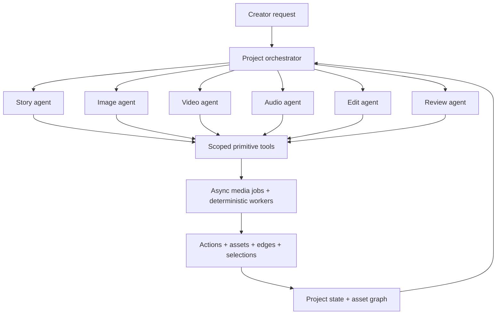
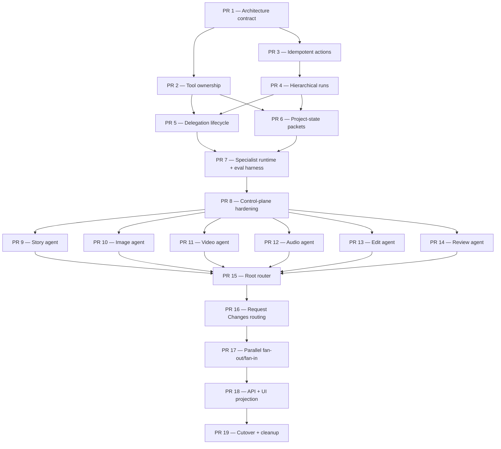

# Specialist-agent orchestration — architecture and PR roadmap

<!-- agent-summary: Proposed roadmap for replacing the all-tools orchestrator with a project router and scoped specialist agents. -->
<!-- agent-summary: The root orchestrator owns intent, project-state reasoning, delegation, blast radius, budget, approval, and completion. -->
<!-- agent-summary: Story, image, video, audio, edit, and review agents own creative execution through role-scoped primitive tools. -->
<!-- agent-summary: Existing granular tools, asset-graph writes, selections, actions, jobs, and deterministic rendering remain the execution foundation. -->
<!-- agent-summary: Specialist runs are durable child orchestrator runs; specialists cannot delegate to one another or silently broaden scope. -->
<!-- agent-summary: Cross-domain prerequisites return typed handoffs to the root, while providers and renderers remain non-agent workers. -->
<!-- agent-summary: Nineteen ordered PRs deliver contracts, durability, specialists, routing, feedback, parallelism, UI projection, and cleanup. -->

> **Status:** Proposed implementation scope. This document does not describe
> shipped behavior. It records the target decision and an independently
> reviewable PR sequence for approval before implementation.
>
> **Sources of truth:** [`NORTH_STAR.md`](../NORTH_STAR.md),
> [`ui-interaction-model.md`](../ui-interaction-model.md), and the asset-graph
> rules in [`CLAUDE.md`](../../CLAUDE.md) remain authoritative until PR 1 lands
> the explicit architecture amendment described below.

## Objective

Make the top-level orchestrator a **project manager and router**, not the agent
that personally reasons over every story, image, video, audio, timeline, review,
and infrastructure tool.

Given a creator request, the root orchestrator should:

1. read a compact projection of current project state;
2. determine the requested scope and affected graph region;
3. select the responsible specialist;
4. issue a typed, bounded work order;
5. coordinate cross-domain prerequisites, budgets, approvals, and completion;
6. reconcile the result into the project and decide what happens next.

Specialist agents do the creative work. Each specialist receives only the
project context relevant to its assignment and only the primitive tools it is
allowed to use. Provider calls, job execution, storage, and rendering remain
server-owned execution infrastructure beneath those tools; final rendering is
deterministic.

## The decision

### One root, six specialists, no deeper hierarchy



The hierarchy stops at two agent levels:

- The **root orchestrator** may delegate to a specialist.
- A **specialist may call its own primitive tools** but may not delegate to
  another specialist or create a grandchild agent run.
- When a specialist discovers a cross-domain prerequisite, it returns a typed
  `handoff_required` result to the root. The root decides whether and how to
  delegate the follow-up.

This preserves one clear owner for project-wide intent and prevents hidden agent
chains, cycles, unbounded context growth, and specialists silently expanding the
blast radius.

### Agent responsibilities

| Agent | Owns | Does not own |
| --- | --- | --- |
| Project orchestrator | User intent, project-state interpretation, routing, dependency/blast-radius decisions, work-order boundaries, budget allocation, approval, completion | Media craft, provider parameters, detailed prerequisite sequences inside one domain |
| Story agent | Brief, narrative blueprint, script, scene/beat and shot planning | Images, clips, audio, timeline assembly |
| Image agent | Visual-anchor planning, anchor images, storyboard tiles, keyframes, still-image revisions | Motion generation, audio, timeline edits |
| Video agent | Motion clips and content-aware edits to existing footage or generated clips | Still-image generation, audio, final timeline structure |
| Audio agent | Voice, dialogue, music, sound, duration fitting, synchronization critique | Visual or timeline generation |
| Edit agent | Timeline assembly, pacing, cuts, compositing intent, deterministic export preparation | Source-media generation and cross-domain quality judgment |
| Review agent | Cross-media critique, continuity/quality checks, issue classification, recommended owner | Mutating assets or automatically spending on revisions |

Export/rendering is deterministic infrastructure, not a seventh creative agent.
`export_video` remains a narrow root-level terminal capability after the edit is
ready and any required approval is satisfied. `publish_to_catalog` remains an
explicit optional distribution action outside the core video-production path.

## Current baseline

As of 2026-07-14, the production orchestrator is a durable single-agent loop:

- `apps/api/src/lib/orchestrator/model.ts` gives one model every registered tool
  schema and asks it to choose at most one tool per turn.
- `apps/api/src/lib/orchestrator/engine.ts` records one action per invocation,
  parks on one async job or approval gate, and resumes from persisted state.
- `orchestrator_runs` has no agent role, parent/child relationship, delegation
  link, typed terminal result, or explicit child wait state.
- `actions` links invocations to one run, but action append is not idempotently
  retryable and actions have no relational delegation link.
- The root model does not yet read a stable-ID project-state view. It receives
  `inputSummary`, compact prior actions, and the tool schemas, so “look at the
  project and route the request” requires a new read projection.
- The leased `orchestrator_dispatches` queue already provides the detached
  execution foundation child runs should reuse.
- The current vocabulary has **18 registered tool names**. Documentation and UI
  projections contain older 15/16/17-tool assumptions and should stop carrying
  hand-maintained tool counts.
- Run projections assume all actions belong to one flat run and impose a static
  tool order for display.
- The same tool-name vocabulary is duplicated across orchestrator type modules,
  and some tools create leaf actions in addition to the engine's wrapper action.
  Delegation needs one canonical invocation identity plus explicit parent-child
  action relationships where leaf actions remain valuable.
- `spent_usd` and model/provider cost records do not currently form one complete
  async cost ledger. Nested runs must not inherit that undercounting or introduce
  double settlement.
- Request Changes appends `board_feedback` into the run, but restart behavior
  still relies partly on fixed stage boundaries rather than graph-scoped
  specialist routing.

This roadmap reuses the durable loop rather than introducing a second workflow
engine.

### Related scopes to reuse, not fork

- [`graph-rerun-decisioning-prs.md`](graph-rerun-decisioning-prs.md) owns the
  graph candidate set, semantic pruning, fingerprint pins, and costed rerun
  proposal. PR 16 integrates that contract rather than inventing a second blast-
  radius model.
- [`regeneration-coverage-prs.md`](regeneration-coverage-prs.md) owns broad
  immutable-version regeneration coverage. Specialists call that vocabulary;
  they do not create mutable replacement paths.
- [`ooda-feedback-loop.md`](ooda-feedback-loop.md) and
  [`ooda-feedback-implementation-prs.md`](ooda-feedback-implementation-prs.md)
  own critique-to-revision learning and feedback capture. The review specialist
  supplies structured findings to that loop.
- [`orchestrator-step-durability.md`](orchestrator-step-durability.md) owns the
  existing bounded store retry work. PR 3 closes its explicitly deferred
  idempotent-action gap.
- [`story-development-agent-handoff.md`](story-development-agent-handoff.md) is
  useful historical context but contains pre-asset-graph assumptions; PR 1 must
  mark superseded sections instead of treating it as current implementation.

## Tool ownership

The existing primitive tools remain granular and idempotent. PR 2 makes the
ownership below executable metadata instead of prompt-only convention.

| Role | Primitive tools |
| --- | --- |
| Story | `create_or_load_brief`, `develop_story_blueprint`, `draft_script`, `plan_shots` |
| Image | `plan_visual_anchors`, `generate_anchor`, `generate_storyboard`, `generate_keyframe`, `regenerate_image_asset` |
| Video | `generate_clip`, `edit_video_asset` |
| Audio | `generate_audio`, `fit_audio_to_picture` |
| Edit | `assemble_timeline` |
| Review | `critique_timeline` |
| Root/control plane | six `delegate_*` tools, deterministic `export_video`, optional explicit `publish_to_catalog`, and model `done` |
| Engine-owned, not model-facing | approval gates, child wait/resume, retries, cancellation, cost settlement |

`request_approval` should stop being a generally available model tool. A
specialist returns a costed proposal or `approval_required`; the root/runtime
creates the gate. This keeps approval a control-plane concern and matches the
observe-first Request Changes contract.

### Cross-domain preconditions

Role scoping intentionally means a specialist cannot always satisfy every
primitive tool error itself.

Example:

```text
Video agent calls generate_clip
  -> tool reports missing beat_keyframe
  -> image tools are not visible to the video agent
  -> video child run returns handoff_required(image, beat_keyframe:<beat id>)
  -> root delegates the bounded prerequisite to the image agent
  -> root retries or resumes the video assignment
```

Within-domain prerequisites stay local. The image agent may move from anchor
planning to storyboard to keyframe because all three belong to its scoped craft.
Changing the story because a shot is difficult does not stay local; that is a
new project-level decision for the root.

## Delegation contracts

The exact TypeScript spelling belongs in PR 1, but every implementation must
preserve these semantics.

### `SpecialistTask.v1`

A typed, versioned work order stored as the delegation action's parameters:

- `role` — one of `story | image | video | audio | edit | review`;
- `objective` — the outcome requested by the root;
- `instruction` — creator intent rewritten for the bounded assignment;
- `target` — stable project, storyboard, scene, beat, panel, asset, lineage, or
  timeline IDs; never position-only references;
- `requiredOutputs` — asset kinds, selection roles, or review artifacts that
  define completion;
- `preserve` — approved assets, fingerprints, selections, or constraints that
  must not change;
- `candidateAffectedAssetIds` — graph-computed candidates the specialist may
  inspect, not an instruction to regenerate all of them;
- `budgetUsd` — the specialist's maximum allocation;
- `approvalContext` — approved proposal/fingerprint token when resuming work
  that required human confirmation;
- `acceptanceCriteria` — concise checks the specialist must satisfy before
  returning `completed`.

The work order is control/audit data, so typed, schema-marked JSONB in
`actions.params` is appropriate. Stable user-facing storyboards, beats, panels,
timelines, and approvals remain relational rows; this roadmap does not move
product structure into JSONB.

### `SpecialistResult.v1`

A compact, typed terminal result persisted on the child run and projected back
to the root:

- `completed` — assignment satisfied; includes output asset IDs and changed
  selection roles;
- `handoff_required` — names the required role, stable target IDs, requirement,
  and why the current specialist cannot satisfy it;
- `approval_required` — includes proposal, affected IDs, pinned fingerprints,
  and estimated cost;
- `blocked_on_user` — the assignment requires genuinely missing creator input;
- `failed` — structured terminal error with retryability.

The root sees the compact result plus IDs, not the specialist's full prompt,
reasoning trace, raw provider response, or media payload.

## Durable run model

Specialists are durable child runs, not in-memory helper calls and not raw
provider jobs.

```text
root orchestrator_run
  -> delegation action (running)
      -> child orchestrator_run (agent_role=image)
          -> primitive actions
              -> async jobs
          -> typed terminal result
      -> delegation action (applied / failed)
  -> root resumes with compact child result
```

Required invariants:

1. A delegation action is created idempotently before its child run.
2. A child run has exactly one parent run and one delegation action.
3. Parent and child always share `project_id` and workspace authorization.
4. A specialist registry cannot contain delegation tools or tools owned by a
   different role.
5. Every primitive call is checked against the work order's stable target IDs;
   a scoped registry alone is not sufficient authorization to touch the whole
   project.
6. Child terminalization finalizes the delegation action exactly once and
   re-enqueues the parent exactly once.
7. Late job completion cannot revive a canceled root or superseded child.
8. Costs are charged once. Root reporting includes descendant spend without
   copying or summing the same charge twice.
9. Approval is rooted in the creator-facing run. Specialists cannot create
   independent user-facing gates.
10. Assets remain immutable; changes mint versions and move selections.
11. Existing action, asset-edge, and selection provenance remains visible even
    though the root sees a compact result.

## PR dependency map



PRs 9–14 intentionally own distinct specialist files and can proceed in
parallel after PR 8. PR 18 is predominantly `apps/web`; it can begin against
fixture payloads once the PR 5 run-tree contract is stable, but it should merge
after the final API projection is known.

## PR roadmap

### PR 1 — Architecture contract and North Star amendment

**Depends on:** this scope being approved.

**Deliver:**

- Add an architecture decision record establishing the two-level hierarchy,
  role boundaries, deterministic worker boundary, and no specialist-to-
  specialist delegation rule.
- Amend `docs/NORTH_STAR.md` Principles 1, 3, 6, 7, and 10: the root owns the
  project flow and blast radius through delegation; one engine means one durable
  runtime reused by every agent; determinism stays in primitive tool contracts;
  specialists self-heal only within their domain; and the **agent system** is
  the only writer while each specialist writes only inside its work order.
- Define `AgentRole`, `SpecialistTask.v1`, `SpecialistResult.v1`, and terminal
  outcome types in a focused shared module.
- Document the six root delegation capabilities and direct export boundary.
- Correct tool-count drift by removing hard-coded counts from authoritative
  prose.

**Acceptance:** reviewers can classify every current tool, every future tool
must declare an owner, and the new model no longer conflicts with the North Star
language.

**Validation:** shared-package type tests, documentation links, and
`pnpm agent:validate -- --scope docs`.

### PR 2 — Tool ownership metadata and role-scoped registry views

**Depends on:** PR 1.

**Deliver:**

- Add required `ownerRole`/capability metadata to primitive tool definitions.
- Replace the duplicated orchestrator/orchestrator-tool name unions with one
  canonical capability catalog that also owns label, execution mode, cost
  class, and gate metadata.
- Create explicit registry builders for `story`, `image`, `video`, `audio`,
  `edit`, and `review`; avoid a new catch-all `index.ts`.
- Add an assertion that every primitive tool has exactly one owner.
- Prevent a specialist registry from containing root delegation/control tools
  or tools owned by another role.
- Convert cross-domain `suggestedNextTools` into a role-level handoff candidate
  instead of exposing the missing tool to the wrong specialist.
- Make run/UI labels derive from the same metadata where practical, eliminating
  duplicate tool-order/count maps.

**Acceptance:** registry tests prove the exact mapping in [Tool ownership](#tool-ownership)
and fail when an unowned or multiply owned tool is registered.

**Validation:** orchestrator-tool registry unit tests and tool-test bridge tests.

### PR 3 — Idempotent action lifecycle and stable invocation IDs

**Depends on:** PR 1. Can proceed in parallel with PR 2.

**Deliver:**

- Preallocate a stable action/tool-call UUID before executing a mutating tool.
- Let `createAction` accept that ID or an explicit invocation idempotency key.
- Add a uniqueness constraint that makes invocation recording safely
  retryable within a run.
- Record `running` before a child run or external job is launched, then patch
  lifecycle fields on completion.
- Add `parent_action_id` (or the equivalent relational link) for leaf actions
  emitted inside one primitive invocation, and pass the canonical action ID into
  asset/provider paths instead of minting unrelated wrapper identities.
- Include `recordInvocation` in bounded store retry without risking duplicate
  action rows.
- Preserve immutable decision fields and append-only audit behavior.

**Acceptance:** crash/retry tests prove one logical invocation creates one
action even when the write response is lost or the dispatch is reclaimed.

**Validation:** migration/RLS tests, store integration tests, engine retry tests,
and the existing action immutability tests.

### PR 4 — Hierarchical orchestrator-run schema and store

**Depends on:** PR 3.

**Deliver:**

- Add additive relational hierarchy fields to `orchestrator_runs`: `agent_role`,
  `root_run_id`, `parent_run_id`, and `delegation_action_id` (exact names may
  follow local conventions).
- Add a typed, schema-marked terminal result surface for specialist results.
- Add parent/role indexes and database constraints for same-project ownership,
  one parent action per child, no self-parenting, and maximum supported depth.
- Extend store mappers and queries for child creation, child listing, root
  lookup, and run-tree reads.
- Extend RLS through project/workspace ownership using existing helpers; never
  compare domain IDs directly to `auth.uid()`.
- Keep dispatch rows one-per-run so child runs reuse the existing leased queue.

**Acceptance:** DB tests create a root and six role variants, reject invalid
links/cross-project children, and read the tree under the correct workspace.

**Validation:** local Supabase migration check, API store tests, RLS/tenancy
tests, and no migration-history rewrite.

### PR 5 — Delegation tool and parent/child execution lifecycle

**Depends on:** PR 4 and PR 2.

**Deliver:**

- Implement the server-owned primitive for creating a specialist child run
  from a typed task and the pre-recorded delegation action.
- Make child creation plus dispatch enqueue atomic/idempotent so a crash cannot
  leave an unreachable child or enqueue the same work twice.
- Add child wait/resume semantics distinct from media-job wait semantics.
- Finalize the delegation action from the child terminal result and propagate
  output asset IDs to the root's compact prior-result projection.
- Re-enqueue the root exactly once after child terminalization.
- Ensure failed/reclaimed dispatches, inline-fast child completion, and late
  callbacks cannot create concurrent root turns.
- Keep the root and child as separate durable histories; do not copy every
  child primitive action into the root action log.
- Enforce depth, per-root child-count, and turn limits at the runtime boundary.

**Acceptance:** an engine test executes root → child → async primitive job →
child resume → root resume across process boundaries with no duplicate action or
turn.

**Validation:** engine, recovery-worker, dispatch-lease, race, and cancellation
unit/integration tests.

### PR 6 — Project-state projection and specialist context packets

**Depends on:** PR 2 and PR 4. Can proceed in parallel with PR 5.

**Deliver:**

- Build a typed project-state projection for the root containing active assets,
  active selections, relevant relational story objects, run/child status,
  approvals, and graph stale candidates.
- Build role-filtered context packets that include stable IDs and concise
  summaries rather than raw media or full project dumps.
- Make target scope explicit for project, storyboard, scene, beat, panel, asset,
  lineage, timeline item, or export requests.
- Thread that target scope into tool execution context and reject primitive
  inputs that reach outside the authorized work order.
- Separate trusted system instructions from creator/project content to reduce
  prompt-injection risk.
- Enforce workspace/project authorization before a task packet is assembled.
- Add compaction/windowing rules so long child histories do not grow model
  context without bound.

**Acceptance:** fixtures prove each role receives the context it needs and does
not receive unrelated provider secrets, raw media payloads, hidden tools, or
cross-project data.

**Validation:** projection unit tests, tenancy tests, token-size fixtures, and
Request Changes target fixtures.

### PR 7 — Reusable specialist runtime and split evaluation harness

**Depends on:** PRs 5 and 6.

**Deliver:**

- Parameterize the existing durable engine with an `agentRole`, role prompt,
  role registry, role context builder, and role completion policy.
- Keep one implementation of parking, resumption, action recording, provider-key
  context, and error handling; do not fork six engines.
- Reject recursive delegation from specialist runs.
- Translate out-of-domain precondition misses into `handoff_required`.
- Split evaluations into root-routing decisions and specialist leaf-tool
  decisions.
- Add a shared specialist test harness with fake stores plus opt-in real-model
  cases.

**Acceptance:** a fixture specialist can call only its two fake owned tools,
complete durably, return a compact result, and request a cross-domain handoff
without seeing the other role's schema.

**Validation:** model tests, engine tests, registry-isolation tests, decision
eval fixtures, and opt-in real-provider routing eval.

### PR 8 — Budget, approval, cancellation, and recovery across the run tree

**Depends on:** PR 7.

**Deliver:**

- Allocate child budgets from root remaining budget and settle actual spend
  exactly once.
- Reconcile async media cost and model-call cost into the same root run family;
  do not rely only on synchronous `ToolCallResult.costUsd`.
- Roll descendant model/provider costs into root reporting without double
  charging credits.
- Convert `approval_required` results into root gates addressed to a delegation
  action/work order—not only a raw tool name—with proposals, affected IDs,
  estimates, and pinned fingerprints.
- Cascade root cancellation to active children and cancellable jobs; ignore late
  completion after cancellation/supersession.
- Define retry/redelegate policy for recoverable child failure and terminal
  policy for non-recoverable failure.
- Extend recovery sweeps and dispatch leases to parent/child waits.

**Acceptance:** tests cover insufficient credits, mid-child budget exhaustion,
approval/rejection, root cancellation, child failure, worker crash, late job
completion, and exactly-once parent resume.

**Validation:** engine/store/credit-ledger/gate/recovery tests plus a local
cancel-and-resume API smoke.

No media specialist may be enabled against live provider work before this PR.

### PR 9 — Story specialist

**Depends on:** PR 8.

**Owns:** new story-agent prompt/config/evals and story registry file. Avoid
editing other specialist files.

**Deliver:**

- Scope the story agent to brief, blueprint, script, and shot/beat plan tools.
- Make blueprint/script optional for visual-first and uploaded-footage projects.
- Preserve duration-aware planning and stable IDs.
- Support story-level Request Changes by minting new graph-backed versions and
  returning affected narrative/plan assets.
- Return handoffs for visual, audio, motion, or edit work rather than calling
  those tools.

**Acceptance:** fresh prompt, existing-brief, visual-first, uploaded-footage,
story revision, and rejected-plan scenarios route correctly and persist the
expected provenance chain.

**Validation:** story decision evals, primitive tool tests, asset-edge
assertions, and opt-in tool smoke.

### PR 10 — Image specialist

**Depends on:** PR 8.

**Owns:** new image-agent prompt/config/evals and image registry file.

**Deliver:**

- Scope the image agent to visual-anchor planning, anchors, storyboard tiles,
  keyframes, and immutable still-image regeneration.
- Narrow any project-wide image primitive with explicit beat, panel, anchor, or
  asset targets before relying on it for a bounded work order.
- Let it satisfy image-domain prerequisites locally.
- Preserve anchor identity, selected storyboard/keyframe slots, content hashes,
  and graph inputs.
- Keep minor/photorealistic-provider routing in deterministic tool contracts,
  including the Gemini requirement.
- Return a story handoff when the requested visual change requires narrative
  restructuring and a video handoff when motion is the requested output.

**Acceptance:** `beat -> storyboard -> keyframe` and targeted image revision run
inside one image child; missing story/plan returns a bounded handoff.

**Validation:** image decision evals, provider-policy tests, tool batteries,
asset/selection assertions, and opt-in image smoke.

### PR 11 — Video specialist

**Depends on:** PR 8.

**Owns:** new video-agent prompt/config/evals and video registry file.

**Deliver:**

- Scope the video agent to new beat clips and content-aware edits of existing
  footage/generated clips.
- Require named beat/source-asset targets; do not let a bounded assignment fan
  out across every missing clip implicitly.
- Disambiguate “make a new take” (`generate_clip`) from “change this footage”
  (`edit_video_asset`).
- Preserve immutable source links, selected beat-clip roles, duration/provider
  constraints, and uploaded-footage grounding.
- Translate missing keyframe/anchor requirements into image-agent handoffs.
- Return edit/audio handoffs rather than altering timelines or sound.

**Acceptance:** new-clip, uploaded-footage edit, generated-clip edit, missing
keyframe, and unsupported-duration scenarios route correctly.

**Validation:** video decision evals, tool batteries, graph lineage assertions,
and opt-in provider smoke.

### PR 12 — Audio specialist

**Depends on:** PR 8.

**Owns:** new audio-agent prompt/config/evals and audio registry file.

**Deliver:**

- Scope the audio agent to narration/dialogue/music/sound generation and fitting
  audio to picture.
- Add explicit narration, dialogue, music, beat, or timeline-slot targets where
  current tools only accept project-wide intent.
- Preserve typed mix/alignment metadata, active audio selections, and timing
  critiques.
- Distinguish rewriting spoken content (story handoff) from regenerating voice
  delivery or fitting existing text (audio work).
- Return edit/video handoffs when picture timing must change.

**Acceptance:** voiceover, music, refit, dialogue-text change, and picture-too-
short scenarios produce the correct local work or handoff.

**Validation:** audio decision evals, alignment tests, tool batteries, asset-edge
assertions, and opt-in audio smoke.

### PR 13 — Edit specialist

**Depends on:** PR 8.

**Owns:** new edit-agent prompt/config/evals and edit registry file.

**Deliver:**

- Scope the edit agent to deterministic timeline assembly driven by creative
  pacing/cut/compositing intent.
- Read selected source media by ID and persist the composite timeline plus child
  edges.
- Return media handoffs for missing or unsuitable source assets rather than
  generating them.
- Produce an export-ready outcome but do not render or publish.

**Acceptance:** generated-media assembly, uploaded-footage assembly, pacing
revision, missing audio, and missing clip scenarios behave correctly.

**Validation:** edit decision evals, timeline tests, composite edge assertions,
and deterministic assembly smoke.

### PR 14 — Review specialist

**Depends on:** PR 8.

**Owns:** new review-agent prompt/config/evals and review registry file.

**Deliver:**

- Scope the review agent to read-only inspection and `critique_timeline`.
- Return structured issues classified by owning role, target stable IDs,
  severity, confidence, and whether creator approval is required.
- Never regenerate, reselect, assemble, or export from the review child.
- Support acceptance criteria for continuity, visual quality, audio fit, pacing,
  safety, and output readiness.

**Acceptance:** a mixed critique produces bounded recommendations for multiple
roles without performing the revisions itself.

**Validation:** review decision evals, structured-output tests, and cross-domain
issue fixtures.

### PR 15 — Root orchestrator router and delegation tool surface

**Depends on:** PRs 9–14.

**Deliver:**

- Replace the root model's 18-tool catalog with six typed `delegate_*` tools,
  deterministic `export_video`, optional explicit catalog publishing, and
  `done`.
- Feed the root the project-state projection and compact specialist outcomes.
- Make the root choose scope/role, not leaf media tools or provider settings.
- Add routing for fresh runs, partial projects, resumes, and multi-domain
  creator requests.
- Ship behind a temporary `POPCORN_SPECIALIST_AGENT_ROUTER` flag, off by default.
- Do not execute both old and new generation paths in shadow mode; comparison
  mode may evaluate decisions only, never duplicate billable work.

**Acceptance:** root evals select the right specialist/export/done across the
full scenario matrix and cannot name a primitive tool.

**Validation:** root decision evals, end-to-end fake child runs, existing entry
route tests, and one local API smoke with mocked media providers.

### PR 16 — Request Changes and graph-scoped selective regeneration

**Depends on:** PR 15.

**Deliver:**

- Route every object-scoped Request Changes message through a new/revived root
  turn with its stable target IDs and current provenance.
- Replace fixed restart-stage boundaries with `downstream_assets()` candidates
  plus root semantic pruning.
- Produce a proposed specialist work plan before expensive/fan-out revisions.
- Preserve unaffected assets and selections; mint new versions only for changed
  work and reconcile downstream selections through the responsible specialists.
- Keep approval, rejection, and direct selection among existing assets as the
  existing explicit UI carve-outs.

**Acceptance:** image-only, clip-only, narration-only, pacing-only, upstream
character, and multi-domain requests regenerate only the approved affected
region and remain auditable.

**Validation:** API integration tests with real graph fixtures, Request Changes
component/API E2E, and stale-candidate/pruning decision evals.

### PR 17 — Parallel specialist fan-out and deterministic fan-in

**Depends on:** PR 16. Serial delegation must be stable first.

**Deliver:**

- Let the root issue one typed delegation plan containing independent child
  tasks, such as image and audio work.
- Create children atomically/idempotently and park the root on a durable join.
- Resume only when the required children are terminal; keep optional/failed
  branches explicit.
- Add budget reservation so concurrent children cannot collectively exceed the
  root ceiling.
- Reconcile immutable assets/selections using fingerprints so late results
  cannot overwrite newer choices.
- Keep within-agent beat/provider fan-out in server-owned jobs; do not make the
  LLM micromanage each parallel unit.

**Acceptance:** image+audio children execute concurrently, survive one worker
restart, respect budget, and fan into edit/review exactly once.

**Validation:** concurrency/race tests, dispatch lease tests, fingerprint
conflict tests, and a timed mocked-media smoke showing real overlap.

### PR 18 — Hierarchical run API and observe-first UI projection

**Depends on:** PR 17 API contract. Web fixture work may begin earlier.

**Deliver:**

- Extend run-detail APIs with a compact root/child hierarchy and specialist
  labels while preserving assets/actions as the source of truth.
- Project creator-facing stages from specialist outcomes, not a numbered list of
  primitive tools.
- Allow inspection/drill-down into specialist actions, jobs, produced assets,
  and handoffs without exposing internal reasoning traces.
- Show one creator feedback/approval loop; do not add direct-edit controls.
- Use TanStack Query for run-tree polling, cache updates, and invalidation.
- Add route/component CSS Modules only; do not grow legacy global styles.

**Acceptance:** users can understand what the orchestrator delegated, which
specialist is active/waiting, what it produced, and what needs approval on
desktop and mobile.

**Validation:** API projection tests, web unit tests, browser inspection at
desktop/mobile, behavior-focused Playwright coverage, and E2E inventory update.

### PR 19 — Enable, delete the flat root surface, and update diagrams

**Depends on:** PR 18 and green end-to-end parity evidence.

**Deliver:**

- Enable specialist routing by default and remove the temporary flag in the
  same or immediately following commit.
- Delete the root model's primitive-tool exposure and obsolete flat-routing
  prompt/evals; keep the primitive implementations for specialists.
- Remove fixed stage-restart logic that the graph-scoped feedback path replaced.
- Update `NORTH_STAR.md`, async-orchestrator research status, tool docs, manual
  tests, and operator runbooks to the as-built hierarchy.
- Replace the public sequential pipeline infographic with three views: product
  architecture, orchestrator runtime, and data/lineage model. Do not market the
  hierarchy as shipped before this PR.
- Remove stale tool counts and generate detailed registry documentation from
  ownership metadata where practical.

**Acceptance:** all production entrypoints use the root router; the root cannot
call a primitive media tool; all primitive tools remain reachable through
exactly one specialist; no fallback flat controller remains.

**Validation:** full API tests, required provider-neutral E2E, selected opt-in
tool smokes, migration status, docs validation, browser visual QA, and production
deployment smoke.

## Required scenario matrix

The roadmap is not complete unless the final eval/test suite covers at least:

| Creator/project state | Expected root decision |
| --- | --- |
| Fresh idea | Story agent |
| Visual-first short with brief, no script | Story or image agent depending on whether a shot plan exists |
| Shot plan without storyboard/keyframe | Image agent |
| Selected keyframes without clips | Video agent |
| Clips without audio | Audio or edit agent based on brief requirements |
| Media ready, no timeline | Edit agent |
| Timeline ready, not reviewed | Review agent |
| Reviewed/approved timeline | Deterministic export |
| “Make this still warmer” | Image agent scoped to the asset |
| “Remove the logo from this footage” | Video agent scoped to the source asset |
| “Shorten this narration” | Audio agent unless words/story meaning must change, then Story agent |
| “Make the opening faster” | Edit agent, with media handoff only if source coverage is insufficient |
| “Rename the protagonist everywhere” | Story agent first, then graph-scoped image/video/audio/edit follow-ups |
| Missing keyframe discovered by video | Image handoff through root, then video retry |
| Cross-domain quality defects | Review result → root delegates each approved repair |
| User cancels during child media job | Root and child cancel; late result cannot revive them |
| Two independent repairs | Parallel children, budget reservation, deterministic fan-in |

## Merge-conflict plan

- PRs 9–14 each own one role file, prompt, and eval scenario module.
- PR 2 creates the role-specific registry boundary before specialist PRs start,
  so they do not all edit `default-registry.ts`.
- PRs 3–5 own run/action/engine infrastructure sequentially.
- PR 18 owns API projection and web files after the hierarchy payload stabilizes.
- PR 19 is the only broad cleanup/documentation synchronization PR.
- Avoid new route/feature `index.ts` aggregators; use explicit files such as
  `story-agent.ts`, `image-agent.ts`, `specialist-runtime.ts`, and
  `run-tree-projection.ts`.

## Rollout gates

Do not enable specialist routing by default until all are true:

1. Root routing evals meet the agreed pass threshold across repeated samples.
2. Every specialist has registry-isolation tests and leaf-tool decision evals.
3. A provider-neutral end-to-end run reaches export through child runs.
4. Request Changes passes at least one image, video, audio, edit, and upstream
   multi-domain regeneration scenario.
5. Parent/child crash recovery, cancellation, approval, and budget tests pass.
6. The UI accurately projects active/waiting/failed child work.
7. No primitive tool is exposed to the root or owned by multiple specialists.
8. No retired schema surface, untyped product JSONB, or direct-edit UI is added.

## Non-goals

- Replacing the immutable asset graph or relational storyboard model.
- Creating an “agent” wrapper around deterministic provider calls, queues,
  storage, selection writes, or Remotion rendering.
- Letting specialists chat directly, delegate recursively, or share unrestricted
  registries.
- Passing raw video, image bytes, provider responses, secrets, or full action
  histories through model context.
- Building a new workflow engine beside the existing durable orchestrator.
- Reintroducing a fixed forward-only pipeline or stage tables.
- Adding direct content-edit controls to the dashboard.
- Supporting arbitrary third-party specialist plugins in the first cutover.

## Definition of done

- The root orchestrator sees only project state, compact child outcomes, six
  delegation capabilities, deterministic export, optional publishing, and
  `done`.
- Each specialist sees only its scoped context and owned tools.
- Cross-domain needs become typed root-mediated handoffs.
- Runs, delegations, primitive actions, jobs, assets, dependencies, costs, and
  selections remain durable and auditable across restarts.
- Creator feedback produces a costed, graph-scoped specialist plan and
  regenerates only approved affected assets.
- Independent specialists can execute concurrently and reconcile safely.
- The UI presents one understandable orchestrated production and feedback loop,
  with drill-down for inspection but no direct content mutation.
- The flat all-tools root prompt, fixed restart boundaries, stale tool counts,
  and sequential public diagram are removed.
