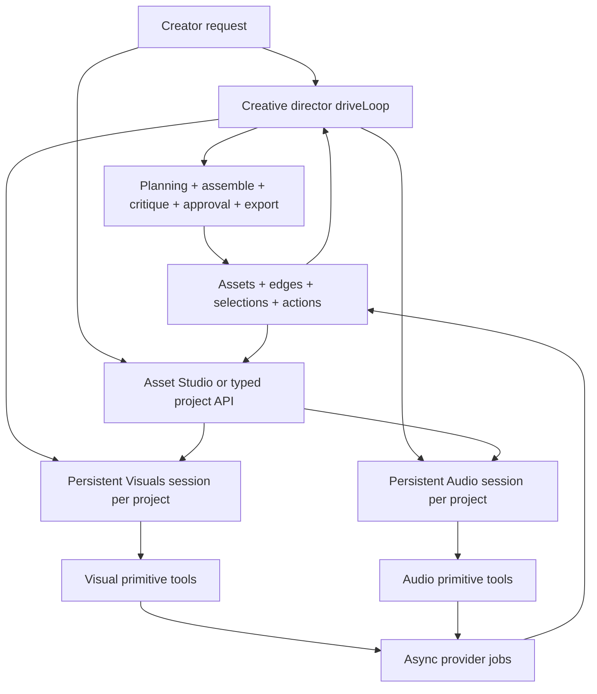
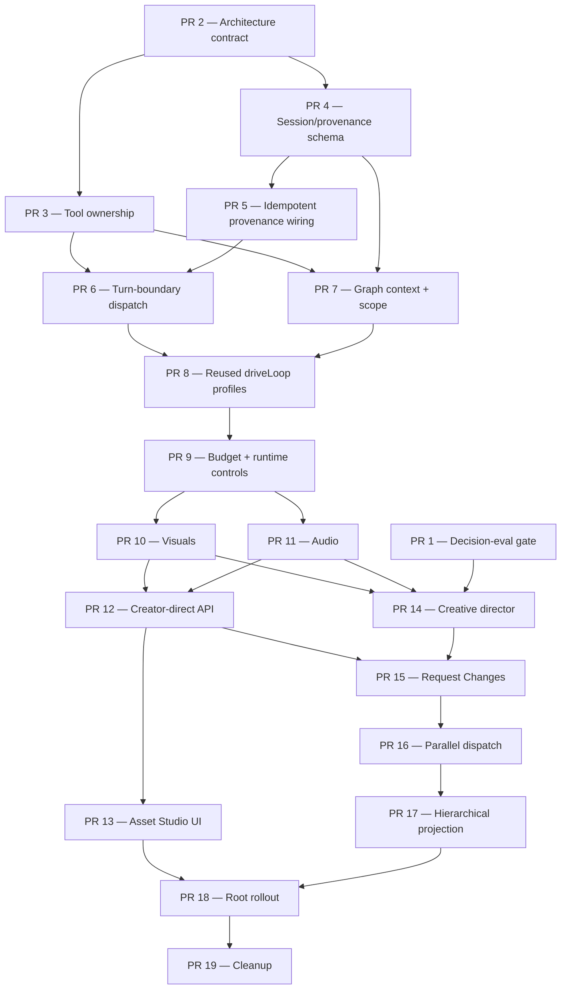

# Creative-director and domain-agent orchestration — architecture and PR roadmap

<!-- agent-summary: Proposed roadmap for a creative director, persistent domain agents, and standalone domain creation. -->
<!-- agent-summary: The creative director owns planning, cross-modality coherence, timeline assembly, critique, approval, routing, and export. -->
<!-- agent-summary: Visuals and Audio reuse the existing driveLoop and the same project-scoped session from either root or creator-direct work. -->
<!-- agent-summary: Inter-agent communication occurs only at durable turn boundaries through done, blocked, or question reports. -->
<!-- agent-summary: The immutable asset graph is the only canonical creative-state channel; tasks and reports carry intent and stable IDs. -->
<!-- agent-summary: Creator-direct image, video, and soundtrack work uses typed project APIs and a calm agent-directed Asset Studio UI. -->
<!-- agent-summary: Actions record trusted origin, session, assignment, run, job, and asset lineage from the first implementation slice. -->
<!-- agent-summary: Nineteen ordered PRs cover evaluation, contracts, durability, agents, standalone creation, hierarchy, rollout, and cleanup. -->

> **Status:** Proposed implementation scope. This document does not describe
> shipped behavior. It records the target decision and an independently
> reviewable PR sequence for approval before implementation.
>
> **Sources of truth:** [`NORTH_STAR.md`](../NORTH_STAR.md),
> [`ui-interaction-model.md`](../ui-interaction-model.md), and the asset-graph
> rules in [`CLAUDE.md`](../../CLAUDE.md) remain authoritative. PR 2 records the
> shared domain contracts without overriding the central-agent principle; the
> hierarchy-specific North Star amendment moves to Gate-0-approved PR 14.

## Objective

Keep one agent responsible for the **creative whole** without forcing that
agent to reason over every media-generation tool.

The root orchestrator is the project's **creative director and router**. It
owns the brief, story development, shot planning, cross-modality coherence,
timeline assembly, critique, approval, blast radius, and final export. It
delegates bounded generation assignments to persistent domain agents and
reconciles their results into one coherent production.

Domain agents own execution craft. They can also be invoked directly from a
project-scoped API and UI for a bounded image, video, or soundtrack request,
without starting a full creative-director production. "Independent" means
independent of the full production flow, not detached from a project, asset
graph, provenance, authorization, budget, or durable session.

The first cut has two domains because that
is the smallest partition supported by the current tool vocabulary:

- **Visuals** owns the complete still-to-motion chain, including anchors,
  storyboards, keyframes, clips, and visual revisions.
- **Audio** owns voice, dialogue, music, sound, fitting, and audio revisions.

Each agent is the same durable `driveLoop` configured with a different prompt,
tool registry, context source, and completion policy. This roadmap does not add
a second agent runtime or turn creative choices into an opaque server workflow.

## The decision

### One creative director, persistent domain agents, no deeper hierarchy



The hierarchy stops at two agent levels, while creator-direct work enters at
the domain level:

- The creative director may dispatch work to a domain session.
- The creator may request a bounded domain outcome through the typed API/UI.
  Image and Video are task kinds in Visuals; Soundtrack is a task kind in
  Audio. They are not separate agents or separate sessions.
- A domain agent may call its own primitive tools but may not dispatch another
  agent or silently broaden its assignment.
- A cross-domain prerequisite returns as `blocked`. For root-origin work, the
  creative director decides whether to dispatch a sibling. For creator-direct
  work, the UI offers an explicit choice to attach a valid dependency or hand
  the request to the full-production flow; it never silently starts one.
- A creative judgment outside a domain's authority returns as `question`. The
  response is addressed to the creative director for root-origin work and to
  the creator-facing conversation for creator-direct work. The answer creates a
  successor assignment in the same domain session.

There is no free-form agent chat and no mid-flight message injection. Every
inter-agent exchange is a persisted, replayable turn boundary.

### The creative director is not a router alone

Routing is one responsibility, not the identity of the root agent. The root
must retain the tools and context where project-wide coherence is decided:

- brief, story, script, shot, and visual-anchor planning;
- visual tone versus audio mood;
- narration duration versus picture duration;
- pacing, cuts, and timeline assembly;
- whole-cut critique and repair prioritization;
- approval proposals and budget tradeoffs;
- export readiness and completion.

The root delegates detailed media execution and provider-level recovery. It
does not delegate ownership of the creative whole.

### Same loop, different agents

The existing engine in `apps/api/src/lib/orchestrator/engine.ts` already:

1. loads a durable run and its prior actions;
2. asks a model to choose one available tool or finish;
3. executes and records the tool call;
4. parks on an async job or approval gate; and
5. resumes by applying the same loop to persisted state.

It also already accepts injected `model` and `registry` dependencies. The new
architecture turns those injection seams into an explicit production
configuration:

```text
AgentDefinition = role prompt + scoped registry + context source + outcome policy
Agent invocation = existing driveLoop + AgentDefinition + durable run
```

The current system effectively runs:

```text
driveLoop(one root prompt, one flat history, all primitive tools)
```

The target runs the same implementation in three configurations:

```text
driveLoop(creative-director prompt, root context, root tools)
driveLoop(visuals prompt, Visuals session context, visual tools)
driveLoop(audio prompt, Audio session context, audio tools)
```

Reusing the loop does **not** mean the work is configuration-only. Durable
sessions, assignment provenance, turn-boundary scheduling, typed outcomes,
scope enforcement, and tree-wide controls still require implementation. It
means parking, resumption, action recording, job waiting, provider-key context,
and failure handling remain one shared engine rather than multiple forks.

### Responsibilities

| Agent or layer | Owns | Does not own |
| --- | --- | --- |
| Creative director | User intent, brief/story/script/shot/visual-anchor planning, cross-modality coherence, routing, blast radius, timeline assembly, critique, approval, budget tradeoffs, export, completion | Provider parameters, fine-grained media generation, in-domain prerequisite sequences |
| Visuals | Anchor-image generation, storyboard tiles, keyframes, clips, still/video revisions, visual continuity inside an assignment | Story/anchor-plan rewrites, audio, timeline assembly, approval, cross-project decisions |
| Audio | Voice, dialogue, music, sound, fitting audio to picture, audio continuity inside an assignment | Story rewrites, visuals, timeline assembly, approval, cross-project decisions |
| Durable runtime | Turn execution, persistence, dispatch claims, waiting, retry, cancellation, authorization, cost settlement, gates | Creative routing, aesthetic judgment, hidden workflow sequencing |
| Providers/workers | Deterministic execution of a chosen tool, storage, rendering | Agent decisions, delegation, project interpretation |

`export_video` remains deterministic execution invoked by the creative
director. `publish_to_catalog` remains an explicit optional distribution action
outside the core video-production path.

Future domain agents are possible, but a new domain must be justified by a
cohesive tool cluster and decision-eval evidence. The design does not target a
particular number of dispatch tools.

## Decision Gate 0 — prove the root hierarchy is worth activating

The root hierarchy is an adoption option, not an assumption that more agents
are automatically better. Standalone image, video, and soundtrack creation is
an explicit product requirement and does not depend on the hierarchy winning
the comparison. Before activating the root cutover, expand the existing
orchestrator decision evals and establish a repeated-sample baseline for:

- wrong next-tool or premature-done decisions;
- performance as project history and available tools grow;
- cross-modality coherence decisions;
- recovery from within-domain and cross-domain precondition misses;
- unnecessary turns and repeated failed calls; and
- selective-regeneration decisions with stable graph IDs.

Agree on a material-improvement threshold before running the comparison. PRs
2–13 establish the shared domain runtime and independently requested Asset
Studio even if the flat root is not measurably suffering. A defer decision
blocks PR 14 and hierarchy-specific PRs while leaving the standalone product
path usable. Do not run both root architectures against live billable providers
for comparison; compare decisions with fixtures or mocked execution.

## Current baseline

As of 2026-07-14, the production orchestrator is one durable all-tools agent:

- `apps/api/src/lib/orchestrator/model.ts` gives one model every registered tool
  schema and asks it to choose at most one tool per turn.
- `apps/api/src/lib/orchestrator/engine.ts` implements the durable `driveLoop`,
  records actions, parks on an async job or approval gate, and resumes from
  persisted state.
- `EngineDeps` already injects a model and tool registry, but production uses
  one root prompt and the default all-tools registry.
- The root model still receives `inputSummary`, compact prior actions, and tool
  schemas rather than a stable-ID project-state projection.
- `orchestrator_runs` has no agent role, persistent domain session, assignment,
  parent/root link, typed inter-agent report, or domain wait state.
- `actions` links invocations to one run, but action append is not idempotently
  retryable and does not attribute a decision through root action, domain
  session, assignment, job, and produced assets.
- The leased `orchestrator_dispatches` queue provides the detached execution
  foundation that domain assignment runs should reuse.
- The current vocabulary has 18 registered tool names. Other documentation and
  UI projections contain older hand-maintained counts, so authoritative prose
  should stop treating a count as a contract.
- Run projections assume one flat history and impose a static tool order.
- `spent_usd` and model/provider cost records do not yet form one complete async
  cost ledger.
- Request Changes still relies partly on fixed stage boundaries rather than
  graph-scoped creative-director decisions.

### Related scopes to reuse, not fork

- [`orchestrator-decision-evals.md`](orchestrator-decision-evals.md) provides
  the existing real-model, no-execution routing harness that Gate 0 extends.
- [`graph-rerun-decisioning-prs.md`](graph-rerun-decisioning-prs.md) owns the
  graph candidate set, semantic pruning, fingerprint pins, and costed rerun
  proposal. PR 15 integrates that contract rather than inventing another blast-
  radius model.
- [`regeneration-coverage-prs.md`](regeneration-coverage-prs.md) owns immutable-
  version regeneration coverage. Domain agents call that vocabulary; they do
  not create mutable replacement paths.
- [`ooda-feedback-loop.md`](ooda-feedback-loop.md) and
  [`ooda-feedback-implementation-prs.md`](ooda-feedback-implementation-prs.md)
  own critique-to-revision learning and feedback capture. The creative
  director's critique supplies structured findings to that loop.
- [`orchestrator-step-durability.md`](orchestrator-step-durability.md) owns the
  existing bounded store retry work. PR 5 closes its deferred idempotent-action
  gap.
- [`story-development-agent-handoff.md`](story-development-agent-handoff.md) is
  historical context with pre-asset-graph assumptions. PR 2 must mark
  superseded sections instead of treating it as current implementation.

## Tool ownership

The primitive tools survive intact. PR 3 makes this ownership executable
metadata rather than prompt-only convention.

| Role | Model-visible tools |
| --- | --- |
| Creative director | `create_or_load_brief`, `develop_story_blueprint`, `draft_script`, `plan_shots`, `plan_visual_anchors`, `assemble_timeline`, `critique_timeline`, `request_approval`, `export_video`, `delegate_visuals`, `delegate_audio`, PR 16's batched `delegate_domains`, optional `publish_to_catalog`, and model `done` |
| Visuals | `generate_anchor`, `generate_storyboard`, `generate_keyframe`, `generate_clip`, `generate_image_asset`, `generate_video_asset`, `regenerate_image_asset`, `edit_video_asset`, and domain `done` / report outcomes |
| Audio | `generate_audio`, `fit_audio_to_picture`, and domain `done` / report outcomes |
| Runtime-owned, not model-facing | Session/assignment claim, wait/resume, report acknowledgement, retry, cancellation, authorization, cost settlement, gate persistence |

The exact root tool count is not a design target. The reliability hypothesis is
that root generation choices collapse into a small number of domain dispatches
while coherence tools remain available where they belong.

`request_approval` stays a **root-only model tool**. The creative director
decides what a root-origin proposal should contain and why. Creator-direct work
uses a runtime-owned two-phase quote/approval gate before any billable dispatch:
proposal first, explicit confirmation or an approved maximum second, then an
idempotent enqueue. Domain agents cannot create arbitrary approval gates or
charge work before that confirmation.

### In-domain self-healing

The Visuals registry intentionally spans still and motion generation:

```text
Visuals calls generate_clip
  -> tool reports missing beat_keyframe
  -> generate_keyframe is in the same Visuals registry
  -> Visuals generates the keyframe and retries generate_clip
  -> Visuals returns done with the produced asset IDs
```

That sequence remains inside one session because it is one visual craft problem.
Changing the story to avoid a difficult shot is outside Visuals authority and
returns `question` or `blocked` to the origin-specific recipient.

## Two entry modes, one domain system

### Full-production entry

The creator starts or resumes a production. The creative director owns the
project-wide plan and dispatches root-origin assignments to Visuals and Audio.
Domain reports return to the waiting root, which reconciles the graph and
continues the whole production.

### Creator-direct Asset Studio entry

The creator asks for one bounded product outcome without starting the full
production flow:

- **Image** maps to Visuals task kind `image_create`.
- **Video** maps to Visuals task kind `video_create`; editing an existing video
  is the distinct `video_edit` kind and requires a pinned source asset.
- **Soundtrack** maps to Audio task kind `soundtrack_create`; other bounded
  sound work may use `audio_create`.

Every request belongs to a normal authorized project. A global Create entry may
let the creator choose an existing project or create a normal blank project, but
there is no workspace-global, temporary, or hidden “default” asset container.
Both entry modes reuse the single persistent `(project_id, domain)` session.
Assignments from the root and creator therefore serialize through one session
queue, while their origin, task kind, inputs, outputs, pins, and recipients stay
isolated and auditable.

The public API accepts a discriminated product request, not raw `DomainTask.v1`,
raw tool names, provider parameters, or client-declared authorization scope.
The server derives the domain, task kind, allowed output kinds, trusted origin,
targets, and scope. A request supplies intent, references, a target or pinned
source where required, creative constraints, and an optional budget preference.
It follows this two-phase lifecycle:

1. create a server-validated proposal/quote without billable generation;
2. explicitly confirm the proposal or approved maximum; and
3. idempotently enqueue the assignment.

The idempotency key is bound to project, actor, request digest, and approval
token. Reusing it with changed input is rejected. Direct questions and blocked
dependencies use fingerprinted one-use successor operations so a stale answer
cannot resume changed work.

Standalone generation must be semantically genuine. Do not fabricate a dummy
storyboard, beat, timeline slot, or retired legacy row just to satisfy a
production-shaped primitive. Visuals gains graph-backed generic image and video
asset primitives where the current storyboard/keyframe/clip tools cannot
represent the request. Audio gains a freeform soundtrack mode. These outputs
are immutable graph assets with typed input/output edges.

Untargeted results enter the project's asset pool and are recorded through
relational assignment-output rows with output role and ordinal. They do not
silently move a production selection. Only an explicitly targeted, pinned, and
transactionally revalidated request may append a selection; “Use in project”
uses the existing explicit selection carveout and reconciliation rules. Before
PR 15's graph-rerun integration, the direct path is restricted to unconsumed
standalone outputs and empty/no-downstream-consumer selection targets. Once an
asset is selected or consumed by production work, changing or replacing it must
handoff to the graph-scoped Request Changes path.

The UI is one calm, outcome-oriented **Asset Studio**, not three toy generators
or cards exposing internal sub-agent names. It uses one Image / Video /
Soundtrack goal selector, one intent prompt, optional references and constraints,
a clear cost proposal, and one primary action. After confirmation it becomes an
observe-first progress view with durable status, provenance, costs, alternatives,
outputs, and the creator-facing conversation. Follow-up requests stay in the
same session and use the existing Request Changes interaction pattern. Advanced
provider, seed, and raw model controls remain hidden.

## Turn-boundary communication contract

### Down: `DomainTask.v1`

Every domain invocation is a typed, versioned assignment. Trusted causation is
an exactly-one origin union:

- `creative_director` — originating root run, root action, and creator message
  IDs; or
- `creator_direct` — authenticated creator, creator message, API/UI entrypoint,
  request digest, and idempotency/approval IDs.

There is no synthetic root run or root action for direct work. The task includes:

- `domain` — `visuals | audio`;
- `taskKind` — server-derived `image_create`, `video_create`, `video_edit`,
  `soundtrack_create`, or `audio_create` for direct work, or a typed root-origin
  production kind;
- `origin` — the trusted discriminated causation union above;
- `objective` — the requested outcome;
- `instruction` — creator intent rewritten for the bounded domain assignment;
- `target` — stable project, storyboard, scene, beat, panel, asset, lineage, or
  timeline IDs, never position-only references;
- `requiredOutputs` — output roles and asset kinds that define completion;
- `allowedOutputKinds` — a server-derived capability boundary, never supplied
  by the client;
- `creativeConstraints` — tone, mood, pacing, continuity, and other constraints
  set by the creative director;
- `preserve` — approved assets, selections, fingerprints, or pins that must not
  change;
- `candidateAffectedAssetIds` — graph-computed candidates the domain may
  inspect, not permission to regenerate all of them;
- `budgetUsd` — maximum allocation for the assignment;
- `approvalContext` — an approved proposal/fingerprint token when relevant;
- `acceptanceCriteria` — concise checks the domain must satisfy before `done`;
- `responseRecipient` — creative director for root-origin work or authenticated
  creator conversation for creator-direct work.

The task is typed control/audit data, so schema-marked JSONB is appropriate.
Stable creator-facing storyboards, beats, panels, timelines, approvals, and
creative state remain relational and graph-backed.

### Up: `DomainReport.v1`

A domain turn emits exactly one agent-authored outcome:

- `done` — includes relationally indexed output asset IDs/roles/ordinals,
  explicitly changed selection roles, acceptance evidence, and a compact
  session summary. Creator-direct completion returns to its API/UI caller and
  never wakes a root run;
- `blocked` — carries a domain-safe projection of the existing
  `PreconditionMiss` shape plus the required domain, stable targets, and why the
  current domain cannot satisfy it. Raw sibling primitive names in
  `satisfyWith` or `suggestedNextTools` remain in the action audit but are
  translated before the domain model sees or emits the report;
- `question` — carries one bounded creative question, relevant target IDs,
  available options/tradeoffs, and the fingerprint that must still match when
  the answer is applied.

`failed`, `canceled`, `timed_out`, `queued`, and `superseded` remain runtime
assignment states, not additional agent-to-agent report vocabulary. A missing
tool/graph prerequisite is `blocked`; a creative judgment outside domain
authority is `question`.

Every task and report has a durable sequence number, idempotency key, persisted
acknowledgement, and origin-specific completion recipient. A root-origin report
wakes its parent exactly once. A creator-direct report never wakes a root or
finalizes a delegation action. Root-origin questions go to the creative
director, which answers from current project constraints or uses its existing
recommended approval path. Creator-direct questions go to the creator-facing
conversation. A fingerprinted, one-use answer creates the next assignment turn
in the same session. It may spend only within the already approved ceiling; a
materially changed or more expensive successor requires a new proposal.
Same-domain prerequisites self-heal before either origin receives an escalation.

For a creator-direct `blocked` report, the UI may offer only explicit, validated
actions: attach an authorized project asset that satisfies the typed dependency,
or involve the creative director/dependency domain. Attachment validates project
ownership, asset kind, graph relationship, and current pins. No blocked report
may silently start a sibling agent or a full production.

### The asset graph is the real communication channel

Tasks and reports carry control flow, intent, constraints, and stable IDs. They
do not copy creative state between agents.

At the start of every domain turn, the agent re-reads the authorized projection
of current assets, edges, selections, pins, and relational story objects. It
writes results as new immutable assets/actions and moves selections through
existing append-only mechanisms. The next agent observes those graph writes.

Session history may retain recent instructions, answers, unresolved questions,
and compact summaries for conversational continuity. It is routing context,
never an alternate source of creative truth. Compaction must retain referenced
asset/action IDs and must not preserve stale copied project snapshots.

## Durable session and run model

A persistent session is an identity and continuity boundary; an assignment run
is a finite, replayable execution of `driveLoop`.

The persistence identities are deliberately distinct:

- `agent_session_id` identifies the permanent project/domain continuity record;
  there is exactly one for each `(project_id, domain)` for the project's lifetime.
- `domain_assignment_id` identifies one root-to-domain or creator-to-domain
  turn. The row contains
  `DomainTask.v1`, sequence, status, correlation/continuation IDs, and pins.
- `orchestrator_run.id` identifies the one finite `driveLoop` run for that
  assignment. Async parking/resumption and infrastructure retries reuse it.
- `DomainReport.v1` is the single acknowledged result keyed to the assignment.
  A `blocked` or `question` successor is a new assignment and run in the same
  session.

There is no separate free-form “message” persistence entity in the first cut;
task and report are the two typed turn-boundary records.

```text
trusted origin (creative-director action OR creator-direct request)
  -> domain agent_session (project_id + domain, persistent)
      -> domain_assignment N (contains DomainTask.v1)
          -> child orchestrator_run (finite driveLoop invocation)
              -> primitive actions
                  -> async jobs
                  -> immutable assets + typed edges
          -> relational assignment outputs + DomainReport.v1 N
      -> compact session context for assignment N+1
  -> origin-specific completion recipient
      -> root wakes exactly once OR creator-direct API/UI updates
```

Do not reopen a terminal child run to simulate persistence. Introduce an
explicit session identity and link ordinary finite runs/assignments to it. One
persistent session exists per `(project_id, domain)` in the initial design;
every assignment has a monotonically increasing sequence and at most one active
claim.

Required invariants:

1. A domain assignment is created idempotently from exactly one trusted origin
   before domain execution begins. Root-origin work also creates its delegation
   action atomically.
2. Every domain run links to one session and assignment plus either the
   originating root run/action or the authenticated creator-direct request,
   never both and never neither.
3. Origin, session, assignment, child run, inputs, and outputs always share
   project/workspace authorization.
4. A domain registry cannot contain dispatch, root coherence, or sibling tools.
5. Every primitive call is checked against the assignment's stable targets; a
   restricted registry alone is not authorization for the whole project.
6. Assignments in one persistent session are serialized across both origins
   from the first dispatch implementation. Queued state and explicit
   supersession are visible. A creator-direct request cannot supersede or
   invalidate a root-origin assignment's pins; the safe default is queueing.
7. A domain report is persisted and acknowledged exactly once. It wakes the
   waiting root exactly once only for root-origin work and updates only the
   creator-direct recipient for direct work.
8. A late completion from assignment N cannot mutate active selections or
   revive work after assignment N+1 supersedes it.
9. Costs are charged once and aggregated across the root run family without
   copying charges.
10. Root cancellation cascades to active assignments and cancellable jobs; late
    callbacks are fenced.
11. Root-origin approval is rooted in the creative-director run. Creator-direct
    work uses a runtime-owned, two-phase proposal gate bound to its actor,
    request digest, budget ceiling, and idempotency key. Domain agents cannot
    create independent gates.
12. Assets remain immutable; changes mint versions and append selections.
13. Session compaction preserves control continuity and stable IDs without
    becoming a second creative-state store.
14. Existing action, edge, selection, job, and asset provenance remains visible
    even though the root consumes a compact report.
15. `domain_assignment_outputs` is an indexed retrieval relationship, not a
    substitute for provenance. Typed input/output asset edges, output
    roles/ordinals, actions, jobs, and immutable lineage remain authoritative.
16. Untargeted creator-direct outputs never move active selections. Targeted
    selection movement requires explicit intent, pinned current state, and one
    transactional revalidation.

## PR dependency map



PRs 10 and 11 intentionally own distinct domain files and can proceed in
parallel after PR 9. PRs 12–13 form the standalone product track and do not
depend on a Gate 0 proceed decision. PR 14 may proceed in parallel with that
track only if Gate 0 says proceed. PR 17 is predominantly an extension of the
root run projection; Asset Studio does not wait for it because PR 12 owns its
stable session/assignment/status/output API.

### Requirements for every implementation PR

Every PR below follows [`AGENT_WORKFLOW.md`](../../AGENT_WORKFLOW.md): keep a
worksheet and feedback entry, add a targeted observable test, exercise the real
affected app/API path, request the required independent reviews, run
`pnpm agent:lint:fix` and scoped `pnpm agent:validate`, and open a ready PR.
Documentation-only contract PRs record why runtime execution is not applicable.
PRs 13 and 17 additionally use TanStack Query for server state and co-located
CSS Modules for new UI styling.

## PR roadmap

### PR 1 — Baseline decision evals and adoption gate

**Depends on:** this scope being approved.

**Deliver:**

- Extend the existing decision-eval harness with long-context, tool-overload,
  cross-modality, selective-regeneration, premature-done, and recovery cases.
- Run repeated samples against the flat production registry and record accuracy,
  unnecessary-turn, and recovery baselines.
- Add fixture-only simulations of the proposed creative-director/domain
  decision surface; never duplicate live billable generation.
- Record the agreed threshold and an explicit proceed/defer decision for the
  root hierarchy. Record standalone domain creation as a separate required
  product track rather than making it contingent on the eval result.

**Acceptance:** the team can state which failure mode the hierarchy addresses
and what improvement justifies root cutover. A defer decision blocks PR 14 and
hierarchy-specific successors but does not block PRs 2–13.

**Validation:** deterministic eval unit tests plus repeated opt-in real-model
decision reports.

### PR 2 — Shared domain-agent contract and proposed hierarchy record

**Depends on:** this scope being approved. It may proceed in parallel with PR 1
and does not require the hierarchy result to be “proceed.”

**Deliver:**

- Add a shared contract record establishing persistent Visuals/Audio sessions,
  one reused `driveLoop`, graph-as-state, turn-boundary communication, both
  trusted origins, and the creator-direct entry path.
- Record the creative-director hierarchy, two-level limit, root coherence
  ownership, and proposed North Star changes as **conditional on Gate 0**. Do
  not amend the active central-agent principle or present the hierarchy as an
  approved architecture when Gate 0 is deferred.
- Define `AgentRole`, `DomainTask.v1`, `DomainReport.v1`, report payloads, and
  runtime assignment states in a focused shared module.
- Define the trusted `creative_director | creator_direct` origin union, direct
  task kinds, shared-session rule, origin-specific report recipients, and
  project-scoped standalone UI/API interaction contract.
- Document the root coherence tools, domain dispatches, deterministic worker
  boundary, and future-domain admission rule.
- Remove hard-coded tool counts from authoritative prose.

**Acceptance:** reviewers can classify every current tool and outcome, use the
shared domain/direct contracts independently, and distinguish a proposed
hierarchy from the active North Star architecture.

**Validation:** shared-package type tests, documentation links, and
`pnpm agent:validate -- --scope docs`.

### PR 3 — Canonical capability ownership and restricted registries

**Depends on:** PR 2.

**Deliver:**

- Add required `ownerRole`/capability metadata to primitive definitions.
- Replace duplicated tool-name unions with one canonical capability catalog
  that also owns label, execution mode, cost class, and gate metadata.
- Create explicit registry builders for `root`, `visuals`, and `audio`; avoid a
  catch-all `index.ts`.
- Assert every primitive tool has exactly one model-facing owner.
- Prevent domain registries from containing root, sibling, or dispatch tools.
- Translate both cross-domain `suggestedNextTools` and
  `unmetRequirements[].satisfyWith` into domain/stable-target `blocked`
  candidates instead of exposing hidden sibling primitive tools.
- Derive run/UI labels from the same metadata where practical.

**Acceptance:** registry tests prove the mapping in [Tool ownership](#tool-ownership)
and fail on unowned, multiply owned, or cross-domain tools.

**Validation:** registry unit tests and tool-test bridge tests.

### PR 4 — Persistent session, assignment, and provenance schema

**Depends on:** PR 2. Can proceed in parallel with PR 3.

**Deliver:**

- Add a persistent project/domain session identity with a uniqueness constraint
  for `(project_id, domain)`.
- Add finite domain assignments with monotonic sequence, continuation,
  correlation, current pins, actor identity, response recipient, completion
  behavior, and origin-specific nullable causation. Enforce exactly one trusted
  origin: root run/action or authenticated creator-direct request.
- Link finite assignment runs and actions to `agent_session_id` and assignment;
  add `parent_action_id` where a primitive emits valuable leaf actions.
- Add a relational `domain_assignment_outputs` retrieval/index surface with
  output role and ordinal. Require typed input/output asset edges and immutable
  lineage; do not treat the join row or loose JSONB as provenance.
- Persist schema-marked domain reports and compact session summaries.
- Add constraints for same-project ownership, one active assignment claim,
  maximum depth, and no self-parenting.
- Extend RLS through existing project/workspace ownership helpers.
- Keep dispatch rows one-per-finite-run so assignments reuse the leased queue.

**Acceptance:** DB tests create/reuse one Visuals session for root and direct
assignments, enforce exactly one trusted origin, link outputs by role/ordinal,
reject invalid or cross-project relationships, and preserve separate run
histories without requiring a synthetic root.

**Validation:** local Supabase migration check, migration/RLS/tenancy tests, and
no migration-history rewrite.

### PR 5 — Idempotent action lifecycle, session store, and provenance wiring

**Depends on:** PR 4.

**Deliver:**

- Preallocate stable action/tool-call IDs before mutating tools execute.
- Make invocation creation idempotently retryable within a run.
- Record `running` before external work launches, then patch lifecycle fields.
- Extend store queries for session lookup/create, assignment enqueue/claim,
  history reads, report acknowledgement, origin-specific completion, and
  root-family projection.
- Pass the canonical root/session/assignment/run/action provenance context into
  primitive, job, asset, edge, and selection paths instead of minting unrelated
  wrapper identities.
- Include invocation recording in bounded store retry without duplicate action
  rows, and preserve immutable decision fields and append-only audit behavior.

**Acceptance:** crash/retry tests prove one logical invocation creates one
action, session claims are stable, direct completion never wakes a root, and
every generated asset can be traced back to its trusted origin before dispatch
is enabled.

**Validation:** API store, concurrency, engine retry, provenance integration,
and action immutability tests.

### PR 6 — Turn-boundary dispatch, reports, and origin-specific completion

**Depends on:** PRs 3 and 5.

**Deliver:**

- Implement one internal assignment service plus root-only `delegate_visuals`
  and `delegate_audio` adapters. The service accepts only server-derived trusted
  origin/scope; public creator-direct routes arrive in PR 12.
- Create the assignment, finite run, origin-specific completion recipient, and
  dispatch enqueue atomically and idempotently.
- Add a domain-wait state distinct from media-job and approval waits.
- Persist exactly one `done | blocked | question` report per completed domain
  turn, acknowledge it, and apply origin-specific completion: finalize/wake a
  root delegation once or update creator-direct state without touching a root.
- Resume a questioned/blocked session through a later sequenced assignment,
  never an out-of-band message.
- Define continuation semantics explicitly: `blocked`/`question` closes the
  current finite assignment, and the root response creates a successor with
  `continues_assignment_id`, `correlation_id`, current pins, and a new sequence.
- Add attempt/cycle limits so two domains cannot bounce the same unmet
  requirement indefinitely.
- Atomically serialize one active turn per session across origins, expose queued
  state, deduplicate task/report writes, and claim/wake the root exactly once
  only when the origin requires it.
- Define safe queue/supersession policy: creator-direct work cannot invalidate
  an orchestrated assignment's pins; joins remain isolated by origin and
  assignment; stale completions are fenced.
- Fence cancellation, inline completion, reclaimed dispatches, duplicate
  callbacks, supersession, and late reports before any domain can run live.
- Enforce depth, per-root assignment, report, continuation, and turn limits.
- Keep this PR at the durable transport boundary: use a fake domain report
  producer in lifecycle tests. Production `driveLoop` report emission lands in
  PR 8, so no domain profile can be enabled here.

**Acceptance:** a transport test executes root → persistent session assignment
→ fake report producer → report → root resume across processes, then sends
follow-up feedback through the same session without duplication.

**Validation:** engine, task/report transport, recovery-worker, dispatch-lease, race,
cancellation, and idempotency tests.

### PR 7 — Fresh graph context, assignment scope, and session compaction

**Depends on:** PRs 3 and 4. Can proceed in parallel with PRs 5–6 after the
schema contract is stable.

**Deliver:**

- Build a typed root projection containing active assets/selections, relational
  story objects, domain status, approvals, graph stale candidates, and pins.
- Build role-filtered domain projections from the current graph at the start of
  every assignment turn.
- Mark assignment origin and active selection status in domain context. Direct
  pool experiments may remain discoverable graph assets but must not be framed
  as root-approved creative truth or active production requirements unless they
  are explicitly selected/targeted.
- Keep tasks and reports ID-based; never copy a project snapshot into session
  memory as canonical state.
- Make target scope explicit for project, storyboard, scene, beat, panel, asset,
  lineage, timeline item, or export requests.
- Reject primitive inputs outside the assignment's stable targets.
- Enforce allowed-target and authorized graph-closure checks server-side for
  every selection append, edge, and minted asset—not only in prompts or parsed
  tool inputs. Narrow project-wide primitives before a domain can call them.
- Separate trusted instructions from creator/project content and enforce
  workspace/project authorization before context assembly.
- Compact long session histories while preserving unresolved questions,
  constraints, report summaries, and referenced asset/action IDs.

**Acceptance:** fixtures prove every role sees current authorized graph state,
not stale copied state, distinguishes pooled experiments from active production
truth, and cannot inspect secrets, hidden tools, unrelated assets, or another
project.

**Validation:** projection, tenancy, prompt-boundary, target-scope, compaction,
token-size, and stale-pin fixtures.

### PR 8 — Role-configured reuse of the existing driveLoop

**Depends on:** PRs 6 and 7.

**Deliver:**

- Introduce `AgentDefinition` with role prompt, registry, context builder, and
  completion/report policy. Keep it declarative and prohibit dispatch tools in
  every non-root definition.
- Parameterize the existing production engine entrypoint to run a root or
  domain definition; do not create a generalized second agent engine.
- Keep one implementation of parking, resumption, action recording, job
  waiting, provider-key context, timeout, and error handling.
- Reject recursive delegation from domain definitions.
- Convert out-of-domain `PreconditionMiss` failures to `blocked`; expose a
  bounded `question` completion for creative escalation.
- Connect production domain completion to PR 6's durable report transport and
  prove `done | blocked | question` emission through the shared loop.
- Split evaluations into root creative/routing decisions and domain leaf-tool
  decisions, using one shared fake-store harness.
- Run the existing flat-root engine and decision suite unchanged through the
  parameterized entrypoint before any domain profile depends on it.

**Acceptance:** the current root behavior/evals pass unchanged through the
parameterized entrypoint; fixture definitions run through that exact production
`driveLoop`, see only their registries/context, self-heal in-domain, and emit a
typed report without a forked runtime.

**Validation:** model, engine, registry-isolation, report-contract, decision-eval,
and opt-in real-provider routing tests.

### PR 9 — Budget, approval, cancellation, and recovery across assignments

**Depends on:** PR 8.

**Deliver:**

- Allocate assignment budgets from the root ceiling and settle actual spend
  exactly once.
- Add the runtime-owned creator-direct proposal/confirmation gate. Bind approval
  to actor, project, request digest, approved maximum, and one-use token before
  billable dispatch.
- Reconcile async provider and model-call costs in one root-family ledger.
- Keep `request_approval` as a root-only creative-director tool while the
  runtime persists/enforces root and creator-direct gates with distinct actors
  and recipients.
- Cascade root/session cancellation to active assignments and cancellable jobs;
  ignore late completion after cancellation or supersession.
- Define retry/re-dispatch policy for recoverable assignment failure and
  terminal policy for non-recoverable failure.
- Extend recovery sweeps to domain waits, unacknowledged reports, active claims,
  and parent wake-up.

**Acceptance:** tests cover insufficient credits, budget exhaustion, root and
direct approval/rejection, changed-input idempotency-key reuse, cancellation,
worker crash, question/resume, blocked/resume, late completion, and exactly-once
cost/report settlement.

**Validation:** engine/store/credit/gate/recovery tests plus a local mocked API
cancel-and-resume smoke.

No domain agent may be enabled against live provider work before this PR.

### PR 10 — Visuals domain profile

**Depends on:** PR 9.

**Owns:** new Visuals prompt/config/evals and Visuals registry file.

**Deliver:**

- Scope Visuals to generated anchors, storyboards, keyframes, clips, immutable
  image regeneration, and content-aware video edits; visual-anchor planning
  remains with the creative director.
- Add graph-backed `generate_image_asset` and `generate_video_asset` primitives
  for genuine standalone outcomes that have no storyboard/beat prerequisite.
  Keep `video_create` and `video_edit` distinct; edit requires an authorized,
  pinned source asset.
- Narrow project-wide primitives with explicit beat, panel, anchor, source
  asset, or lineage targets.
- Keep storyboard → keyframe → clip prerequisite recovery inside the session.
- Preserve anchor identity, selected slots, immutable source links, content
  hashes, provider/duration constraints, and uploaded-footage grounding.
- Keep minor/photorealistic-provider policy in deterministic tool contracts.
- Return `blocked` for missing root-owned visual-anchor plans or required Audio
  work, and `question` when the visual change requires story, pacing, or
  approval judgment. Route the report to the origin-specific recipient.
- Prove root-origin and creator-direct image/video assignments reuse the same
  serialized Visuals session without contaminating pins or origin joins.

**Acceptance:** first-pass production visuals, standalone image/video assets,
targeted still revision, new clip, uploaded-footage edit, missing keyframe
recovery, and creative escalation all run through one persistent Visuals
session with correct lineage and selection behavior.

**Validation:** Visuals decision evals, tool batteries, provider-policy tests,
graph/selection assertions, follow-up-session tests, and opt-in media smoke.

### PR 11 — Audio domain profile

**Depends on:** PR 9. Can proceed in parallel with PR 10.

**Owns:** new Audio prompt/config/evals and Audio registry file.

**Deliver:**

- Scope Audio to narration, dialogue, music, sound generation, and fitting audio
  to picture.
- Add `soundtrack_create` and freeform `audio_create` modes that can generate a
  graph-backed standalone asset without a timeline slot or fabricated plan.
- Add explicit narration, dialogue, music, beat, asset, or timeline-slot targets
  where current tools accept only project-wide intent.
- Preserve typed mix/alignment metadata, active selections, timing constraints,
  and immutable graph inputs.
- Distinguish regenerating delivery/fitting from changing spoken meaning, which
  becomes `question` for the creative director.
- Return `blocked` when current picture assets are a hard prerequisite.
- Prove root-origin and creator-direct soundtrack work reuses the same
  serialized Audio session with distinct origin joins and recipients.

**Acceptance:** voiceover, production music, standalone soundtrack/audio,
refit, “redo warmer,” dialogue-meaning change, and picture-too-short scenarios
produce correct local work or typed escalation across one persistent Audio
session.

**Validation:** Audio decision evals, alignment tests, tool batteries,
asset-edge/selection assertions, follow-up-session tests, and opt-in audio smoke.

### PR 12 — Creator-direct domain API and follow-up contract

**Depends on:** PRs 10 and 11. This is part of the standalone track and does
not require Gate 0 to say proceed.

**Owns:** a focused protected route such as `domain-agent-assignments.ts`, its
smallest protected mount, shared request/response types, and web client/query
primitives. It does not add a broad route `index.ts`.

**Deliver:**

- Add project-scoped, authenticated endpoints to propose and quote a typed
  Image, Video, Video Edit, Soundtrack, or Audio request; explicitly confirm it;
  and idempotently enqueue it through PR 6's single internal assignment service.
- Use a discriminated server-validated request shape. The server maps product
  kind to Visuals/Audio, derives `taskKind`, trusted creator-direct origin,
  authorized targets/closure, and allowed output kinds. It never infers edit
  intent from prompt text or accepts raw `DomainTask.v1` from the client.
- Require a pinned authorized source asset for `video_edit`; validate project
  ownership and current fingerprints for every reference or target.
- Bind proposal confirmation and idempotency to project, actor, request digest,
  approved maximum, and one-use approval token. Return `202` with stable
  session, assignment, and run IDs only after confirmation.
- Add stable session/assignment/status/report/output/provenance reads sufficient
  for Asset Studio; do not make PR 13 depend on the later root-tree projection.
- Add fingerprinted, one-use creator-direct question answers, validated blocked
  dependency attachment/escalation, cancel, and direct follow-up Request Changes
  operations. Every answer/follow-up creates a successor assignment in the same
  session; only creator-direct questions are answerable by these routes. Before
  PR 15, follow-ups are limited to unselected, unconsumed standalone outputs;
  return a typed production-change handoff for anything with downstream use.
- Save untargeted output to the project asset pool without changing active
  selections. Explicit targeted selection movement must revalidate pins and
  commit transactionally. Before PR 15, “Use in project” may fill only an
  eligible empty target with no downstream consumers; replacing or invalidating
  production structure remains disabled.
- Keep authorization in the protected route and existing project/workspace RLS;
  never trust a client-declared domain, owner role, origin, scope, or recipient.

**Acceptance:** API tests cover direct image, video, video edit, soundtrack, and
follow-up creation; changed-input idempotency-key reuse; quote rejection;
creator question/answer; blocked attach/escalate; cancel; queued root/direct
contention; output retrieval; selection non-movement; and cross-project denial.
A direct completion cannot wake a root or finalize a delegation action.

**Validation:** protected-route, request-union, RLS, proposal/gate, idempotency,
successor, queue, graph-scope, selection, and mocked-provider integration tests.

### PR 13 — Asset Studio standalone creation UI

**Depends on:** PR 12. This is part of the standalone track and does not require
Gate 0 to say proceed.

**Owns:** an outcome-oriented route such as `/create` and
`StandaloneCreationPage.tsx`, co-located CSS Modules, typed query hooks, and
small launch points from authenticated product surfaces.

**Deliver:**

- Add one Asset Studio with an Image / Video / Soundtrack goal selector, normal
  destination-project choice/creation, one intent prompt, optional references
  and bounded creative constraints, a cost proposal, and one primary action.
- Label outcomes in creator language; do not expose internal agent names, raw
  provider/model/seed controls, tool names, or a raw assignment editor.
- Require explicit proposal confirmation before launch. Show cost/credit impact
  and allow rejection or revision without dispatching billable work.
- Transition into an observe-first session view with skeleton/loading states,
  queued/active/waiting/blocked/failed/canceled states, durable progress,
  provenance, cost, alternatives, and immutable outputs.
- Make completed outputs discoverable through the existing project asset
  library as well as stable Asset Studio deep links; do not create a second
  client-only gallery or standalone asset store.
- Answer creator-direct questions in the same conversation. For blocked work,
  offer only validated dependency attachment or an explicit handoff to the full
  production flow. Never auto-start a sibling or hidden production.
- Use Request Changes for safe unconsumed-output follow-ups in the same shared
  domain session. Offer “Use in project” only for PR 12's eligible empty target;
  otherwise explain that the full production-change path is required.
- Use TanStack Query for server state, typed client functions next to the API
  module, CSS-variable tokens, and co-located CSS Modules. Cover keyboard,
  screen-reader, reduced-motion, empty, error, desktop, and mobile behavior.
- Ship behind a standalone-specific feature flag and enable only after the
  direct API/media smoke and UX acceptance checks pass; it is independent of
  the creative-director rollout flag.

**Acceptance:** a creator can make, inspect, revise, and reuse an image, video,
or soundtrack without starting a full production; the result remains in the
chosen project's asset graph with complete provenance and does not silently
replace any selected production asset.

**Validation:** web unit/query tests, accessibility checks, desktop/mobile
browser QA, behavior-focused Playwright, real route/API smoke with mocked
providers, and E2E inventory updates.

### PR 14 — Creative-director profile and root tool surface

**Depends on:** PRs 10 and 11 **and Gate 0 recording “proceed.”** It may run in
parallel with PRs 12–13 because all three reuse the same stable domain contracts.

**Deliver:**

- Promote PR 2's conditional hierarchy record to accepted status and amend
  `docs/NORTH_STAR.md` Principles 1, 3, 6, 7, and 10: the creative director owns
  the whole flow; one engine means one `driveLoop` shared by all agents; domains
  self-heal only in-lane; graph state moves between agents by ID; and the agent
  system remains the only writer.
- Replace the flat all-tools root registry with the exact root ownership in
  [Tool ownership](#tool-ownership).
- Add a creative-director prompt that explicitly owns story, cross-modality
  constraints, visual-anchor planning, assembly, critique, approval, blast
  radius, and completion.
- Feed the root current graph state, compact origin-filtered domain reports,
  unresolved questions, active/queued assignments, costs, gates, and pins.
- Make the root choose between its coherence tools and domain dispatch, never a
  leaf media/provider tool.
- Support fresh projects, partial projects, resumes, multi-domain requests,
  blocked prerequisites, creative questions, and queued creator-direct work.
- Ship behind a temporary hierarchy feature flag, off by default.
- Compare decisions only; never execute flat and hierarchical billable work in
  shadow mode.

**Acceptance:** root evals preserve creative coherence and choose the correct
root tool/domain/done across the scenario matrix; the registry cannot name a
leaf Visuals or Audio tool, and creator-direct history does not masquerade as
root-approved project truth.

**Validation:** creative-director/routing evals, end-to-end fake assignments,
entry-route tests, concurrent-origin fixtures, and a mocked-provider API smoke.

### PR 15 — Request Changes and graph-scoped selective regeneration

**Depends on:** PRs 12 and 14; `graph-rerun-decisioning-prs.md` PR 1 (read-only
proposal assembly) and PR 2 (agent decision/pinned-ID contract); and
`regeneration-coverage-prs.md` PR 1 plus the enabled kind-specific coverage PRs
(PR 2 keyframe, PR 3 clip, PR 4 audio, PR 5 cut, PR 6 storyboard). A scenario
must remain disabled until its corresponding immutable regeneration path exists.
Reuse graph-rerun PR 4/5 execution/fallback contracts where they have landed;
do not duplicate them here. Safe unconsumed creator-direct follow-ups already
exist in PR 12; this PR owns root-directed multi-domain selective regeneration
and unlocks direct changes/reselection after an output has production consumers.

**Deliver:**

- Route every production object-scoped Request Changes message through a
  new/revived root turn with stable target IDs and current provenance.
- Replace fixed restart-stage boundaries with `downstream_assets()` candidates
  plus creative-director semantic pruning.
- Reuse the appropriate persistent domain session for follow-up feedback such
  as “redo beats 3–5 warmer,” while preserving origin/assignment isolation.
- Propose a costed root work plan before expensive/fan-out revisions.
- Preserve unaffected assets/selections and fence work with current
  fingerprints.
- Keep approval, rejection, and selection among existing assets as the existing
  explicit UI carve-outs.
- Extend creator-direct Request Changes and “Use in project” from PR 12's safe
  unconsumed subset to selected/consumed outputs only through the same
  blast-radius, fingerprint, proposal, and downstream reconciliation contracts.

**Acceptance:** visual-only, audio-only, pacing-only, upstream-story, and mixed
requests regenerate only the approved graph region and remain auditable.

**Validation:** API integration with graph fixtures, Request Changes E2E, stale-
candidate/pruning evals, origin-isolation, and persistent-session follow-up tests.

### PR 16 — Cross-session parallel dispatch and deterministic fan-in

**Depends on:** PR 15. Serial delegation must be stable first.

**Deliver:**

- Add one root-only batched `delegate_domains` capability. A single model tool
  call atomically creates independent Visuals/Audio assignments and parks the
  root on their durable join; separate parking delegate calls cannot implement
  fan-out because the first would stop the current root turn.
- Reuse PR 6's one-active-assignment session guarantee while allowing different
  domain sessions to run in parallel. Creator-direct work in the same domain is
  visibly queued and cannot join, supersede, or invalidate root-origin work.
- Reserve budget so concurrent assignments cannot exceed the root ceiling.
- Resume only when required reports arrive; keep optional/failed branches
  explicit.
- Reconcile immutable assets/selections using fingerprints so late results
  cannot overwrite newer choices.
- Keep within-domain beat/provider fan-out in server-owned jobs.

**Acceptance:** Visuals and Audio overlap, survive a worker restart, respect
budget/session locks, isolate origin joins, and fan into root assembly/critique
exactly once.

**Validation:** concurrency, lease, session-lock, origin-join,
budget-reservation, fingerprint-conflict, and timed mocked-media tests.

### PR 17 — Hierarchical session/run API and observe-first production UI

**Depends on:** PR 16. It extends PR 12's stable domain projection rather than
replacing it; web fixture work may begin earlier.

**Deliver:**

- Extend run-detail APIs with the root tree, persistent domain sessions, finite
  assignments, reports, and action/job drill-down.
- Project creator-facing progress from creative work and domain outcomes rather
  than a numbered primitive-tool pipeline.
- Show active/queued/waiting/blocked/failed states and root handling of
  root-origin domain questions without exposing reasoning traces or presenting
  internal sessions as unrelated user conversations.
- Keep the production page's one creator-facing root feedback/approval loop and
  no direct-edit controls; creator-direct question mutations remain confined to
  Asset Studio and creator-direct assignment authorization.
- Use TanStack Query for polling, cache updates, and invalidation.
- Add route/component CSS Modules only; do not grow legacy global styles.

**Acceptance:** users can understand what the creative director delegated,
which domain is active or queued, what it produced, and which root proposal
needs creator approval on desktop/mobile, while standalone assignments retain
their correct direct recipient.

**Validation:** API projection, origin-recipient, web unit, browser
desktop/mobile, behavior-focused Playwright, and E2E inventory updates.

### PR 18 — Creative-director default-on rollout and soak

**Depends on:** PR 17, green parity/evaluation evidence, and PR 13 so every
production surface understands shared domain-session contention.

**Deliver:**

- Enable creative-director/domain routing by default while retaining a
  time-bounded emergency fallback flag. Do not couple the independently managed
  Asset Studio flag to this root-cutover flag.
- Define soak duration, success/error/cost thresholds, rollback owner, and
  monitoring for decisions, assignments, cross-origin session contention, and
  exports.
- Exercise every production entrypoint and Request Changes path through the new
  default without executing duplicate billable work.
- Record the explicit cleanup decision after thresholds hold for the soak.

**Acceptance:** the new root path is default-on, all production entrypoints meet
the agreed soak thresholds, standalone creation remains intact, and rollback is
verified without data-shape divergence.

**Validation:** production-like API/E2E smoke, cross-entry contention tests,
monitoring queries, rollback rehearsal, and recorded soak evidence.

### PR 19 — Remove the flat root surface and synchronize as-built docs

**Depends on:** PR 18 completed soak and cleanup decision.

**Deliver:**

- Remove the fallback flag and delete primitive media exposure from the root
  prompt while keeping primitive implementations for domain registries and
  creator-direct assignments.
- Remove fixed stage-restart logic replaced by graph-scoped feedback.
- Update `NORTH_STAR.md`, async-orchestrator research, tool docs, manual tests,
  and operator runbooks to the as-built architecture and both entry modes.
- Replace sequential pipeline diagrams with product architecture,
  runtime/session, and data/lineage views. Do not market the hierarchy as
  shipped before cutover.
- Remove stale tool counts and derive detailed registry docs from ownership
  metadata where practical.

**Acceptance:** every full-production entrypoint uses the creative-director
profile; root cannot call leaf media tools; direct API/UI requests still use the
same domain profiles; each primitive has exactly one owner; domain follow-ups
reuse persistent sessions; no flat fallback or stale flag remains.

**Validation:** full API tests, provider-neutral E2E, standalone and production
entry smokes, selected opt-in tool smokes, migration status, docs validation,
browser QA, and deployment smoke.

## Required scenario matrix

| Creator/project state | Expected system decision |
| --- | --- |
| Standalone image request | Creator-direct `image_create` in the project's Visuals session; immutable pooled output, no automatic selection |
| Standalone video request | Creator-direct `video_create` in the project's Visuals session with no fabricated beat/storyboard |
| Existing video edit | Creator-direct `video_edit` with an authorized pinned source asset, never inferred from prompt text |
| Standalone soundtrack request | Creator-direct `soundtrack_create` in the project's Audio session with no fabricated timeline slot |
| Direct request before approved cost | Return proposal/quote; do not enqueue billable work until explicit confirmation |
| Direct question | Address the creator conversation; fingerprinted answer creates a successor in the same session |
| Direct cross-domain block | Offer validated dependency attachment or explicit full-production handoff; do not auto-start it |
| Direct follow-up (“warmer”) | Same-session successor while the output is unconsumed; otherwise graph-scoped production Request Changes after PR 15 |
| Direct output completes | Add to project asset pool with output role/ordinal and lineage; do not move a selection unless explicitly targeted and revalidated |
| Later full production uses a direct asset | Root observes the existing graph asset and may explicitly select/reuse it; session continuity remains shared |
| Root and direct request target one domain | Serialize visibly; direct work cannot supersede or invalidate root pins or join state |
| Fresh idea | Use root brief/story/script/shot-planning tools |
| Visual-first short with sufficient brief | Root plans shots/visual anchors or dispatches Visuals based on graph state |
| Shot plan without storyboard/keyframes | Dispatch Visuals |
| Keyframes without clips | Dispatch or continue Visuals |
| Visuals discovers a missing keyframe for a clip | Self-heal inside Visuals and retry |
| Clips without required audio | Dispatch Audio |
| Media ready, no timeline | Root calls `assemble_timeline` |
| Timeline ready, not reviewed | Root calls `critique_timeline` |
| Expensive approved repair proposed | Root calls `request_approval` before dispatch |
| Reviewed/approved timeline | Root calls deterministic `export_video` |
| “Redo beats 3–5 warmer” | Follow-up assignment in the existing Visuals session |
| “Remove the logo from this footage” | Visuals, scoped to the source asset |
| “Shorten this narration” | Audio if delivery/fitting; root story planning if meaning changes |
| “Make the opening faster” | Root assembly/pacing decision; dispatch only if source coverage changes |
| “Rename the protagonist everywhere” | Root story decision, then graph-scoped Visuals/Audio follow-ups |
| Visuals requires an Audio asset | `blocked(PreconditionMiss)` → root dispatches Audio → resumes Visuals |
| Visuals asks whether realism or style should win | `question` → root answers/resumes; if necessary, root proposes one recommended creator approval |
| User cancels during domain media work | Root/session assignment cancel; late result is fenced |
| Two independent repairs | Parallel Visuals/Audio assignments, serialized per session, deterministic fan-in |

## Merge-conflict plan

- PRs 10 and 11 own separate domain prompt, registry, and eval files.
- PR 3 creates role-specific registry boundaries before domain work so agents do
  not all edit `default-registry.ts`.
- PRs 4–6 own action/session/dispatch infrastructure sequentially.
- PR 12 owns one explicit creator-direct API route group and shared projection;
  PR 13 owns standalone web route/components in distinct files.
- PR 14 owns the root prompt/config after domain profiles stabilize.
- PR 17 extends the production projection/UI without replacing PR 12's Asset
  Studio contract.
- PR 18 owns only root rollout/soak; PR 19 is the only broad cleanup and as-built
  documentation synchronization PR.
- Avoid new route/feature `index.ts` aggregators; use explicit names such as
  `root-agent.ts`, `visuals-agent.ts`, `audio-agent.ts`,
  `domain-session-store.ts`, `domain-agent-assignments.ts`,
  `standalone-agent-creation.ts`, and `session-run-projection.ts`.

## Rollout gates

Standalone API/UI activation and creative-director cutover use separate flags
and gates. Do not enable billable standalone creation until PRs 2–13 meet their
security, proposal, provenance, UX, and media-smoke acceptance. Do not enable
creative-director routing by default until all are true:

1. Gate 0 records a proceed decision and root decision evals meet the agreed
   repeated-sample threshold.
2. Visuals and Audio have registry-isolation and leaf-tool decision evals.
3. A provider-neutral end-to-end run reaches export through persistent sessions.
4. Request Changes passes visual, audio, pacing, and upstream multi-domain cases.
5. Assignment crash recovery, serialization, cancellation, approval, and budget
   tests pass.
6. Late/superseded assignment results cannot mutate current selections.
7. The production UI accurately projects active/queued/waiting/blocked/failed
   work, root handling of root-origin domain questions, and creator-facing root
   approvals. Asset Studio separately handles only creator-direct recipients.
8. No leaf domain tool is exposed to the root or multiply owned.
9. Session memory is bounded and demonstrably not a second creative-state store.
10. No retired schema surface, untyped product JSONB, or direct-edit UI is added.
11. The default-on path completes its defined soak before the flat path is
    deleted.

## Non-goals

- Replacing the immutable asset graph or relational storyboard model.
- Moving creative decisions into deterministic server workflows.
- Building a new agent loop, workflow engine, or per-domain fork of `driveLoop`.
- Creating a separate Story, Edit, or Review agent in the first cut.
- Splitting still-image and motion generation into separate agents in the first
  cut; Visuals owns their prerequisite chain.
- Letting domains chat directly, delegate recursively, or receive mid-flight
  messages.
- Treating session memory as canonical creative state.
- Passing raw media, provider responses, secrets, or full action histories into
  model context.
- Wrapping providers, queues, storage, selection writes, or rendering in agents.
- Reintroducing a fixed forward-only pipeline or stage tables.
- Adding direct content-edit controls to the dashboard.
- Supporting arbitrary third-party domain plugins in the first cutover.
- Creating workspace-global, temporary, or hidden default projects/assets for
  standalone work.
- Creating separate “image agent” and “video agent” sessions; both are task
  kinds in the project's one Visuals session.
- Exposing raw provider/model/seed controls or treating generation as an opaque
  prompt-to-URL endpoint.
- Fabricating dummy storyboards, beats, timeline slots, or retired legacy data
  to make standalone generation fit a production primitive.
- Treating relational assignment-output rows as a replacement for typed asset
  edges, actions, jobs, and immutable provenance.

## Definition of done

- The root is demonstrably a creative director plus router, not a router alone.
- Root retains planning, assembly, critique, approval, export, and completion.
- Visuals and Audio run the exact shared durable `driveLoop` with restricted
  registries, prompts, graph context, and persistent project/domain sessions.
- A creator can independently request, inspect, revise, and reuse an Image,
  Video, or Soundtrack through a typed project API and Asset Studio without
  starting a full production.
- Root-origin and creator-direct assignments reuse the same serialized
  project/domain session while preserving trusted origin, pins, recipients,
  joins, approvals, and completion behavior.
- Inter-agent communication is limited to durable tasks and
  `done | blocked | question` reports at turn boundaries.
- The asset graph remains the only canonical creative-state channel.
- Every root decision, assignment, primitive action, job, asset, edge,
  selection, cost, and report remains attributable across restarts.
- Creator feedback reuses the correct session, proposes a graph-scoped plan, and
  regenerates only approved affected assets.
- Visuals and Audio can run concurrently while each session remains serialized.
- Standalone outputs are immutable project assets with typed lineage and do not
  silently move production selections.
- The UI presents one understandable creative production plus one calm,
  outcome-oriented Asset Studio, both observe-first and without direct content
  mutation or raw provider controls.
- The flat all-tools root prompt, fixed restart boundaries, stale counts, and
  sequential public diagram are removed after cutover.
