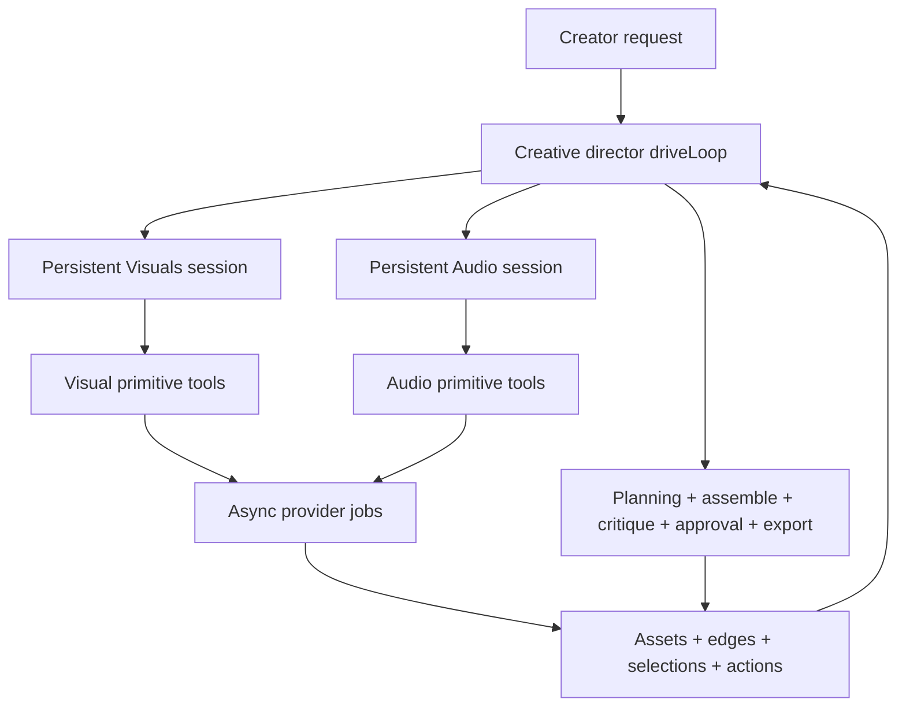
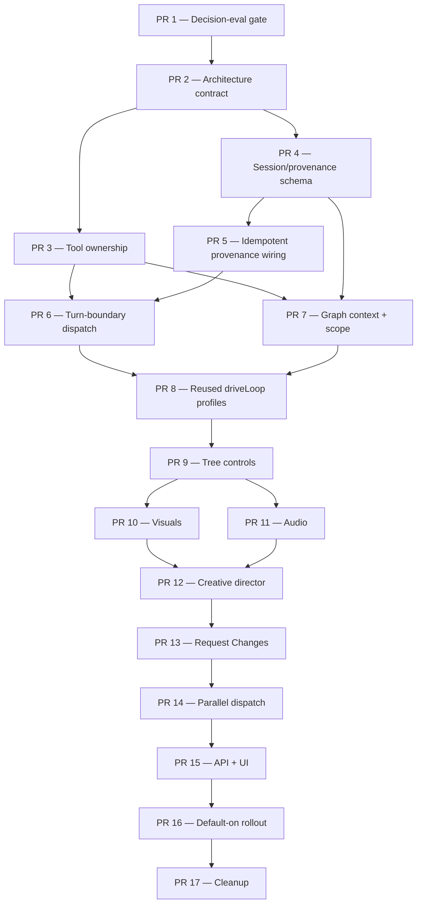

# Creative-director and domain-agent orchestration — architecture and PR roadmap

<!-- agent-summary: Proposed roadmap for replacing the all-tools orchestrator with a creative director and persistent domain agents. -->
<!-- agent-summary: The creative director owns planning, cross-modality coherence, timeline assembly, critique, approval, routing, and export. -->
<!-- agent-summary: Visuals and Audio reuse the existing driveLoop with domain prompts, restricted registries, and project-scoped sessions. -->
<!-- agent-summary: Inter-agent communication occurs only at durable turn boundaries through done, blocked, or question reports. -->
<!-- agent-summary: The immutable asset graph is the only canonical creative-state channel; tasks and reports carry intent and stable IDs. -->
<!-- agent-summary: Actions record root, session, assignment, run, job, and asset lineage from the first implementation slice. -->
<!-- agent-summary: Seventeen ordered PRs cover evaluation, contracts, durability, agents, feedback, parallelism, UI, rollout, and cleanup. -->

> **Status:** Proposed implementation scope. This document does not describe
> shipped behavior. It records the target decision and an independently
> reviewable PR sequence for approval before implementation.
>
> **Sources of truth:** [`NORTH_STAR.md`](../NORTH_STAR.md),
> [`ui-interaction-model.md`](../ui-interaction-model.md), and the asset-graph
> rules in [`CLAUDE.md`](../../CLAUDE.md) remain authoritative until PR 2 lands
> the explicit architecture amendment described below.

## Objective

Keep one agent responsible for the **creative whole** without forcing that
agent to reason over every media-generation tool.

The root orchestrator is the project's **creative director and router**. It
owns the brief, story development, shot planning, cross-modality coherence,
timeline assembly, critique, approval, blast radius, and final export. It
delegates bounded generation assignments to persistent domain agents and
reconciles their results into one coherent production.

Domain agents own execution craft. The first cut has two domains because that
is the smallest partition supported by the current tool vocabulary:

- **Visuals** owns the complete still-to-motion chain, including anchors,
  storyboards, keyframes, clips, and visual revisions.
- **Audio** owns voice, dialogue, music, sound, fitting, and audio revisions.

Each agent is the same durable `driveLoop` configured with a different prompt,
tool registry, context source, and completion policy. This roadmap does not add
a second agent runtime or turn creative choices into an opaque server workflow.

## The decision

### One creative director, persistent domain agents, no deeper hierarchy



The hierarchy stops at two agent levels:

- The creative director may dispatch work to a domain session.
- A domain agent may call its own primitive tools but may not dispatch another
  agent or silently broaden its assignment.
- A cross-domain prerequisite returns to the creative director as `blocked`.
  The creative director decides whether to dispatch a sibling domain and when
  to resume the blocked session.
- A creative judgment outside a domain's authority returns as `question`. The
  creative director answers it directly or uses the existing creator approval
  path, then resumes the same domain session.

There is no free-form agent chat and no mid-flight message injection. Every
inter-agent exchange is a persisted, replayable turn boundary.

### The creative director is not a router alone

Routing is one responsibility, not the identity of the root agent. The root
must retain the tools and context where project-wide coherence is decided:

- brief, story, script, shot, and visual-anchor planning;
- visual tone versus audio mood;
- narration duration versus picture duration;
- pacing, cuts, and timeline assembly;
- whole-cut critique and repair prioritization;
- approval proposals and budget tradeoffs;
- export readiness and completion.

The root delegates detailed media execution and provider-level recovery. It
does not delegate ownership of the creative whole.

### Same loop, different agents

The existing engine in `apps/api/src/lib/orchestrator/engine.ts` already:

1. loads a durable run and its prior actions;
2. asks a model to choose one available tool or finish;
3. executes and records the tool call;
4. parks on an async job or approval gate; and
5. resumes by applying the same loop to persisted state.

It also already accepts injected `model` and `registry` dependencies. The new
architecture turns those injection seams into an explicit production
configuration:

```text
AgentDefinition = role prompt + scoped registry + context source + outcome policy
Agent invocation = existing driveLoop + AgentDefinition + durable run
```

The current system effectively runs:

```text
driveLoop(one root prompt, one flat history, all primitive tools)
```

The target runs the same implementation in three configurations:

```text
driveLoop(creative-director prompt, root context, root tools)
driveLoop(visuals prompt, Visuals session context, visual tools)
driveLoop(audio prompt, Audio session context, audio tools)
```

Reusing the loop does **not** mean the work is configuration-only. Durable
sessions, assignment provenance, turn-boundary scheduling, typed outcomes,
scope enforcement, and tree-wide controls still require implementation. It
means parking, resumption, action recording, job waiting, provider-key context,
and failure handling remain one shared engine rather than multiple forks.

### Responsibilities

| Agent or layer | Owns | Does not own |
| --- | --- | --- |
| Creative director | User intent, brief/story/script/shot/visual-anchor planning, cross-modality coherence, routing, blast radius, timeline assembly, critique, approval, budget tradeoffs, export, completion | Provider parameters, fine-grained media generation, in-domain prerequisite sequences |
| Visuals | Anchor-image generation, storyboard tiles, keyframes, clips, still/video revisions, visual continuity inside an assignment | Story/anchor-plan rewrites, audio, timeline assembly, approval, cross-project decisions |
| Audio | Voice, dialogue, music, sound, fitting audio to picture, audio continuity inside an assignment | Story rewrites, visuals, timeline assembly, approval, cross-project decisions |
| Durable runtime | Turn execution, persistence, dispatch claims, waiting, retry, cancellation, authorization, cost settlement, gates | Creative routing, aesthetic judgment, hidden workflow sequencing |
| Providers/workers | Deterministic execution of a chosen tool, storage, rendering | Agent decisions, delegation, project interpretation |

`export_video` remains deterministic execution invoked by the creative
director. `publish_to_catalog` remains an explicit optional distribution action
outside the core video-production path.

Future domain agents are possible, but a new domain must be justified by a
cohesive tool cluster and decision-eval evidence. The design does not target a
particular number of dispatch tools.

## Decision Gate 0 — prove the split is worth activating

The hierarchy is an adoption option, not an assumption that more agents are
automatically better. Before schema or runtime investment, expand the existing
orchestrator decision evals and establish a repeated-sample baseline for:

- wrong next-tool or premature-done decisions;
- performance as project history and available tools grow;
- cross-modality coherence decisions;
- recovery from within-domain and cross-domain precondition misses;
- unnecessary turns and repeated failed calls; and
- selective-regeneration decisions with stable graph IDs.

Agree on a material-improvement threshold before running the comparison. If the
flat agent is not measurably suffering, merge the architecture contract and
provenance/registry no-regret work as appropriate, but defer the session and
dispatch rollout. Do not run both architectures against live billable providers
for comparison; compare decisions with fixtures or mocked execution.

## Current baseline

As of 2026-07-14, the production orchestrator is one durable all-tools agent:

- `apps/api/src/lib/orchestrator/model.ts` gives one model every registered tool
  schema and asks it to choose at most one tool per turn.
- `apps/api/src/lib/orchestrator/engine.ts` implements the durable `driveLoop`,
  records actions, parks on an async job or approval gate, and resumes from
  persisted state.
- `EngineDeps` already injects a model and tool registry, but production uses
  one root prompt and the default all-tools registry.
- The root model still receives `inputSummary`, compact prior actions, and tool
  schemas rather than a stable-ID project-state projection.
- `orchestrator_runs` has no agent role, persistent domain session, assignment,
  parent/root link, typed inter-agent report, or domain wait state.
- `actions` links invocations to one run, but action append is not idempotently
  retryable and does not attribute a decision through root action, domain
  session, assignment, job, and produced assets.
- The leased `orchestrator_dispatches` queue provides the detached execution
  foundation that domain assignment runs should reuse.
- The current vocabulary has 18 registered tool names. Other documentation and
  UI projections contain older hand-maintained counts, so authoritative prose
  should stop treating a count as a contract.
- Run projections assume one flat history and impose a static tool order.
- `spent_usd` and model/provider cost records do not yet form one complete async
  cost ledger.
- Request Changes still relies partly on fixed stage boundaries rather than
  graph-scoped creative-director decisions.

### Related scopes to reuse, not fork

- [`orchestrator-decision-evals.md`](orchestrator-decision-evals.md) provides
  the existing real-model, no-execution routing harness that Gate 0 extends.
- [`graph-rerun-decisioning-prs.md`](graph-rerun-decisioning-prs.md) owns the
  graph candidate set, semantic pruning, fingerprint pins, and costed rerun
  proposal. PR 13 integrates that contract rather than inventing another blast-
  radius model.
- [`regeneration-coverage-prs.md`](regeneration-coverage-prs.md) owns immutable-
  version regeneration coverage. Domain agents call that vocabulary; they do
  not create mutable replacement paths.
- [`ooda-feedback-loop.md`](ooda-feedback-loop.md) and
  [`ooda-feedback-implementation-prs.md`](ooda-feedback-implementation-prs.md)
  own critique-to-revision learning and feedback capture. The creative
  director's critique supplies structured findings to that loop.
- [`orchestrator-step-durability.md`](orchestrator-step-durability.md) owns the
  existing bounded store retry work. PR 4 closes its deferred idempotent-action
  gap.
- [`story-development-agent-handoff.md`](story-development-agent-handoff.md) is
  historical context with pre-asset-graph assumptions. PR 2 must mark
  superseded sections instead of treating it as current implementation.

## Tool ownership

The primitive tools survive intact. PR 3 makes this ownership executable
metadata rather than prompt-only convention.

| Role | Model-visible tools |
| --- | --- |
| Creative director | `create_or_load_brief`, `develop_story_blueprint`, `draft_script`, `plan_shots`, `plan_visual_anchors`, `assemble_timeline`, `critique_timeline`, `request_approval`, `export_video`, `delegate_visuals`, `delegate_audio`, PR 14's batched `delegate_domains`, optional `publish_to_catalog`, and model `done` |
| Visuals | `generate_anchor`, `generate_storyboard`, `generate_keyframe`, `generate_clip`, `regenerate_image_asset`, `edit_video_asset`, and domain `done` / report outcomes |
| Audio | `generate_audio`, `fit_audio_to_picture`, and domain `done` / report outcomes |
| Runtime-owned, not model-facing | Session/assignment claim, wait/resume, report acknowledgement, retry, cancellation, authorization, cost settlement, gate persistence |

The exact root tool count is not a design target. The reliability hypothesis is
that root generation choices collapse into a small number of domain dispatches
while coherence tools remain available where they belong.

`request_approval` stays a **root-only model tool**. The creative director
decides what proposal to present and why; the runtime persists and enforces the
gate. Domain agents cannot create independent creator-facing approvals.

### In-domain self-healing

The Visuals registry intentionally spans still and motion generation:

```text
Visuals calls generate_clip
  -> tool reports missing beat_keyframe
  -> generate_keyframe is in the same Visuals registry
  -> Visuals generates the keyframe and retries generate_clip
  -> Visuals returns done with the produced asset IDs
```

That sequence remains inside one session because it is one visual craft problem.
Changing the story to avoid a difficult shot is outside Visuals authority and
returns `question` or `blocked` to the creative director.

## Turn-boundary communication contract

### Down: `DomainTask.v1`

Every dispatch is a typed, versioned assignment stored with the originating
root action:

- `domain` — `visuals | audio`;
- `objective` — the requested outcome;
- `instruction` — creator intent rewritten for the bounded domain assignment;
- `target` — stable project, storyboard, scene, beat, panel, asset, lineage, or
  timeline IDs, never position-only references;
- `requiredOutputs` — asset kinds or selection roles that define completion;
- `creativeConstraints` — tone, mood, pacing, continuity, and other constraints
  set by the creative director;
- `preserve` — approved assets, selections, fingerprints, or pins that must not
  change;
- `candidateAffectedAssetIds` — graph-computed candidates the domain may
  inspect, not permission to regenerate all of them;
- `budgetUsd` — maximum allocation for the assignment;
- `approvalContext` — an approved proposal/fingerprint token when relevant;
- `acceptanceCriteria` — concise checks the domain must satisfy before `done`;
- `causation` — originating root run, action, and creator message IDs.

The task is typed control/audit data, so schema-marked JSONB is appropriate.
Stable creator-facing storyboards, beats, panels, timelines, approvals, and
creative state remain relational and graph-backed.

### Up: `DomainReport.v1`

A domain turn emits exactly one agent-authored outcome:

- `done` — includes output asset IDs, changed selection roles, acceptance
  evidence, and a compact session summary;
- `blocked` — carries a domain-safe projection of the existing
  `PreconditionMiss` shape plus the required domain, stable targets, and why the
  current domain cannot satisfy it. Raw sibling primitive names in
  `satisfyWith` or `suggestedNextTools` remain in the action audit but are
  translated before the domain model sees or emits the report;
- `question` — carries one bounded creative question, relevant target IDs,
  available options/tradeoffs, and the fingerprint that must still match when
  the answer is applied.

`failed`, `canceled`, `timed_out`, and `superseded` remain runtime assignment
states, not additional agent-to-agent report vocabulary. A missing tool/graph
prerequisite is `blocked`; a creative judgment outside domain authority is
`question`.

Every task and report has a durable sequence number, idempotency key, persisted
acknowledgement, and exactly-once parent wake-up. A domain question is addressed
to the creative director, not directly to the creator. The root answers from
the brief/project constraints and creates the next assignment turn in the same
session. If creator input is truly necessary, the root converts its recommended
answer into the existing approve/reject proposal flow; rejection returns normal
creator feedback to the root rather than introducing a separate domain-question
UI mutation.

### The asset graph is the real communication channel

Tasks and reports carry control flow, intent, constraints, and stable IDs. They
do not copy creative state between agents.

At the start of every domain turn, the agent re-reads the authorized projection
of current assets, edges, selections, pins, and relational story objects. It
writes results as new immutable assets/actions and moves selections through
existing append-only mechanisms. The next agent observes those graph writes.

Session history may retain recent instructions, answers, unresolved questions,
and compact summaries for conversational continuity. It is routing context,
never an alternate source of creative truth. Compaction must retain referenced
asset/action IDs and must not preserve stale copied project snapshots.

## Durable session and run model

A persistent session is an identity and continuity boundary; an assignment run
is a finite, replayable execution of `driveLoop`.

The persistence identities are deliberately distinct:

- `agent_session_id` identifies the permanent project/domain continuity record;
  there is exactly one for each `(project_id, domain)` for the project's lifetime.
- `domain_assignment_id` identifies one root-to-domain turn. The row contains
  `DomainTask.v1`, sequence, status, correlation/continuation IDs, and pins.
- `orchestrator_run.id` identifies the one finite `driveLoop` run for that
  assignment. Async parking/resumption and infrastructure retries reuse it.
- `DomainReport.v1` is the single acknowledged result keyed to the assignment.
  A `blocked` or `question` successor is a new assignment and run in the same
  session.

There is no separate free-form “message” persistence entity in the first cut;
task and report are the two typed turn-boundary records.

```text
root orchestrator_run
  -> root delegation action (running)
      -> domain agent_session (project_id + domain, persistent)
          -> domain_assignment N (contains DomainTask.v1)
              -> child orchestrator_run (finite driveLoop invocation)
                  -> primitive actions
                      -> async jobs
                      -> assets + edges + selections
              -> DomainReport.v1 N
          -> compact session context for assignment N+1
      -> root delegation action (applied / failed)
  -> root resumes exactly once with the report and current graph state
```

Do not reopen a terminal child run to simulate persistence. Introduce an
explicit session identity and link ordinary finite runs/assignments to it. One
persistent session exists per `(project_id, domain)` in the initial design;
every assignment has a monotonically increasing sequence and at most one active
claim.

Required invariants:

1. A root delegation action and domain assignment are created idempotently
   before domain execution begins.
2. Every domain run links to one session, assignment, originating root run, and
   originating root action.
3. Root, session, assignment, and child run always share project/workspace
   authorization.
4. A domain registry cannot contain dispatch, root coherence, or sibling tools.
5. Every primitive call is checked against the assignment's stable targets; a
   restricted registry alone is not authorization for the whole project.
6. Assignments in one persistent session are serialized from the first dispatch
   implementation. A second request may queue or supersede according to explicit
   policy but may not run concurrently against stale selection pins.
7. A domain report is persisted and acknowledged exactly once; it wakes the
   waiting root exactly once.
8. A late completion from assignment N cannot mutate active selections or
   revive work after assignment N+1 supersedes it.
9. Costs are charged once and aggregated across the root run family without
   copying charges.
10. Root cancellation cascades to active assignments and cancellable jobs; late
    callbacks are fenced.
11. Creator approval is rooted in the creative-director run. Domain agents
    cannot create independent gates.
12. Assets remain immutable; changes mint versions and append selections.
13. Session compaction preserves control continuity and stable IDs without
    becoming a second creative-state store.
14. Existing action, edge, selection, job, and asset provenance remains visible
    even though the root consumes a compact report.

## PR dependency map



PRs 10 and 11 intentionally own distinct domain files and can proceed in
parallel after PR 9. PR 15 is predominantly `apps/web`; fixture work may begin
after the PR 6 session/report contract stabilizes, but it should merge after the
final API projection is known.

### Requirements for every implementation PR

Every PR below follows [`AGENT_WORKFLOW.md`](../../AGENT_WORKFLOW.md): keep a
worksheet and feedback entry, add a targeted observable test, exercise the real
affected app/API path, request the required independent reviews, run
`pnpm agent:lint:fix` and scoped `pnpm agent:validate`, and open a ready PR.
Documentation-only contract PRs record why runtime execution is not applicable.
PR 15 additionally uses TanStack Query for server state and co-located CSS
Modules for new UI styling.

## PR roadmap

### PR 1 — Baseline decision evals and adoption gate

**Depends on:** this scope being approved.

**Deliver:**

- Extend the existing decision-eval harness with long-context, tool-overload,
  cross-modality, selective-regeneration, premature-done, and recovery cases.
- Run repeated samples against the flat production registry and record accuracy,
  unnecessary-turn, and recovery baselines.
- Add fixture-only simulations of the proposed creative-director/domain
  decision surface; never duplicate live billable generation.
- Record the agreed threshold and an explicit proceed/defer decision.

**Acceptance:** the team can state which failure mode the hierarchy addresses
and what improvement justifies runtime investment. A defer decision leaves the
remaining roadmap valid for later adoption.

**Validation:** deterministic eval unit tests plus repeated opt-in real-model
decision reports.

### PR 2 — Architecture contract and North Star amendment

**Depends on:** PR 1 proceed decision. The written contract may still land if
runtime activation is deferred, provided its status is explicit.

**Deliver:**

- Add an architecture decision record establishing the creative-director role,
  persistent Visuals/Audio sessions, two-level limit, graph-as-state rule, and
  turn-boundary-only communication.
- Amend `docs/NORTH_STAR.md` Principles 1, 3, 6, 7, and 10: the creative
  director owns the whole flow; one engine means one `driveLoop` shared by all
  agents; domains self-heal only in-lane; graph state moves between agents by ID;
  and the agent system remains the only writer.
- Define `AgentRole`, `DomainTask.v1`, `DomainReport.v1`, report payloads, and
  runtime assignment states in a focused shared module.
- Document the root coherence tools, domain dispatches, deterministic worker
  boundary, and future-domain admission rule.
- Remove hard-coded tool counts from authoritative prose.

**Acceptance:** reviewers can classify every current tool and outcome, and the
target no longer conflicts with North Star's “central agent” wording.

**Validation:** shared-package type tests, documentation links, and
`pnpm agent:validate -- --scope docs`.

### PR 3 — Canonical capability ownership and restricted registries

**Depends on:** PR 2.

**Deliver:**

- Add required `ownerRole`/capability metadata to primitive definitions.
- Replace duplicated tool-name unions with one canonical capability catalog
  that also owns label, execution mode, cost class, and gate metadata.
- Create explicit registry builders for `root`, `visuals`, and `audio`; avoid a
  catch-all `index.ts`.
- Assert every primitive tool has exactly one model-facing owner.
- Prevent domain registries from containing root, sibling, or dispatch tools.
- Translate both cross-domain `suggestedNextTools` and
  `unmetRequirements[].satisfyWith` into domain/stable-target `blocked`
  candidates instead of exposing hidden sibling primitive tools.
- Derive run/UI labels from the same metadata where practical.

**Acceptance:** registry tests prove the mapping in [Tool ownership](#tool-ownership)
and fail on unowned, multiply owned, or cross-domain tools.

**Validation:** registry unit tests and tool-test bridge tests.

### PR 4 — Persistent session, assignment, and provenance schema

**Depends on:** PR 2. Can proceed in parallel with PR 3.

**Deliver:**

- Add a persistent project/domain session identity with a uniqueness constraint
  for `(project_id, domain)`.
- Add finite domain assignments with monotonic sequence, continuation,
  correlation, current pins, originating root run, and originating root action.
- Link finite assignment runs and actions to `agent_session_id` and assignment;
  add `parent_action_id` where a primitive emits valuable leaf actions.
- Persist schema-marked domain reports and compact session summaries.
- Add constraints for same-project ownership, one active assignment claim,
  maximum depth, and no self-parenting.
- Extend RLS through existing project/workspace ownership helpers.
- Keep dispatch rows one-per-finite-run so assignments reuse the leased queue.

**Acceptance:** DB tests create/reuse a Visuals session, link multiple finite
assignments and actions to their originating root decisions, reject invalid or
cross-project relationships, and preserve separate run histories.

**Validation:** local Supabase migration check, migration/RLS/tenancy tests, and
no migration-history rewrite.

### PR 5 — Idempotent action lifecycle, session store, and provenance wiring

**Depends on:** PR 4.

**Deliver:**

- Preallocate stable action/tool-call IDs before mutating tools execute.
- Make invocation creation idempotently retryable within a run.
- Record `running` before external work launches, then patch lifecycle fields.
- Extend store queries for session lookup/create, assignment enqueue/claim,
  history reads, report acknowledgement, and root-family projection.
- Pass the canonical root/session/assignment/run/action provenance context into
  primitive, job, asset, edge, and selection paths instead of minting unrelated
  wrapper identities.
- Include invocation recording in bounded store retry without duplicate action
  rows, and preserve immutable decision fields and append-only audit behavior.

**Acceptance:** crash/retry tests prove one logical invocation creates one
action, session claims are stable, and every generated asset can be traced back
to the root decision before dispatch is enabled.

**Validation:** API store, concurrency, engine retry, provenance integration,
and action immutability tests.

### PR 6 — Turn-boundary dispatch, reports, and parent wake-up

**Depends on:** PRs 3 and 5.

**Deliver:**

- Implement root-only `delegate_visuals` and `delegate_audio` tools that append
  typed tasks to the persistent session.
- Create the assignment, finite run, and dispatch enqueue atomically and
  idempotently.
- Add a domain-wait state distinct from media-job and approval waits.
- Persist exactly one `done | blocked | question` report per completed domain
  turn, acknowledge it, finalize the delegation action, and wake the root once.
- Resume a questioned/blocked session through a later sequenced assignment,
  never an out-of-band message.
- Define continuation semantics explicitly: `blocked`/`question` closes the
  current finite assignment, and the root response creates a successor with
  `continues_assignment_id`, `correlation_id`, current pins, and a new sequence.
- Add attempt/cycle limits so two domains cannot bounce the same unmet
  requirement indefinitely.
- Atomically serialize one active turn per session, deduplicate task/report writes,
  and claim/wake the root exactly once.
- Fence cancellation, inline completion, reclaimed dispatches, duplicate
  callbacks, supersession, and late reports before any domain can run live.
- Enforce depth, per-root assignment, report, continuation, and turn limits.
- Keep this PR at the durable transport boundary: use a fake domain report
  producer in lifecycle tests. Production `driveLoop` report emission lands in
  PR 8, so no domain profile can be enabled here.

**Acceptance:** a transport test executes root → persistent session assignment
→ fake report producer → report → root resume across processes, then sends
follow-up feedback through the same session without duplication.

**Validation:** engine, task/report transport, recovery-worker, dispatch-lease, race,
cancellation, and idempotency tests.

### PR 7 — Fresh graph context, assignment scope, and session compaction

**Depends on:** PRs 3 and 4. Can proceed in parallel with PRs 5–6 after the
schema contract is stable.

**Deliver:**

- Build a typed root projection containing active assets/selections, relational
  story objects, domain status, approvals, graph stale candidates, and pins.
- Build role-filtered domain projections from the current graph at the start of
  every assignment turn.
- Keep tasks and reports ID-based; never copy a project snapshot into session
  memory as canonical state.
- Make target scope explicit for project, storyboard, scene, beat, panel, asset,
  lineage, timeline item, or export requests.
- Reject primitive inputs outside the assignment's stable targets.
- Enforce allowed-target and authorized graph-closure checks server-side for
  every selection append, edge, and minted asset—not only in prompts or parsed
  tool inputs. Narrow project-wide primitives before a domain can call them.
- Separate trusted instructions from creator/project content and enforce
  workspace/project authorization before context assembly.
- Compact long session histories while preserving unresolved questions,
  constraints, report summaries, and referenced asset/action IDs.

**Acceptance:** fixtures prove every role sees current authorized graph state,
not stale copied state, and cannot inspect secrets, hidden tools, unrelated
assets, or another project.

**Validation:** projection, tenancy, prompt-boundary, target-scope, compaction,
token-size, and stale-pin fixtures.

### PR 8 — Role-configured reuse of the existing driveLoop

**Depends on:** PRs 6 and 7.

**Deliver:**

- Introduce `AgentDefinition` with role prompt, registry, context builder, and
  completion/report policy. Keep it declarative and prohibit dispatch tools in
  every non-root definition.
- Parameterize the existing production engine entrypoint to run a root or
  domain definition; do not create a generalized second agent engine.
- Keep one implementation of parking, resumption, action recording, job
  waiting, provider-key context, timeout, and error handling.
- Reject recursive delegation from domain definitions.
- Convert out-of-domain `PreconditionMiss` failures to `blocked`; expose a
  bounded `question` completion for creative escalation.
- Connect production domain completion to PR 6's durable report transport and
  prove `done | blocked | question` emission through the shared loop.
- Split evaluations into root creative/routing decisions and domain leaf-tool
  decisions, using one shared fake-store harness.
- Run the existing flat-root engine and decision suite unchanged through the
  parameterized entrypoint before any domain profile depends on it.

**Acceptance:** the current root behavior/evals pass unchanged through the
parameterized entrypoint; fixture definitions run through that exact production
`driveLoop`, see only their registries/context, self-heal in-domain, and emit a
typed report without a forked runtime.

**Validation:** model, engine, registry-isolation, report-contract, decision-eval,
and opt-in real-provider routing tests.

### PR 9 — Budget, root approval, cancellation, and recovery across assignments

**Depends on:** PR 8.

**Deliver:**

- Allocate assignment budgets from the root ceiling and settle actual spend
  exactly once.
- Reconcile async provider and model-call costs in one root-family ledger.
- Keep `request_approval` as a root-only creative-director tool while the
  runtime persists/enforces gates addressed to a proposal and originating work.
- Cascade root/session cancellation to active assignments and cancellable jobs;
  ignore late completion after cancellation or supersession.
- Define retry/re-dispatch policy for recoverable assignment failure and
  terminal policy for non-recoverable failure.
- Extend recovery sweeps to domain waits, unacknowledged reports, active claims,
  and parent wake-up.

**Acceptance:** tests cover insufficient credits, budget exhaustion, approval
and rejection, cancellation, worker crash, question/resume, blocked/resume,
late completion, and exactly-once cost/report settlement.

**Validation:** engine/store/credit/gate/recovery tests plus a local mocked API
cancel-and-resume smoke.

No domain agent may be enabled against live provider work before this PR.

### PR 10 — Visuals domain profile

**Depends on:** PR 9.

**Owns:** new Visuals prompt/config/evals and Visuals registry file.

**Deliver:**

- Scope Visuals to generated anchors, storyboards, keyframes, clips, immutable
  image regeneration, and content-aware video edits; visual-anchor planning
  remains with the creative director.
- Narrow project-wide primitives with explicit beat, panel, anchor, source
  asset, or lineage targets.
- Keep storyboard → keyframe → clip prerequisite recovery inside the session.
- Preserve anchor identity, selected slots, immutable source links, content
  hashes, provider/duration constraints, and uploaded-footage grounding.
- Keep minor/photorealistic-provider policy in deterministic tool contracts.
- Return `blocked` for missing root-owned visual-anchor plans or required Audio
  work, and `question` when the visual change requires story, pacing, or
  approval judgment.

**Acceptance:** first-pass visual generation, targeted still revision, new clip,
uploaded-footage edit, missing keyframe recovery, and creative escalation all
run through one persistent Visuals session with correct lineage.

**Validation:** Visuals decision evals, tool batteries, provider-policy tests,
graph/selection assertions, follow-up-session tests, and opt-in media smoke.

### PR 11 — Audio domain profile

**Depends on:** PR 9. Can proceed in parallel with PR 10.

**Owns:** new Audio prompt/config/evals and Audio registry file.

**Deliver:**

- Scope Audio to narration, dialogue, music, sound generation, and fitting audio
  to picture.
- Add explicit narration, dialogue, music, beat, asset, or timeline-slot targets
  where current tools accept only project-wide intent.
- Preserve typed mix/alignment metadata, active selections, timing constraints,
  and immutable graph inputs.
- Distinguish regenerating delivery/fitting from changing spoken meaning, which
  becomes `question` for the creative director.
- Return `blocked` when current picture assets are a hard prerequisite.

**Acceptance:** voiceover, music, refit, “redo warmer,” dialogue-meaning change,
and picture-too-short scenarios produce correct local work or typed escalation
across one persistent Audio session.

**Validation:** Audio decision evals, alignment tests, tool batteries,
asset-edge/selection assertions, follow-up-session tests, and opt-in audio smoke.

### PR 12 — Creative-director profile and root tool surface

**Depends on:** PRs 10 and 11.

**Deliver:**

- Replace the flat all-tools root registry with the exact root ownership in
  [Tool ownership](#tool-ownership).
- Add a creative-director prompt that explicitly owns story, cross-modality
  constraints, visual-anchor planning, assembly, critique, approval, blast
  radius, and completion.
- Feed the root current graph state, compact domain reports, unresolved
  questions, active assignments, costs, gates, and pins.
- Make the root choose between its coherence tools and domain dispatch, never a
  leaf media/provider tool.
- Support fresh projects, partial projects, resumes, multi-domain requests,
  blocked prerequisites, creative questions, and follow-up feedback.
- Ship behind a temporary feature flag, off by default.
- Compare decisions only; never execute flat and hierarchical billable work in
  shadow mode.

**Acceptance:** root evals preserve creative coherence and choose the correct
root tool/domain/done across the scenario matrix; the registry cannot name a
leaf Visuals or Audio tool.

**Validation:** creative-director/routing evals, end-to-end fake assignments,
entry-route tests, and a local mocked-provider API smoke.

### PR 13 — Request Changes and graph-scoped selective regeneration

**Depends on:** PR 12; `graph-rerun-decisioning-prs.md` PR 1 (read-only proposal
assembly) and PR 2 (agent decision/pinned-ID contract); and
`regeneration-coverage-prs.md` PR 1 plus the enabled kind-specific coverage PRs
(PR 2 keyframe, PR 3 clip, PR 4 audio, PR 5 cut, PR 6 storyboard). A scenario
must remain disabled until its corresponding immutable regeneration path exists.
Reuse graph-rerun PR 4/5 execution/fallback contracts where they have landed;
do not duplicate them here.

**Deliver:**

- Route every object-scoped Request Changes message through a new/revived root
  turn with stable target IDs and current provenance.
- Replace fixed restart-stage boundaries with `downstream_assets()` candidates
  plus creative-director semantic pruning.
- Reuse the appropriate persistent domain session for follow-up feedback such
  as “redo beats 3–5 warmer.”
- Propose a costed root work plan before expensive/fan-out revisions.
- Preserve unaffected assets/selections and fence work with current
  fingerprints.
- Keep approval, rejection, and selection among existing assets as the existing
  explicit UI carve-outs.

**Acceptance:** visual-only, audio-only, pacing-only, upstream-story, and mixed
requests regenerate only the approved graph region and remain auditable.

**Validation:** API integration with graph fixtures, Request Changes E2E, stale-
candidate/pruning evals, and persistent-session follow-up tests.

### PR 14 — Cross-session parallel dispatch and deterministic fan-in

**Depends on:** PR 13. Serial delegation must be stable first.

**Deliver:**

- Add one root-only batched `delegate_domains` capability. A single model tool
  call atomically creates independent Visuals/Audio assignments and parks the
  root on their durable join; separate parking delegate calls cannot implement
  fan-out because the first would stop the current root turn.
- Reuse PR 6's one-active-assignment session guarantee while allowing different
  domain sessions to run in parallel.
- Reserve budget so concurrent assignments cannot exceed the root ceiling.
- Resume only when required reports arrive; keep optional/failed branches
  explicit.
- Reconcile immutable assets/selections using fingerprints so late results
  cannot overwrite newer choices.
- Keep within-domain beat/provider fan-out in server-owned jobs.

**Acceptance:** Visuals and Audio overlap, survive a worker restart, respect
budget/session locks, and fan into root assembly/critique exactly once.

**Validation:** concurrency, lease, session-lock, budget-reservation,
fingerprint-conflict, and timed mocked-media tests.

### PR 15 — Session/run API and observe-first UI projection

**Depends on:** PR 14 API contract. Web fixture work may begin earlier.

**Deliver:**

- Extend run-detail APIs with the root, persistent domain sessions, finite
  assignments, reports, and action/job drill-down.
- Project creator-facing progress from creative work and domain outcomes rather
  than a numbered primitive-tool pipeline.
- Show active/waiting/blocked/failed states and root handling of domain questions
  without exposing reasoning traces, presenting sessions as independent user
  conversations, or adding a direct domain-question answer mutation.
- Keep one creator-facing feedback/approval loop and no direct-edit controls.
- Use TanStack Query for polling, cache updates, and invalidation.
- Add route/component CSS Modules only; do not grow legacy global styles.

**Acceptance:** users can understand what the creative director delegated,
which domain is active, what it produced, and which root proposal needs creator
approval on desktop/mobile.

**Validation:** API projection, web unit, browser desktop/mobile, behavior-
focused Playwright, and E2E inventory updates.

### PR 16 — Default-on rollout and soak

**Depends on:** PR 15 and green parity/evaluation evidence.

**Deliver:**

- Enable creative-director/domain routing by default while retaining a
  time-bounded emergency fallback flag.
- Define soak duration, success/error/cost thresholds, rollback owner, and
  monitoring for decisions, assignments, session contention, and exports.
- Exercise every production entrypoint and Request Changes path through the new
  default without executing duplicate billable work.
- Record the explicit cleanup decision after thresholds hold for the soak.

**Acceptance:** the new path is default-on, all production entrypoints meet the
agreed soak thresholds, and rollback is verified without data-shape divergence.

**Validation:** production-like API/E2E smoke, monitoring queries, rollback
rehearsal, and recorded soak evidence.

### PR 17 — Remove the flat root surface and synchronize as-built docs

**Depends on:** PR 16 completed soak and cleanup decision.

**Deliver:**

- Remove the fallback flag and delete primitive media exposure from the root
  prompt while keeping primitive implementations for domain registries.
- Remove fixed stage-restart logic replaced by graph-scoped feedback.
- Update `NORTH_STAR.md`, async-orchestrator research, tool docs, manual tests,
  and operator runbooks to the as-built architecture.
- Replace sequential pipeline diagrams with product architecture, runtime/session,
  and data/lineage views. Do not market the hierarchy as shipped before cutover.
- Remove stale tool counts and derive detailed registry docs from ownership
  metadata where practical.

**Acceptance:** every production entrypoint uses the creative-director profile;
root cannot call leaf media tools; each primitive has exactly one owner; domain
follow-ups reuse persistent sessions; no flat fallback or stale flag remains.

**Validation:** full API tests, provider-neutral E2E, selected opt-in tool
smokes, migration status, docs validation, browser QA, and deployment smoke.

## Required scenario matrix

| Creator/project state | Expected creative-director decision |
| --- | --- |
| Fresh idea | Use root brief/story/script/shot-planning tools |
| Visual-first short with sufficient brief | Root plans shots/visual anchors or dispatches Visuals based on graph state |
| Shot plan without storyboard/keyframes | Dispatch Visuals |
| Keyframes without clips | Dispatch or continue Visuals |
| Visuals discovers a missing keyframe for a clip | Self-heal inside Visuals and retry |
| Clips without required audio | Dispatch Audio |
| Media ready, no timeline | Root calls `assemble_timeline` |
| Timeline ready, not reviewed | Root calls `critique_timeline` |
| Expensive approved repair proposed | Root calls `request_approval` before dispatch |
| Reviewed/approved timeline | Root calls deterministic `export_video` |
| “Redo beats 3–5 warmer” | Follow-up assignment in the existing Visuals session |
| “Remove the logo from this footage” | Visuals, scoped to the source asset |
| “Shorten this narration” | Audio if delivery/fitting; root story planning if meaning changes |
| “Make the opening faster” | Root assembly/pacing decision; dispatch only if source coverage changes |
| “Rename the protagonist everywhere” | Root story decision, then graph-scoped Visuals/Audio follow-ups |
| Visuals requires an Audio asset | `blocked(PreconditionMiss)` → root dispatches Audio → resumes Visuals |
| Visuals asks whether realism or style should win | `question` → root answers/resumes; if necessary, root proposes one recommended creator approval |
| User cancels during domain media work | Root/session assignment cancel; late result is fenced |
| Two independent repairs | Parallel Visuals/Audio assignments, serialized per session, deterministic fan-in |

## Merge-conflict plan

- PRs 10 and 11 own separate domain prompt, registry, and eval files.
- PR 3 creates role-specific registry boundaries before domain work so agents do
  not all edit `default-registry.ts`.
- PRs 4–6 own action/session/dispatch infrastructure sequentially.
- PR 12 owns the root prompt/config after domain profiles stabilize.
- PR 15 owns API projection and web files after the session payload stabilizes.
- PR 16 owns only rollout/soak; PR 17 is the only broad cleanup and as-built
  documentation synchronization PR.
- Avoid new route/feature `index.ts` aggregators; use explicit names such as
  `root-agent.ts`, `visuals-agent.ts`, `audio-agent.ts`,
  `domain-session-store.ts`, and `session-run-projection.ts`.

## Rollout gates

Do not enable domain routing by default until all are true:

1. Gate 0 records a proceed decision and root decision evals meet the agreed
   repeated-sample threshold.
2. Visuals and Audio have registry-isolation and leaf-tool decision evals.
3. A provider-neutral end-to-end run reaches export through persistent sessions.
4. Request Changes passes visual, audio, pacing, and upstream multi-domain cases.
5. Assignment crash recovery, serialization, cancellation, approval, and budget
   tests pass.
6. Late/superseded assignment results cannot mutate current selections.
7. The UI accurately projects active/waiting/blocked/failed work, root handling
   of domain questions, and creator-facing root approvals.
8. No leaf domain tool is exposed to the root or multiply owned.
9. Session memory is bounded and demonstrably not a second creative-state store.
10. No retired schema surface, untyped product JSONB, or direct-edit UI is added.
11. The default-on path completes its defined soak before the flat path is
    deleted.

## Non-goals

- Replacing the immutable asset graph or relational storyboard model.
- Moving creative decisions into deterministic server workflows.
- Building a new agent loop, workflow engine, or per-domain fork of `driveLoop`.
- Creating a separate Story, Edit, or Review agent in the first cut.
- Splitting still-image and motion generation into separate agents in the first
  cut; Visuals owns their prerequisite chain.
- Letting domains chat directly, delegate recursively, or receive mid-flight
  messages.
- Treating session memory as canonical creative state.
- Passing raw media, provider responses, secrets, or full action histories into
  model context.
- Wrapping providers, queues, storage, selection writes, or rendering in agents.
- Reintroducing a fixed forward-only pipeline or stage tables.
- Adding direct content-edit controls to the dashboard.
- Supporting arbitrary third-party domain plugins in the first cutover.

## Definition of done

- The root is demonstrably a creative director plus router, not a router alone.
- Root retains planning, assembly, critique, approval, export, and completion.
- Visuals and Audio run the exact shared durable `driveLoop` with restricted
  registries, prompts, graph context, and persistent project/domain sessions.
- Inter-agent communication is limited to durable tasks and
  `done | blocked | question` reports at turn boundaries.
- The asset graph remains the only canonical creative-state channel.
- Every root decision, assignment, primitive action, job, asset, edge,
  selection, cost, and report remains attributable across restarts.
- Creator feedback reuses the correct session, proposes a graph-scoped plan, and
  regenerates only approved affected assets.
- Visuals and Audio can run concurrently while each session remains serialized.
- The UI presents one understandable creative production with inspection but no
  direct content mutation.
- The flat all-tools root prompt, fixed restart boundaries, stale counts, and
  sequential public diagram are removed after cutover.
